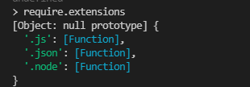

## 为什么需要模块化

近年来，随着 Web 应用程序的快速发展，JavaScript 代码越来越庞大，越来越复杂。人们迫切地需要模块化编程来解决代码体积与协作问题。通过模块化，我们可以专注核心业务代码，其它能力都可以引入封装好的模块。JavaScript 社区为此付出了巨大的努力，涌现了不少优秀的模块加载解决方案。

总结起来，主要有以下几点诉求：

+ 网站正在变成网络应用，前端代码不再是脚本片段
+ 代码复杂度随着项目变大而急剧增加，需要拆分维护
+ 文件 / 模块之间需要高度解耦，明确依赖关系
+ 上线部署希望尽可能减少 HTTP 请求、并能做静态分析与优化

`JavaScript` 语言自身在很长一段时间里都没有内置的模块系统，于是社区先后给出了 `CommonJS`、`AMD`、`CMD` 等规范，最终 ES6 才在语言层面给出了官方答案 —— `ES Module`。

## 没有模块系统的年代

在没有任何模块化方案之前，浏览器只能这样组织代码：

```html
<script src="https://karldu.cn/post/a.js"></script>
<script src="https://karldu.cn/post/b.js"></script>
<script src="https://karldu.cn/post/c.js"></script>
<!-- ...更多 script 标签 -->
```

这种写法有几个明显问题：

1. 所有变量都暴露在全局，容易污染和冲突；
2. 依赖关系隐含在 `<script>` 的书写顺序中，难以维护；
3. 同步加载会**阻塞页面渲染**，体验差。

为了缓解全局污染，开发者会使用 IIFE（立即执行函数）形成块作用域：

```javascript
(function () {
  function fun1() {
    alert('it works');
  }
  fun1();
})();
```

但这只是"私有作用域"，并不是真正意义上的模块系统：依赖、加载、复用问题依然没解决。

## CommonJS

`CommonJS` 规范最初是为了弥补 JS 没有模块标准的缺点，让 JS 也具备像 `Java`、`Python` 那样开发大型应用的基础能力，而不只是停留在脚本程序阶段。它期望基于该规范写出的应用具备跨宿主环境执行的能力，可以用来写 Web 程序，也可以写服务器、命令行工具，甚至桌面应用。

`Node.js` 能够以一种成熟的姿态出现，离不开 `CommonJS` 规范的影响；反过来，`CommonJS` 能在服务端落地，也离不开 `Node.js` 的优异表现。


### 规范三要素

`CommonJS` 对模块的定义十分简单，主要分为 **模块引用**、**模块定义**、**模块标识** 三部分。

**模块引用：**

```javascript
const fs = require('fs');
```

`require()` 接收一个模块标识，将该模块的 API 引入到当前上下文中。

**模块定义：** 上下文提供 `exports` 对象用于导出当前模块的方法或变量，它是唯一的出口；同时还存在一个 `module` 对象代表模块自身，`exports` 是 `module` 的属性。在 `Node.js` 中，一个文件就是一个模块：

```javascript
// math.js
exports.add = function (a, b) {
  return a + b;
};

// 或者整体覆盖
module.exports = {
  add(a, b) { return a + b; },
};
```

```javascript
// app.js
const math = require('./math');
const result = math.add(10, 20);
```

**模块标识：** 即传给 `require()` 的参数，必须符合小驼峰命名的字符串，或以 `.`、`..`、`/` 开头的相对／绝对路径，可以不带 `.js` 后缀。

### Node.js 的模块加载流程

在 `Node.js` 中引入一个模块，大体经历三个步骤：**路径分析 → 文件定位 → 编译执行**。模块分为两类：

+ **核心模块**：在源码编译阶段被打进二进制，部分核心模块在进程启动时就直接加载到内存。引入时省略了文件定位和编译执行，并且在路径分析时优先匹配，速度最快。
+ **文件模块**：运行时动态加载，需要完整地经历三个步骤，速度比核心模块慢。

#### 优先从缓存加载

和浏览器缓存静态文件类似，`Node.js` 也会缓存引入过的模块，但缓存的是**编译后的对象**而不是文件。无论是核心模块还是文件模块，`require()` 对相同模块的二次加载都优先走缓存。

#### 路径分析

`require()` 收到的标识符大致分为：

- 核心模块（`http`、`fs`、`path` …），优先级仅次于缓存；
- 以 `/`、`./`、`../` 开头的路径式文件模块，会被解析为真实路径并以此作为缓存索引；
- 非路径形式的自定义模块，需要沿 `node_modules` 路径链向上逐级查找。

可以在任意 JS 文件里打印查看自定义模块的查找路径：

```javascript
console.log(module.paths);
```


数组的生成规则：当前目录下的 `node_modules` → 父目录的 `node_modules` → 一直向上递归到根目录的 `node_modules`。因此当前文件层级越深，自定义模块查找耗时越多，这也是自定义模块加载最慢的原因。

#### 文件定位

- **后缀分析**：标识符没带后缀时，按 `.js` → `.json` → `.node` 的顺序依次尝试。这里依赖同步的 `fs` 调用判断文件是否存在，对单线程的 `Node.js` 是性能敏感点，所以如果是 `.json`、`.node` 文件，加上后缀可以略微提速。
- **目录处理**：若定位到目录，则把它当作包来处理。先在该目录下查找 `package.json`，用 `main` 字段指定的文件作为入口；如果 `main` 缺失或错误，就依次尝试 `index.js`、`index.json`、`index.node`。如果都找不到，则继续沿 `module.paths` 向上查找；全部用尽仍未找到，则抛出异常。

#### 模块编译

每个文件模块都是一个对象：

```javascript
function Module(id, parent) {
  this.id = id;
  this.exports = {};
  this.parent = parent;
  if (parent && parent.children) parent.children.push(this);
  this.filename = null;
  this.loaded = false;
  this.children = [];
}
```

不同扩展名的载入方式不同：

- `.js`：通过 `fs` 同步读取文件后编译执行；
- `.json`：同步读取后用 `JSON.parse()` 解析返回；
- `.node`：用 `C/C++` 编写的扩展文件，通过 `process.dlopen()` 加载；
- 其它扩展名：当作 `.js` 处理。

每个编译成功的模块都会以文件路径为 key 缓存在 `Module._cache` 上，下次加载直接命中缓存。通过 `require.extensions` 可以查看当前已注册的扩展处理函数：

```javascript
console.log(require.extensions);
```



## AMD 与 RequireJS

`CommonJS` 的同步加载方式天然适合服务端（文件都在本地磁盘），但拿到浏览器就行不通了 —— 同步加载远程脚本会严重阻塞页面。于是浏览器端衍生出了 `AMD`（Asynchronous Module Definition）规范，其代表实现就是 [RequireJS](http://www.requirejs.cn/home.html)。

### RequireJS 能解决什么

对比下面两种写法：

```html
<!-- 传统写法：alert 弹出时页面一片空白 -->
<script src="https://karldu.cn/post/a.js"></script>
```

```html
<!-- RequireJS 写法：body 已经渲染，再执行 a 模块 -->
<script src="https://karldu.cn/post/require.js"></script>
<script>require(['a']);</script>
```

RequireJS 带来的好处：

1. 异步加载，不阻塞页面渲染；
2. 通过程序化的依赖声明加载脚本，告别堆砌 `<script>`。

### 基本 API

`require` 与 `requirejs` 是同一个东西，只是名字更短。

- `define` 用于定义模块；
- `require` 用于加载依赖模块并在加载完成后执行回调。

```javascript
// a.js
define(function () {
  function fun1() {
    alert('it works');
  }
  fun1();
});
```

```javascript
require(['js/a'], function () {
  alert('load finished');
});
```

注意：即使只有一个依赖，第一个参数也必须是数组。

### 路径与多源回退

实际项目里需要加载本地文件、CDN 上的库，可以通过 `require.config` 统一配置：

```javascript
require.config({
  paths: {
    // 数组形式可以做 CDN 失败回退
    jquery: ['http://libs.baidu.com/jquery/2.0.3/jquery', 'js/jquery'],
    a: 'js/a',
  },
});

require(['jquery', 'a'], function ($) {
  $(function () {
    alert('load finished');
  });
});
```

要点：

1. 模块名不要写 `.js` 后缀；
2. 回调参数顺序与依赖数组顺序一致，不输出值的模块尽量放后面。

### 全局配置：data-main

每个页面都写一遍 `require.config` 不优雅，RequireJS 支持"主数据"机制：把配置抽到一个 `main.js`，然后在 script 标签上加 `data-main`：

```html
<script data-main="js/main" src="https://karldu.cn/post/js/require.js"></script>
```

`data-main` 指定的脚本会在 `require.js` 加载完后执行，并且其所在目录会成为默认的 `baseUrl`：

```javascript
require.config({ baseUrl: 'js' });
```

### 加载非 AMD 模块：shim

老版本 jQuery、`underscore`、各种 jQuery 插件并不遵循 AMD 规范，需要通过 `shim` "垫"成可用模块：

```javascript
require.config({
  shim: {
    underscore: { exports: '_' },
    'jquery.form': { deps: ['jquery'] }, // 也可简写为 'jquery.form': ['jquery']
  },
});

require(['jquery', 'jquery.form'], function ($) {
  $('#form').ajaxSubmit({});
});
```

## CMD 与 SeaJS

[SeaJS](https://www.zhangxinxu.com/sp/seajs/) 遵循的是 [CMD](https://github.com/cmdjs/specification/blob/master/draft/module.md)（Common Module Definition）规范。它和 AMD 的主要差别在于**依赖的声明时机**。

```javascript
// CMD 风格：依赖就近
define(function (require, exports, module) {
  var a = require('./a');
  a.doSomething();
  var b = require('./b');
  b.doSomething();
});
```

```javascript
// AMD 风格：依赖前置
define(['./a', './b'], function (a, b) {
  a.doSomething();
  b.doSomething();
});
```

### AMD vs CMD

- **AMD 依赖前置**：执行模块前依赖已全部明确，性能更好；缺点是要在函数顶部维护依赖数组，写到几百行后想新增依赖比较麻烦。
- **CMD 依赖就近**：可以把 `require` 写在代码任意位置，加载器需要把 `function.toString()` 后用正则提取 `require(...)` 才能拿到依赖列表，是用性能换开发便利。

### 硬依赖与软依赖

有些依赖是条件性的：

```javascript
if (status) {
  a.doSomething();
}
```

这种"软依赖"如果当成硬依赖一律前置加载，可能白白加载用不到的模块。更经济的方式是**强依赖前置，弱依赖通过异步回调按需加载**：

```javascript
if (status) {
  async(['a'], function (a) {
    a.doSomething();
  });
}
```

## ES6 Module

在 ES6 之前，模块化要靠 `RequireJS`/`SeaJS`（浏览器）或 `CommonJS`（Node.js）。ES6 把模块化下沉到语言层面，**编译时**就能确定依赖关系以及输入输出的变量。

### 特点

- 模块内自动开启严格模式，无需 `"use strict"`；
- 可以导入导出函数、对象、字符串、数字、布尔值、类等任意类型；
- 每个模块拥有独立的上下文，顶层声明的变量不会污染全局；
- 模块只加载一次（单例），后续 `import` 直接复用内存中的实例。

### export 与 import

基本用法：

```javascript
// test.js
let myName = 'Tom';
let myAge = 20;
let myFn = function () {
  return `My name is ${myName}! I'm ${myAge} years old.`;
};
class MyClass {
  static a = 'yeah!';
}
export { myName, myAge, myFn, MyClass };
```

```javascript
// app.js
import { myName, myAge, myFn, MyClass } from './test.js';
console.log(myFn());      // My name is Tom! I'm 20 years old.
console.log(MyClass.a);   // yeah!
```

注意：

- 导出的函数和类必须有名称（`export default` 除外）；
- `export` 可以出现在模块的任意位置，但必须处于模块顶层；
- `import` 会被提升到模块顶部，最先执行；
- 建议在文件尾部用 `export { ... }` 一次性导出，集中明确对外接口。

### as 重命名

```javascript
// 导出时改名
let myName = 'Tom';
export { myName as exportName };

// 导入时改名（解决不同模块导出同名变量的冲突）
import { myName as name1 } from './test1.js';
import { myName as name2 } from './test2.js';
```

### import 的特性

**只读**：不能改写导入绑定本身，但如果是对象，可以改对象内部属性（不推荐）。

```javascript
import { a } from './xxx.js';
a = {};         // ❌ 报错
a.foo = 'hi';   // ✅ 但应避免
```

**单例**：多次 `import` 同一模块只执行一次。

```javascript
import { a } from './xxx.js';
import { a } from './xxx.js';
// 等价于一次 import
```

**静态**：`import` 在编译时解析，路径不能是表达式或变量，也不能放在 `if`/`for` 等运行时分支里（这是 `import()` 动态导入提案要解决的问题）。

### export default

- 一个模块里 `export` 可以多个，但 `export default` 只能有一个；
- `import` 默认导出无需 `{}`，且可用任意变量名接收。

```javascript
// module.js
const a = 'My name is Tom!';
export default a;

// app.js
import anyName from './module.js';
```

### 复合写法

`export` 与 `import` 可以一句话搞定转发：

```javascript
export { foo, bar } from 'methods';

// 改名转发
export { foo as bar } from 'methods';
export { foo as default } from 'methods';
export { default as foo } from 'methods';

// 全量转发
export * from 'methods';
```

## require vs import

`require / exports` 是 `CommonJS`、`AMD` 为了解决模块化引入的，`import / export` 则是 ES6 的语言级规范。两者的核心差异：

### 调用时间

- `require` 运行时调用，可以出现在代码任意位置；
- `import` 编译时解析，必须放在文件顶部。

### 本质

- `require` 是**赋值过程**，返回值（对象、数字、字符串、函数）被赋值给某个变量，属于值传递；
- `import` 是**绑定过程**，导入的是引用，且为只读，值的更新方向由导出方决定。

### 用法对比

```javascript
// CommonJS
// module.js
module.exports = {
  print() { console.log(123); },
};

// sample.js
const obj = require('./module.js');
obj.print();
```

```javascript
// ES Module
// module.js
export default function test(args) {
  console.log(args);
}

// sample.js
import test from './module.js';
test();
```

### 小结

- `require` 引入基础数据类型时是值拷贝；引入引用类型时是浅拷贝；
- 出现循环依赖时，`CommonJS` 会输出已执行部分，未执行部分拿到的是不完整的导出；
- `CommonJS` 的 `module.exports` 默认是一个对象，即便你只想导出一个基础值，它仍然被包裹在对象里；
- `ES Module` 是语言级规范，支持静态分析，是现代前端工具链（`Webpack`、`Vite`、`Rollup`、`esbuild` …）做 Tree Shaking 的基础。

## 总结

回顾一下整条演进路线：

| 规范 | 主要场景 | 加载方式 | 代表实现 |
| --- | --- | --- | --- |
| 无模块 / IIFE | 早期浏览器 | 同步 `<script>` | — |
| CommonJS | 服务端 | 运行时同步 | Node.js |
| AMD | 浏览器 | 运行时异步，依赖前置 | RequireJS |
| CMD | 浏览器 | 运行时异步，依赖就近 | SeaJS |
| ES Module | 通用 | 编译时静态分析 | 浏览器原生、Node.js、打包器 |

今天，绝大多数项目都应该优先使用 ES Module；只有在维护老项目或编写 Node.js 脚本时，才会和 `CommonJS` 打交道。理解这条演进脉络，有助于看懂各种工具链配置（如 `type: "module"`、`.mjs` / `.cjs`、`exports` 字段等）背后的取舍。

