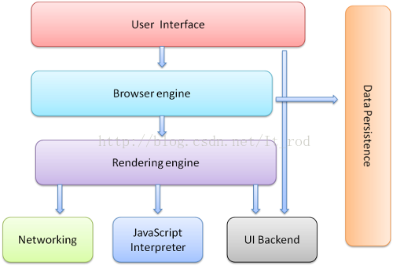

## 进程与线程

### 进程

学术上说，进程是一个具有一定独立功能的程序在一个数据集上的一次动态执行的过程，是操作系统进行资源分配和调度的一个独立单位，是应用程序运行的载体。我们这里将进程比喻为工厂的车间，它代表CPU所能处理的单个任务。任一时刻，CPU总是运行一个进程，其他进程处于非运行状态。

### 线程

在早期的操作系统中并没有线程的概念，进程是能拥有资源和独立运行的最小单位，也是程序执行的最小单位。任务调度采用的是时间片轮转的抢占式调度方式，而进程是任务调度的最小单位，每个进程有各自独立的一块内存，使得各个进程之间内存地址相互隔离。后来，随着计算机的发展，对CPU的要求越来越高，进程之间的切换开销较大，已经无法满足越来越复杂的程序的要求了。于是就发明了线程，线程是程序执行中一个单一的顺序控制流程，是程序执行流的最小单元。这里把线程比喻一个车间的工人，即一个车间可以允许由多个工人协同完成一个任务。

### 进程与线程的关系

进程是操作系统分配资源的最小单元，线程是程序的最小单元。
一个进程最少有一个线程，可以有多个线程。
进程之间相互独立，同一进程下的线程共享程序的内存空间和进程下的资源。
调度和切换：线程上下文切换比进程上下文切换快得多。

### 多进程和多线程

多进程就是你一边听歌一边写代码，进程之间互不影响，并发运行。
多线程是指程序中包含多个执行流，一个程序可以运行多个线程执行不同的任务。

## 浏览器的进程与线程

- 浏览器进程（Browser）：浏览器的主进程，作用如下
  - 负责浏览器界面的显示，与用户交互
  - 负责各个页面的管理，销毁和创建页面
  - 将 Render 进程得到的 Bitmap 绘制到界面上
  - 网络资源的管理
- GPU 进程：3D 绘制等
- 浏览器渲染进程（Render 进程，内部是多线程的）

## 浏览器为什么要多进程

在浏览器刚被设计出来的时候，网页简单，每个页面资源占有非常低，因此一个进程处理多个页面是可行的，但是随着网页的日益复杂，把所有页面都放进一个进程里会导致一个网页崩溃全部网页崩溃。另外线程之间共享进程资源存在安全隐患的问题。

## Browser 进程和 Render 进程、GPU 进程是如何合作的

  
  
  + Browser 进程收到用户的请求，首先由 UI 线程处理，而且将相应任务转给 IO 线程，随机将该任务传递给 Render 进程
  + Render 进程的 IO 线程经过简单解释后交给渲染线程，渲染线程接受到请求后，加载网页并渲染网页，期间需要 Browser 进程获取资源和 GPU 进程来帮助渲染，最后 Render 进程将结果由 IO 线程传递给 Browser 进程
  + Browser 进程接收到结果并将结果绘制出来

## 5. 浏览器 Render 进程有哪些线程

### GUI 线程

    负责渲染浏览器界面，解析 HTML，CSS，构建 DOM 树和 RenderObject 树，布局和绘制等。
    当界面需要重绘（Repaint）或由于某种操作引发回流(reflow)时，该线程就会执行
    注意，GUI 渲染线程与 JS 引擎线程是互斥的，当 JS 引擎执行时 GUI 线程会被挂起（相当于被冻结了），GUI 更新会被保存在一个队列中等到 JS 引擎空闲时立即被执行。

### JS 引擎线程

    也称为JS内核，负责处理Javascript脚本程序。（例如V8引擎）
    JS引擎线程负责解析Javascript脚本，运行代码。
    JS引擎一直等待着任务队列中任务的到来，然后加以处理，一个Tab页（renderer进程）中无论什么时候都只有一个JS线程在运行JS程序
    同样注意，GUI渲染线程与JS引擎线程是互斥的，所以如果JS执行的时间过长，这样就会造成页面的渲染不连贯，导致页面渲染加载阻塞。

### 事件触发线程

    归属于浏览器而不是JS引擎，用来控制事件循环（可以理解，JS引擎自己都忙不过来，需要浏览器另开线程协助）
    当JS引擎执行代码块如setTimeOut时（也可来自浏览器内核的其他线程,如鼠标点击、AJAX异步请求等），会将对应任务添加到事件线程中
    当对应的事件符合触发条件被触发时，该线程会把事件添加到待处理队列的队尾，等待JS引擎的处理
    注意，由于JS的单线程关系，所以这些待处理队列中的事件都得排队等待JS引擎处理（当JS引擎空闲时才会去执行）

### 定时触发线程

    传说中的`setInterval`与`setTimeout`所在线程
    浏览器定时计数器并不是由`JavaScript`引擎计数的,（因为`JavaScript`引擎是单线程的, 如果处于阻塞线程状态就会影响记计时的准确）
    因此通过单独线程来计时并触发定时（计时完毕后，添加到事件队列中，等待JS引擎空闲后执行）
    注意，W3C在HTML标准中规定，规定要求setTimeout中低于4ms的时间间隔算为4ms。

### 异步 http 请求线程

    在XMLHttpRequest在连接后是通过浏览器新开一个线程请求
    将检测到状态变更时，如果设置有回调函数，异步线程就产生状态变更事件，将这个回调再放入事件队列中。再由JavaScript引擎执行

## JS 引擎线程相关介绍

### 为什么 JavaScript 是单线程的

上面已经说得很清楚，JavaScript 引擎线程生存在 Render 进程（浏览器渲染进程），线程之间的关系我们很清楚，线程之间贡献资源互相影响。假设 JavaScript 引擎存在两个线程，那么彼此操作了同一个资源，就会造成同步问题，到底以谁为准？
所以 JavaScript 就是单线程，这已经称为了这门语言的核心特征，将来也不会改变，脚本语言多数都是如此。

