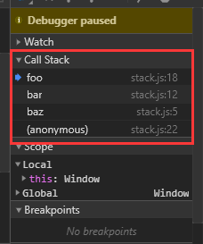

# this 全面解析

在上一张，我们排除了一些对`this`的误解，并且明白了每个函数的`this`是在调用时被绑定的，完全取决于函数的调用位置（也就是函数的调用方法）

## 调用位置

在理解`this`的绑定过程之前我们要理解什么是调用位置：

> 调用位置就是函数在代码被调用的位置（而不是声明的位置）。  
> 只有仔细分析调用位置才能回答这个问题：这个`this`到底引用的是什么？

通常来说，寻找调用位置就是寻找 **函数被调用的位置**，但是做起来并没有那么简单，因为某些编程模式可能会隐藏真正的调用位置。最重要的是要分析调用栈（就是为了达到当前执行位置所调用的所有函数）。我们关系的调用位置就在当前正在执行的函数的前一个调用中。

```javascript
function baz() {
  // 当前调用栈是 baz
  // 因此，当前调用位置是全局作用域
  console.log("baz");
  bar();
}

function bar() {
  // 当前调用栈是：baz -> bar
  // 因此，当前调用位置在baz中
  console.log("bar");
  foo();
}

function foo() {
  // 当前调用栈 baz -> bar -> foo
  // 因此当前调用位置在 bar 中
  console.log("foo");
}

baz();
```

注意我们是如何（从调用栈中）分析出真正的调用位置，因为它决定了`this`的绑定。

我们可以把调用栈想象成一个函数调用链，就像我们在前面代码段的注释所写的医用。但是这种方法实际开发中太麻烦，我们更推荐的另一种查看调用栈的方法是使用浏览器的调试工具。



## 绑定规则

1. 默认绑定
2. 隐式绑定
3. 显示绑定
4. `new`绑定

### 默认绑定

最常用的函数调用类型：独立函数调用

```javascript
function foo() {
  console.log(this.a);
}
var a = 2;
foo(); // 2
```

我们调用`foo()`，`this.a`被解析成了全局变量`a`。
为什么？因为在本例中，函数调用时应用了`this`的默认绑定，因此`this`默认指向全局对象。

那么我们怎么知道这里应用了默认绑定？我们可以通过分析调用位置来看看`foo()`是如何调用的，在代码中，`foo()`是直接使用不加任何修饰符的函数引用进行调用的，因此只能使用默认绑定，无法引用其他规则。

### 隐式绑定

另一条需要考虑的规则是调用位置是否有 **上下文对象**，或者说是否被某个 **对象** 拥有或包含。

```javascript
function foo() {
  console.log(this.a);
}

var obj = {
  a: 2,
  foo: foo,
};

obj.foo(); // 2
```

首先需要注意的是`foo()`的声明方式，及其之后是如何被当作引用属性添加到`obj`中的。
调用位置会使用`obj`上下文来引用函数，因此你可以说函数被调用时`obj`对象拥有或者包含函数引用。

无论你如何称呼这个模式，当`foo()`被调用时，它的落脚点确实指向`obj`对象。当函数引用有上下文对象时，隐式绑定规则会把函数调用中的`this`绑定到这个上下文对象。因为调用`foo()`时`this`被绑定到`obj`，因此`this.a`和`obj.a`是一样的。

**对象属性引用链中只有最顶层或者说最后一层会影响调用位置！**

```javascript
function foo() {
  console.log(this.a);
}

var obj2 = {
  a: 42,
  foo: foo,
};

var obj1 = {
  a: 2,
  obj2: obj2,
};

obj1.obj2.foo(); // 42
```

打印结果是 42 而不是 2。因为对象属性引用链只有最后一层才会影响调用位置！

#### 隐式丢失

1、隐式绑定经常会出现丢失绑定对象，见下例。

```javascript
function foo() {
  console.log(this.a);
}

var obj = {
  a: 2,
  foo: foo,
};

var bar = obj.foo; // 函数别名！
var a = "oops, global"; // a 是全局对象的属性
bar(); // "oops, global"
```

虽然`bar`是`obj.foo`的一个引用，但是实际上，它引用的是`foo`函数本身，因此，此时的`bar()`其实是一个不带任何修饰的函数调用，因此应用了默认绑定。

2、一种更微妙、更常见并且更出乎意料的情况发生在传入回调函数时：

```javascript
function foo() {
  console.log(this.a);
}
function doFoo(fn) {
  // fn 其实引用的是 foo
  fn(); // <-- 调用位置！
}
var obj = {
  a: 2,
  foo: foo,
};
var a = "oops, global"; // a 是全局对象的属性
doFoo(obj.foo); // "oops, global"
```

参数传递其实就是一种隐式赋值，因此我们传入函数时也会被隐式赋值，所以结果和上一
个例子一样。

如果把函数传入语言内置的函数而不是传入你自己声明的函数，会发生什么呢？结果是一
样的，没有区别：

```javascript
function foo() {
  console.log(this.a);
}

var obj = {
  a: 2,
  foo: foo,
};

var a = "oops, global"; // a 是全局对象的属性
setTimeout(obj.foo, 100); // "oops, global"
```

这个原因很简单，我们看下面这段伪代码，就明白了

```javascript
// JavaScript 环境中内置的 setTimeout() 函数实现和下面的伪代码类似：
function setTimeout(fn, delay) {
  // 等待 delay 毫秒
  fn(); // <-- 调用位置！
}
```

就像我们看到的那样，回调函数丢失`this`绑定是非常常见的。
除此之外，还有一种情况`this`的行为会出乎我们意料：调用回调函数的函数可能会修改`this`。在一些流行的`JavaScript`库中事件处理器常会把回调函数的`this`强制绑定到触发事件的`DOM`元素上。
这在一些情况下可能很有用，但是有时它可能会让你感到非常郁闷。遗憾的是，这些工具通常无法选择是否启用这个行为。无论是哪种情况，`this`的改变都是意想不到的，实际上你无法控制回调函数的执行方式，因此就没有办法控制会影响绑定的调用位置。之后我们会介绍如何通过固定`this`来修复（这里是双关，"修复"和"固定"的英语单词都是`fix`）这个问题。

### 显示绑定

就像我们刚才看到的那样，在分析隐式绑定时，我们必须在一个对象内部包含一个指向函数的属性，并通过这个属性间接引用函数，从而把`this`间接（隐式）绑定到这个对象上。那么如果我们不想在对象内部包含函数引用，而想在某个对象上强制调用函数，该怎么做呢？
`JavaScript`中的函数都有一些有用的特性（这和它们的原型有关），可以用来解决这个问题。具体点说，可以使用函数的`call(..)`和`apply(..)`方法。严格来说，`JavaScript`的宿主环境有时会提供一些非常特殊的函数，它们并没有这两个方法。但是这样的函数非常罕见，`JavaScript`提供的绝大多数函数以及你自己创建的所有函数都可以使用`call(..)`和`apply(..)`方法。
这两个方法是如何工作的呢？它们的第一个参数是一个对象，它们会把这个对象绑定到`this`，接着在调用函数时指定这个`this`。因为你可以直接指定`this`的绑定对象，因此我们称之为 **显式绑定**

```javascript
function foo() {
  console.log(this.a);
}
var obj = {
  a: 2,
};
foo.call(obj); // 2
```

通过`foo.call(..)`，我们可以在调用`foo`时强制把它的`this`绑定到`obj`上。如果你传入了一个原始值（字符串类型、布尔类型或者数字类型）来当作`this`的绑定对象，这个原始值会被转换成它的对象形式，也就是`new String(..)`、`new Boolean(..)`或者`new Number(..)`。这通常被称为 *装箱*。

可惜，显式绑定仍然无法解决我们之前提出的丢失绑定问题

```javascript
function foo() {
  console.log(this.a);
}
var obj = {
  a: 2,
};
var bar = function () {
  foo.call(obj);
};

bar(); // 2
setTimeout(bar, 100); // 2

// 硬绑定的 bar 不可能再修改它的 this
bar.call(window); // 2
```

我们来看看这个变种到底是怎样工作的。我们创建了函数`bar()`，并在它的内部手动调用了`foo.call(obj)`，因此强制把`foo`的`this`绑定到了`obj`。无论之后如何调用函数`bar`，它总会手动在`obj`上调用`foo`。这种绑定是一种显式的强制绑定，因此我们称之为硬绑定。就是创建一个包裹函数，传入所有的参数并返回接收到的所有值：

```javascript
function foo(something) {
  console.log(this.a, something);
  return this.a + something;
}
var obj = {
  a: 2,
};
var bar = function () {
  return foo.apply(obj, arguments);
};
var b = bar(3); // 2 3
console.log(b); // 5
```

另一种使用方法是创建一个`i`可以重复使用的辅助函数：

```javascript
function foo(something) {
  console.log(this.a, something);
  return this.a + something;
}
// 简单的辅助绑定函数
function bind(fn, obj) {
  return function () {
    return fn.apply(obj, arguments);
  };
}
var obj = {
  a: 2,
};
var bar = bind(foo, obj);
var b = bar(3); // 2 3
console.log(b); // 5
```

由于硬绑定是一种非常常用的模式，所以在`ES5`中提供了内置的方法`Function.prototype.bind`，它的用法如下：

```javascript
function foo(something) {
  console.log(this.a, something);
  return this.a + something;
}
var obj = {
  a: 2,
};
var bar = foo.bind(obj);
var b = bar(3); // 2 3
console.log(b); // 5
```

`bind(..)`会返回一个硬绑定的新函数，它会把参数设置为`this`的上下文并调用原始函数。

API 调用的"上下文"
第三方库的许多函数，以及`JavaScript`语言和宿主环境中许多新的内置函数，都提供了一个可选的参数，通常被称为"上下文"（context），其作用和`bind(..)`一样，确保你的回调函数使用指定的`this`。
举例来说：

```javascript
function foo(el) {
  console.log(el, this.id);
}
var obj = {
  id: "awesome",
};

// 调用 foo(..) 时把 this 绑定到 obj
[1, 2, 3].forEach(foo, obj); // 1 awesome 2 awesome 3 awesome
```

这些函数实际上就是通过`call(..)`或者`apply(..)`实现了显式绑定，这样你可以少些一些代码。

### new 绑定

这是第四条也是最后一条`this`的绑定规则，在讲解它之前我们首先需要澄清一个非常常见的关于`JavaScript`中函数和对象的误解。在传统的面向类的语言中，"构造函数"是类中的一些特殊方法，使用`new`初始化类时会调用类中的构造函数。通常的形式是这样的：

```javascript
something = new MyClass(..);
```

`JavaScript`也有一个`new`操作符，使用方法看起来也和那些面向类的语言一样，绝大多数开发者都认为`JavaScript`中`new`的机制也和那些语言一样。然而，`JavaScript`中`new`的机制实际上和面向类的语言完全不同。

首先我们重新定义一下`JavaScript`中的"构造函数"。在`JavaScript`中，构造函数只是一些使用`new`操作符时被调用的函数。它们并不会属于某个类，也不会实例化一个类。实际上，它们甚至都不能说是一种特殊的函数类型，它们只是被`new`操作符调用的普通函数而已。举例来说，思考一下`Number(..)`作为构造函数时的行为，ES5.1 中这样描述它：

>Number 构造函数  
当 Number 在 new 表达式中被调用时，它是一个构造函数：它会初始化新创建的对象。所以，包括内置对象函数在内的所有函数都可以用 new 来调用，这种函数调用被称为构造函数调用。这里有一个重要但是非常细微的区别：实际上并不存在所谓的"构造函数"，只有对于函数的"构造调用"。使用"new"来调用函数，或者说发生构造函数调用时，会自动执行下面的操作。

1. 创建（或者说构造）一个全新的对象
2. 这个新对象会被执行 [[ 原型 ]] 连接
3. 这个新对象会绑定到函数调用的 this
4. 如果函数没有返回其他对象，那么 new 表达式中的函数调用会自动返回这个新对象

我们现在关心的是第 1 步、第 3 步、第 4 步，所以暂时跳过第 2 步。
思考下面的代码：

```javascript
function foo(a) {
  this.a = a;
}
var bar = new foo(2);
console.log(bar.a); // 2
```

使用`new`来调用`foo(..)`时，我们会构造一个新对象并把它绑定到`foo(..)`调用中的`this`上。new 是最后一种可以影响函数调用时`this`绑定行为的方法，我们称之为`new`绑定。

## 优先级

现在我们已经了解了函数调用中 this 绑定的四条规则，你需要做的就是找到函数的调用位置并判断应当应用哪条规则。但是，如果某个调用位置可以应用多条规则该怎么办？为了解决这个问题就必须给这些规则设定优先级，这就是我们接下来要介绍的内容。毫无疑问，默认绑定的优先级是四条规则中最低的，所以我们可以先不考虑它。
隐式绑定和显式绑定哪个优先级更高？我们来测试一下：

```javascript
function foo() {
  console.log( this.a );
}
var obj1 = {
  a: 2,
  foo: foo
};
var obj2 = {
  a: 3,
  foo: foo
};

obj1.foo(); // 2
obj2.foo(); // 3
obj1.foo.call( obj2 ); // 3
obj2.foo.call( obj1 ); // 2
```

可以看到，显式绑定优先级更高，也就是说在判断时应当先考虑是否可以应用显式绑定。
然后，我们还需要搞清楚`new`绑定和隐式绑定的优先级谁高谁低：

```javascript
function foo(something) {
  this.a = something;
}
var obj1 = {
  foo: foo
};
var obj2 = {};
obj1.foo(2);

console.log(obj1.a); // 2
obj1.foo.call(obj2, 3);
console.log(obj2.a); // 3
var bar = new obj1.foo(4);
console.log(obj1.a); // 2
console.log(bar.a); // 4
```

可以看到`new`绑定比隐式绑定优先级高。但是`new`绑定和显式绑定谁的优先级更高呢？`new`和`call/apply`无法一起使用，因此无法通过`new foo.call(obj1)`来直接进行测试。但是我们可以使用硬绑定来测试它俩的优先级。

在看代码之前先回忆一下硬绑定是如何工作的。`Function.prototype.bind(..)`会创建一个新的包装函数，这个函数会忽略它当前的`this`绑定（无论绑定的对象是什么），并把我们提供的对象绑定到`this`上。这样看起来硬绑定（也是显式绑定的一种）似乎比`new`绑定的优先级更高，无法使用`new`来控制`this`绑定。
我们看看是不是这样：

```javascript
function foo(something) {
  this.a = something;
}
var obj1 = {};
var bar = foo.bind(obj1);
bar(2);
console.log(obj1.a); // 2
var baz = new bar(3);
console.log(obj1.a); // 2
console.log(baz.a); // 3
```

出乎意料！ `bar`被硬绑定到`obj1`上，但是`new bar(3)`并没有像我们预计的那样把`obj1.a`修改为`3`。相反，`new`修改了硬绑定（到 obj1 的）调用 bar(..) 中的`this`。因为使用了`new`绑定，我们得到了一个名字为`baz`的新对象，并且`baz.a`的值是`3`。

再来看看我们之前介绍的“裸”辅助函数 bind：

```javascript
function bind(fn, obj) {
  return function () {
    fn.apply(obj, arguments);
  };
}
```

非常令人惊讶，因为看起来在辅助函数中`new`操作符的调用无法修改`this`绑定，但是在刚才的代码中`new`确实修改了`this`绑定。
实际上，ES5 中内置的`Function.prototype.bind(..)`更加复杂。下面是`MDN`提供的一种`bind(..)`实现，为了方便阅读我们对代码进行了排版：

```javascript
if (!Function.prototype.bind) {
  Function.prototype.bind = function (oThis) {
    if (typeof this !== "function") {
      // 与 ECMAScript 5 最接近的
      // 内部 IsCallable 函数
      throw new TypeError(
        "Function.prototype.bind - what is trying " +
        "to be bound is not callable");
    }
    var aArgs = Array.prototype.slice.call(arguments, 1),
      fToBind = this,
      fNOP = function () { },
      fBound = function () {
        return fToBind.apply(
          (
            this instanceof fNOP &&
              oThis ? this : oThis
          ),
          aArgs.concat(
            Array.prototype.slice.call(arguments)
          );
      }
      ;
    fNOP.prototype = this.prototype;
    fBound.prototype = new fNOP();
    return fBound;
  };
}
```

>这种`bind(..)`是一种`polyfill`代码（`polyfill`就是我们常说的刮墙用的腻子，`polyfill`代码主要用于旧浏览器的兼容，比如说在旧的浏览器中并没有内置`bind`函数，因此可以使用`polyfill`代码在旧浏览器中实现新的功能），对于`new`使用的硬绑定函数来说，这段`polyfill`代码和`ES5`内置的`bind(..)`函数并不完全相同（后面会介绍为什么要在`new`中使用硬绑定函数）。由于`polyfill`并不是内置函数，所以无法创建一个不包含`.prototype`的函数，因此会具有一些副作用。如果你要在 `new`中使用硬绑定函数并且依赖`polyfill`代码的话，一定要非常小心。

下面是`new`修改`this`的相关代码：

```javascript
this instanceof fNOP && oThis ? this : oThis
// ... 以及：
fNOP.prototype = this.prototype;
fBound.prototype = new fNOP();
```

我们并不会详细解释这段代码做了什么（这非常复杂并且不在我们的讨论范围之内），不过简单来说，这段代码会判断硬绑定函数是否是被`new`调用，如果是的话就会使用新创建的`this`替换硬绑定的`this`。

那么，为什么要在`new`中使用硬绑定函数呢？直接使用普通函数不是更简单吗？之所以要在`new`中使用硬绑定函数，主要目的是预先设置函数的一些参数，这样在使用`new`进行初始化时就可以只传入其余的参数。`bind(..)`的功能之一就是可以把除了第一个参数（第一个参数用于绑定`this`）之外的其他参数都传给下层的函数（这种技术称为"部分应用"，是"[柯里化](/post/881c7e7f-d263-4e30-baef-089db3df104f/)"的一种）。举例来说：

```javascript
function foo(p1, p2) {
  this.val = p1 + p2;
}
// 之所以使用 null 是因为在本例中我们并不关心硬绑定的 this 是什么
// 反正使用 new 时 this 会被修改
var bar = foo.bind(null, "p1");
var baz = new bar("p2");
baz.val; // p1p2
```
## 判断 this

我们现在根据上面讲过的优先级来判断函数再某个调用位置应用的是哪条规则。
1. 函数是否再`new`中调用（`new`绑定）？如果是的话`this`绑定的就是新创建的对象。

```javascript
var foo = new bar();
```

2. 函数是否通过`call`、`apply`（显示绑定）或者硬绑定调用？如果是的话，`this`绑定的就是指定的对象

```javascript
var foo = new bar(obj2);
```

3. 函数是否在某个上下文对象中调用（默认绑定）？如果是的话，`this`绑定的是那个上下问对象

```javascript
var foo = obj1.bar();
```

4. 如果都不是的话，使用默认绑定。如果在严格模式下，就绑定到`undefined`，否则绑定到全局对象。

```javascript
var foo = bar();
```

## 绑定例外

在某些场景下`this`的绑定行为会出乎意料，你认为应当应用其他绑定规则时，实际上应用的可能是默认绑定规则。

### 被忽略的this

如果你把`null`或者`undefined`作为`this`的绑定对象传入`call`、`apply`或者`bind`，这些值在调用时会被忽略，实际应用的是默认绑定规则：

```javascript
function foo() {
  console.log( this.a );
}
var a = 2;
foo.call( null ); // 2
```

那么什么情况下你会传入`null`呢？
一种非常常见的做法是使用`apply(..)`来"展开"一个数组，并当作参数传入一个函数。类似地，`bind(..)`可以对参数进行柯里化（预先设置一些参数），这种方法有时非常有用：

```javascript
function foo(a, b) {
  console.log("a:" + a + ", b:" + b);
}
// 把数组“展开”成参数
foo.apply(null, [2, 3]); // a:2, b:3
// 使用 bind(..) 进行柯里化
var bar = foo.bind(null, 2);
bar(3); // a:2, b:3
```

这两种方法都需要传入一个参数当作`this`的绑定对象。如果函数并不关心`this`的话，你仍然需要传入一个占位值，这时`null`可能是一个不错的选择，就像代码所示的那样。

>尽管本书中未提到，在`ES6`中，可以用 ... 操作符代替`apply(..)`来"展开"数组，`foo(...[1,2])`和`foo(1,2)`是一样的，这样可以避免不必要的`this`绑定。可惜，在`ES6`中没有柯里化的相关语法，因此还是需要使用`bind(..)`。

然而，总是使用`null`来忽略`this`绑定可能产生一些副作用。如果某个函数确实使用了`this`（比如第三方库中的一个函数），那默认绑定规则会把`this`绑定到全局对象（在浏览器中这个对象是`window`），这将导致不可预计的后果（比如修改全局对象）。显而易见，这种方式可能会导致许多难以分析和追踪的`bug`。

### 间接引用

另一个需要注意的是，你有可能（有意或者无意地）创建一个函数的“间接引用”，在这种情况下，调用这个函数会应用默认绑定规则。间接引用最容易在赋值时发生：

```javascript
function foo() {
  console.log( this.a );
}
var a = 2;
var o = { a: 3, foo: foo };
var p = { a: 4 };
o.foo(); // 3
(p.foo = o.foo)(); // 2
```

赋值表达式`p.foo = o.foo`的返回值是目标函数的引用，因此调用位置是`foo()`而不是`p.foo()`或者`o.foo()`。根据我们之前说过的，这里会应用默认绑定。
注意：对于默认绑定来说，决定`this`绑定对象的并不是调用位置是否处于严格模式，而是函数体是否处于严格模式。如果函数体处于严格模式，`this`会被绑定到`undefined`，否则`this`会被绑定到全局对象。

### 软绑定

之前我们已经看到过，硬绑定这种方式可以把`this`强制绑定到指定的对象（除了使用`new`时），防止函数调用应用默认绑定规则。问题在于，硬绑定会大大降低函数的灵活性，使用硬绑定之后就无法使用隐式绑定或者显式绑定来修改`this`。如果可以给默认绑定指定一个全局对象和`undefined`以外的值，那就可以实现和硬绑定相同的效果，同时保留隐式绑定或者显式绑定修改`this`的能力。可以通过一种被称为软绑定的方法来实现我们想要的效果：

```javascript
if (!Function.prototype.softBind) {
  Function.prototype.softBind = function (obj) {
    var fn = this;
    // 捕获所有 curried 参数
    var curried = [].slice.call(arguments, 1);
    var bound = function () {
      return fn.apply(
        (!this || this === (window || global)) ?
          obj : this,
        curried.concat.apply(curried, arguments)
      );
    };
    bound.prototype = Object.create(fn.prototype);
    return bound;
  };
}
```

除了软绑定之外，softBind(..) 的其他原理和 ES5 内置的 bind(..) 类似。它会对指定的函数进行封装，首先检查调用时的 this，如果 this 绑定到全局对象或者 undefined，那就把指定的默认对象 obj 绑定到 this，否则不会修改 this。此外，这段代码还支持可选的柯里化（详情请查看之前和 bind(..) 相关的介绍）。

下面我们看看 softBind 是否实现了软绑定功能：

```javascript
function foo() {
  console.log("name: " + this.name);
}
var obj = { name: "obj" },
  obj2 = { name: "obj2" },
  obj3 = { name: "obj3" };
var fooOBJ = foo.softBind(obj);
fooOBJ(); // name: obj
obj2.foo = foo.softBind(obj);
obj2.foo(); // name: obj2 <---- 看！！！
fooOBJ.call(obj3); // name: obj3 <---- 看！
setTimeout(obj2.foo, 10); // name: obj <---- 应用了软绑定
```

可以看到，软绑定版本的 foo() 可以手动将 this 绑定到 obj2 或者 obj3 上，但如果应用默认绑定，则会将 this 绑定到 obj。

## this词法

我们之前介绍的四条规则已经可以包含所有正常的函数。但是`ES6`中介绍了一种无法使用这些规则的特殊函数类型：箭头函数。
箭头函数并不是使用`function`关键字定义的，而是使用被称为"胖箭头"的操作符 => 定义的。箭头函数不使用`this`的四种标准规则，而是根据外层（函数或者全局）作用域来决定`this`。
我们来看看箭头函数的词法作用域：

```javascript
function foo() {
  // 返回一个箭头函数
  return (a) => {
    //this 继承自 foo()
    console.log(this.a);
  };
}
var obj1 = {
  a: 2
};
var obj2 = {
  a: 3
};
var bar = foo.call(obj1);
bar.call(obj2); // 2, 不是 3 ！
```

foo() 内部创建的箭头函数会捕获调用时 foo() 的 this。由于 foo() 的 this 绑定到 obj1，
bar（引用箭头函数）的 this 也会绑定到 obj1，箭头函数的绑定无法被修改。（new 也不
行！）
箭头函数最常用于回调函数中，例如事件处理器或者定时器：

```javascript
function foo() {
  setTimeout(() => {
    // 这里的 this 在此法上继承自 foo()
    console.log(this.a);
  }, 100);
}
var obj = {
  a: 2
};
foo.call(obj); // 2
```

箭头函数可以像`bind(..)`一样确保函数的`this`被绑定到指定对象，此外，其重要性还体现在它用更常见的词法作用域取代了传统的`this`机制。实际上，在`ES6`之前我们就已经在使用一种几乎和箭头函数完全一样的模式。

```javascript
function foo() {
  var self = this; // lexical capture of this
  setTimeout(function () {
    console.log(self.a);
  }, 100);
}
var obj = {
  a: 2
};
foo.call(obj); // 2
```

虽然`self = this`和箭头函数看起来都可以取代`bind(..)`，但是从本质上来说，它们想替代的是`this`机制。如果你经常编写 `this`风格的代码，但是绝大部分时候都会使用`self = this`或者箭头函数来否定`this`机制，那你或许应当：

1. 只使用词法作用域并完全抛弃错误`this`风格的代码；
2. 完全采用`this`风格，在必要时使用`bind(..)`，尽量避免使用`self = this`和箭头函数。

当然，包含这两种代码风格的程序可以正常运行，但是在同一个函数或者同一个程序中混合使用这两种风格通常会使代码更难维护，并且可能也会更难编写。

## 小结

如果要判断一个运行中函数的`this`绑定，就需要找到这个函数的直接调用位置。找到之后就可以顺序应用下面这四条规则来判断  `this`的绑定对象。

1. 由`new`调用？绑定到新创建的对象。
2. 由`call`或者`apply`（或者`bind`）调用？绑定到指定的对象。
3. 由上下文对象调用？绑定到那个上下文对象。
4. 默认：在严格模式下绑定到`undefined`，否则绑定到全局对象。

