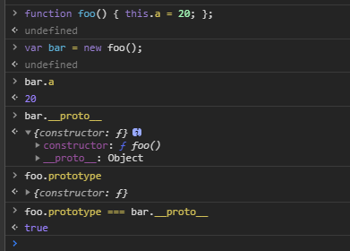

# 原型

## [[Prototype]]

`JavaScript`中的对象有一个特殊的`[[prototype]]`内置属性，其实就是对于其他对象的引用。几乎所有的对象在创建时`[[prototype]]`属性都会被默认赋予一个空的值。

`[[prototype]]`有啥用呢？当我们试图引用对象的属性就会出发`[[Get]]`操作，比如`myObject.a`。对于默认的`[[Get]]`操作来说，第一步是检查对象本身是否有这个属性，如果有的话就使用它，如果没有就需要使用对象的原型链了。

```javascript
var anOtherObject=  {
  a: 2
};

anOtherObject.a; // 2
```

我们知道，除了`null`和`undefined`以外都是对象。每一个对象都有自己的属性和方法。那么当我们访问一个对象的属性的时候，如果这个对象没有这个属性，引擎就会往原型链上向上查找，一个对象除了拥有自己的属性和方法，也会继承来自原型上层的父级对象的属性。所以，引擎会向上查找直至找到原型链上的对象或达到原型链的顶层。

```javascript
//// 假定有一个对象 o, 其自身的属性（own properties）有 a 和 b：
// {a: 1, b: 2}
// o 的原型 o.[[Prototype]]有属性 b 和 c：
// {b: 3, c: 4}
// 最后, o.[[Prototype]].[[Prototype]] 是 null.
// 这就是原型链的末尾，即 null，
// 根据定义，null 没有[[Prototype]].
// 综上，整个原型链如下: 
// {a:1, b:2} ---> {b:3, c:4} ---> null
console.log(o.a); // 1
// a是o的自身属性吗？是的，该属性的值为1

console.log(o.b); // 2
// b是o的自身属性吗？是的，该属性的值为2
// o.[[Prototype]]上还有一个'b'属性,但是它不会被访问到.这种情况称为"属性遮蔽 (property shadowing)".

console.log(o.c); // 4
// c是o的自身属性吗？不是，那看看o.[[Prototype]]上有没有.
// c是o.[[Prototype]]的自身属性吗？是的,该属性的值为4

console.log(o.d); // undefined
// d是o的自身属性吗？不是,那看看o.[[Prototype]]上有没有.
// d是o.[[Prototype]]的自身属性吗？不是，那看看o.[[Prototype]].[[Prototype]]上有没有.
// o.[[Prototype]].[[Prototype]]为null，停止搜索，
// 没有d属性，返回undefined
```

上面是一个原型链的模型，每个函数都有一个原型属性`prototype`指向自己的原型，而由这个函数创建的对象也有一个`_proto_ `属性指向这个原型。

我们可以看到这里面有`_proto_`和`prototype`这两个东西。如果你有使用过`chrome`的`develop tools`或者`vscode`进行单步调试的经验的话你会经常看到`_proto_`这个字段。那么，这个到底是什么意思呢？

先看`_proto_`开始说起

每一个`JS`对象一定对应一个原型对象，并且从原型对象那里继承属性和方法。（重点）

> Every JavaScript object has a second JavaScript object (or null, but this is rare) associated with it. This second object is known as a prototype, and the first object inherits properties from the prototype.

看下面这个例子：

```javascript
var one = {x: 1};
var two = new Object();
one.__proto__ === Object.protopyte //true
two.__proto__ === Object.prototype //true
one.toSting === one.__proto__.toString //true
```

我们看到`one`和`two`都拥有一个`__proto__`属性，且原型对象都是`Object.prototype`，拥有对象上的属性和方法。

那么，`Object.prototype`到底是个啥？我们先把这个问题往后放，先搞清楚`prototype`和`_proto_`有什么区别？



首先，`prototype`和`_proto_`的第一个区别就在于：每一个对象都会有一个`_proto_`属性来标示自己所继承的原型。但是函数才会有`prototype`属性。当我们创建函数的时候，`JS`会为这个函数追加一个`prototype`属性。当我们尝试把这个函数当成一个构造函数来调用的时候，那么`JS`就会创建这个构造函数的实例，这个实例会继承构造函数`prototype`的所有属性和方法。同时实例会通过`_proto_`指向构造函数的`prototype`。

于是`JS`就是这样通过`_proto_`和`prototype`来实现原型链。

构造函数就是通过`prototype`来保存要共享给实例的属性和方法。

对象的`_proto_`总是指向自己的构造函数的`prototype`

## Object.prototype

哪里是`[[prototype]]`的尽头呢？如上图，我们顺着箭头方向可以看到所有普通的`[[prototype]]`链最终都会指向内置的`Object.prototype`。由于所有的普通对象都源于这个对象，所以它包含了`JavaScript`中许多通用的功能。

有些功能我们已经很熟悉了，比如说`.toString()`和`.valueOf()`等等。

给一个对象设置属性并不仅仅是添加一个新属性或者修改已有的属性值。现在我们完整地讲解一下这个过程

```javascript
myObject.foo = "bar";
```

如果`myObject`对象中包含名为`foo`的普通数据访问属性，这条赋值语句只会修改已有的属性值。

如果`foo`不是直接存在于`myObject`中，`[[Prototype]]`链就会被遍历，类似`[[Get]]`操作。如果原型链上找不到`foo`，`foo`就会被直接添加到`myObject`上。

然而，如果`foo`存在于原型链上层，赋值语句`myObject.foo = "bar"`的行为就会有些不同（而且可能很出人意料）。稍后我们会进行介绍。

如果属性名`foo`既出现在`myObject`中也出现在`myObject`的`[[Prototype]]`链上层，那么就会发生屏蔽。`myObject`中包含的`foo`属性会屏蔽原型链上层的所有`foo`属性，因为`myObject.foo`总是会选择原型链中最底层的`foo`属性。

屏蔽比我们想象中更加复杂。下面我们分析一下如果`foo`不直接存在于`myObject`中而是存在于原型链上层时`myObject.foo = "bar"`会出现的三种情况。

1. 如果在`[[Prototype]]`链上层存在名为`foo`的普通数据访问属性（参见第 3 章）并且没有被标记为只（writable:false），那就会直接在`myObject`中添加一个名为`foo`的新属性，它是屏蔽属性。
2. 如果在 [[Prototype]] 链上层存在 foo，但是它被标记为只读（writable:false），那么无法修改已有属性或者在 myObject 上创建屏蔽属性。如果运行在严格模式下，代码会抛出一个错误。否则，这条赋值语句会被忽略。总之，不会发生屏蔽。
3. 如果在 [[Prototype]] 链上层存在 foo 并且它是一个 setter（参见第 3 章），那就一定会调用这个 setter。foo 不会被添加到（或者说屏蔽于）myObject，也不会重新定义 foo 这个 setter。

给对象添加属性大多数情况是第一种情况，但是当原型链已存在该同名属性时，我们就不能用`=`来赋值了。我们可以用`Object.defineProperty`来向对象添加属性。

