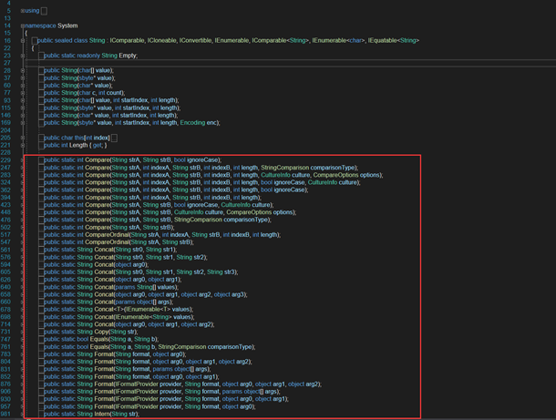
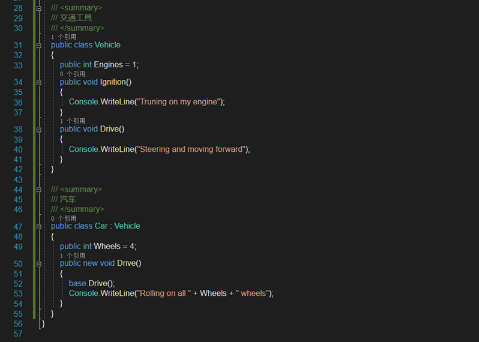
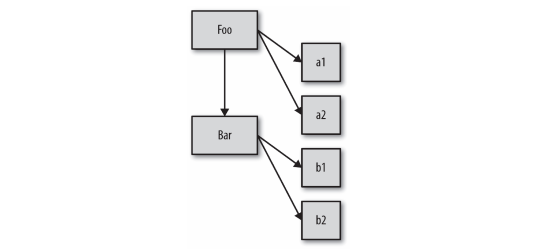
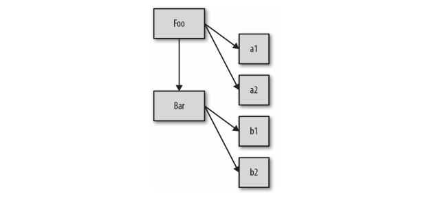

# 类

## 前言

`JavaScript`提供了更接近传统语言的写法，引入了`class`（类），作为对象的模板。通过`class`关键字，可以定义类。

## 类理论

类 / 继承描述了一种代码的组织结构形式 ，一种在软件中对真实世界中问题领域的建模方法。

面向对象编程强调的是数据和操作数据的行为本质上是互相关联的（当然，不同的数据有不同的行为），因此好的设计就是把数据以及和它相关的行为打包（或者说封装）起来。这在正式的计算机科学中有时被称为数据结构。



面向对象编程强调的是**数据和数据操作的行为本质上是互相关联的**，因此，好的设计就是将数据和数据相关的行为打包（封装）起来。这在正式的计算机科学中有时被称为数据结构。

我们在多个类似的对象上抽象出它们的共性，比如我看到笔筒里的一筒笔，有钢笔、铅笔、圆珠笔、画笔等等，它们都有不同的属性，有的是红色，有的是蓝色，有的是黑色，它们有不同的品牌等等，这些都是它们的属性。它们的行为有那些？它们都可以写字，它们可以捅人....。罗列出它们所有的属性和行为，我们会发现它们好像都有一个共性————它们都属于笔。我们可以说，钢笔属于笔，毛笔属于笔，铅笔也属于笔，它们都可以写，它们都有品牌。这就是**继承**的概念。

我们还可以使用类对数据结构进行分类，可以把任意数据结构看作范围更广的定义的一种特例。 我们来看一个常见的例子，“汽车”可以被看作“交通工具”的一种特例，后者是更广泛的类。 我们可以在软件中定义一个 Vehicle 类和一个 Car 类来对这种关系进行建模。

Vehicle 的定义可能包含推进器（比如引擎）、载人能力等等，这些都是 Vehicle 的行为。我们在 Vehicle 中定义的是（几乎）所有类型的交通工具（飞机、火车和汽车）都包含的东西。

在我们的软件中，对不同的交通工具重复定义“载人能力”是没有意义的。相反，我们只在 Vehicle 中定义一次，定义 Car 时，只要声明它继承（或者扩展）了 Vehicle 的这个基础定义就行。Car 的定义就是对通用 Vehicle 定义的特殊化。



## “类”设计模式

我们从来没有把类作为设计模式来看待，讨论得最多的是面向对象设计模式，比如迭代器模式、观察者模式、工厂模式、单例模式，等等。从这个角度来说，我们似乎是在（低级）面向对象类的基础上实现了所有（高级）设计模式，似乎面向对象是优秀代码的基础。

如果熟悉函数式编程，那你就知道类也是一种非常常用的一种设计模式。类并不是必须的编程基础，是一种可选的代码抽象。

### `JavaScript`中的“类”

`JavaScript`属于哪一类呢？在相当长的一段时间里，`JavaScript`只有一些近似类的语法元素（`new`、`instanceof`)，不过在后来的`ES6`特性中新增了一些元素，比如`class`关键字。

那这是不是意味着`JavaScript`中实际上有类呢？简单来说，不是。

类是一种设计模式，所以我们可以用一些方法，来实习类的功能，为了满足对于类设计模式的最普遍需求，`JavaScript`提供了一些近似类的语法。

虽然有近似类的语法，但是`JavaScript`的机制一直在阻止我们使用类设计模式，在近似类的表象之下，`JavaScript`的机制其实和类完全不同。

## 类的机制

### 建造

“类”和“实例”的概念来源于房屋建造。建筑师会规划出一个建筑的所有特性：多宽、多高、多少个窗户以及窗户的位置，甚至连建造墙和房顶需要的材料都要计划好。在这个阶段他并不需要关心建筑会被建在哪，也不需要关心会建造多少个这样的建筑。

建筑师也不太关心建筑里的内容——家具、壁纸、吊扇等——他只关心需要用什么结构来容纳它们。

建筑蓝图只是建筑计划，它们并不是真正的建筑，我们还需要一个建筑工人来建造建筑。建筑工人会按照蓝图建造建筑。实际上，他会把规划好的特性从蓝图中复制到现实世界的建筑中。

完成后，建筑就成为了蓝图的物理实例，本质上就是对蓝图的复制。之后建筑工人就可以到下一个地方，把所有工作都重复一遍，再创建一份副本。

建筑和蓝图之间的关系是间接的。你可以通过蓝图了解建筑的结构，只观察建筑本身是无法获得这些信息的。但是如果你想打开一扇门，那就必须接触真实的建筑才行——蓝图只能表示门应该在哪，但并不是真正的门。

一个类就是一张蓝图。为了获得真正可以交互的对象，我们必须按照类来建造（也可以说实例化）一个东西，这个东西通常被称为实例，有需要的话，我们可以直接在实例上调用方法并访问其所有公有数据属性。这个对象就是类中描述的所有特性的一份副本。

你走进一栋建筑时，它的蓝图不太可能挂在墙上（尽管这个蓝图可能会保存在公共档案馆中）。类似地，你通常也不会使用一个实例对象来直接访问并操作它的类，不过至少可以判断出这个实例对象来自哪个类。

把类和实例对象之间的关系看作是直接关系而不是间接关系通常更有助于理解。类通过复制操作被实例化为对象形式：



如你所见，箭头的方向是从左向右、从上向下，它表示概念和物理意义上发生的复制操作。

### 构造方法

类实例是由一个特殊的类方法构造的，这个方法名通常和类名相同，被称为构造函数。这个方法的任务就是初始化实例需要的所有信息（状态）。
举例来说，思考下面这个关于类的伪代码（编造出来的语法）：

```javascript
class CoolGuy {
    specialTrick = nothing CoolGuy(trick) {
        specialTrick = trick
    }
    showOff() {
        output("Here's my trick: ", specialTrick)
    }
}
```

我们可以调用类构造函数来生成一个 CoolGuy 实例：

```javascript
Joe = new CoolGuy("jumping rope");
Joe.showOff() // 这是我的绝技：跳绳
```

注意，`CoolGuy`类有一个`CoolGuy()`构造函数，执行`new CoolGuy()`时实际上调用的就是它。构造函数会返回一个对象（也就是类的一个实例），之后我们可以在这个对象上调用`showOff()`方法，来输出指定`CoolGuy`的特长。

显然，跳绳让乔成为了一个非常酷的家伙。

类构造函数属于类，而且通常和类同名。此外，构造函数大多需要用`new`来调，这样语言引擎才知道你想要构造一个新的类实例。

在面向类的语言中，你可以先定义一个类，然后定义一个继承前者的类。后者通常被称为“子类”，前者通常被称为“父类”。这些术语显然是类比父母和孩子，不过在意思上稍有扩展，你很快就会看到。对于父母的亲生孩子来说，父母的基因特性会被复制给孩子。显然，在大多数生物的繁殖系统中，双亲都会贡献等量的基因给孩子。但是在编程语言中，我们假设只有一个父类。一旦孩子出生，他们就变成了单独的个体。虽然孩子会从父母继承许多特性，但是他是一个独一无二的存在。如果孩子的头发是红色，父母的头发未必是红的，也不会随之变红，二者之间没有直接的联系。

同理，定义好一个子类之后，相对于父类来说它就是一个独立并且完全不同的类。子类会包含父类行为的原始副本，但是也可以**重写**所有继承的行为甚至定义新行为。

非常重要的一点是，我们讨论的父类和子类并不是实例。父类和子类的比喻容易造成一些误解，实际上我们应当把父类和子类称为父类 DNA 和子类 DNA。我们需要根据这些DNA 来创建（或者说实例化）一个人，然后才能和他进行沟通。

好了，我们先抛开现实中的父母和孩子，来看一个稍有不同的例子：不同类型的交通工具。这是一个非常典型（并且经常被抱怨）的讲解继承的例子。

首先回顾一下本章前面部分提出的 Vehicle 和 Car 类。思考下面关于类继承的伪代码：

```javascript
class Vehicle {
  engines = 1 ignition() {
    output("Turning on my engine.");
  }
  drive() {
    ignition();
    output("Steering and moving forward!")
  }
}
class Car inherits Vehicle {
  wheels = 4 drive() {
    inherited: drive() output("Rolling on all ", wheels, " wheels!")
  }
}
class SpeedBoat inherits Vehicle {
  engines = 2 ignition() {
    output("Turning on my ", engines, " engines.")
  }
  pilot() {
    inherited: drive() output("Speeding through the water with ease!")
  }
}
```

我们通过定义`Vehicle`类来假设一种发动机，一种点火方式，一种驾驶方法。但是你不可能制造一个通用的“交通工具”，因为这个类只是一个抽象的概念。
接下来我们定义了两类具体的交通工具：`Car`和`SpeedBoat`。它们都从`Vehicle`继承了通用的特性并根据自身类别修改了某些特性。汽车需要四个轮子，快艇需要两个发动机，因此它必须启动两个发动机的点火装置。

### 多态

`Car`重写了继承自父类的`drive()`方法，但是之后`Car`调用了`inherited:drive()`方法，这表明`Car`可以引用继承来的原始 `drive()`方法。快艇的`pilot()`方法同样引用了原始`drive()`方法。

> 这个技术被称为多态或者虚拟多态。在本例中，更恰当的说法是**相对**多态。

多态是一个非常广泛的话题，我们现在所说的“相对”只是多态的一个方面：任何方法都可以引用继承层次中高层的方法（无论高层的方法名和当前方法名是否相同）。之所以说“相对”是因为我们并不会定义想要访问的绝对继承层次（或者说类），而是使用相对引用“查找上一层”。

在许多语言中可以使用`super`来代替本例中的`inherited`，它的含义是超类（superclass），表示当前类的父类/祖先类。

多态的另一个方面是，在继承链的不同层次中一个方法名可以被多次定义，当调用方法时会自动选择合适的定义。

在之前的代码中就有两个这样的例子：drive() 被定义在 Vehicle 和 Car 中，ignition() 被定义在 Vehicle 和 SpeedBoat 中。

我们可以在 ignition() 中看到多态非常有趣的一点。在 pilot() 中通过相对多态引用了（继承来的）Vehicle 中的 drive()。但是那个 drive() 方法直接通过名字（而不是相对引用）引用了 ignotion() 方法。

那么语言引擎会使用哪个 ignition() 呢，Vehicle 的还是 SpeedBoat 的？实际上它会使用SpeedBoat 的 ignition()。如果你直接实例化了 Vehicle 类然后调用它的 drive()，那语言引擎就会使用 Vehicle 中的 ignition() 方法。

换言之，ignition() 方法定义的多态性取决于你是在哪个类的实例中引用它。

这似乎是一个过于深入的学术细节，但是只有理解了这个细节才能理解 JavaScript 中类似（但是并不相同）的 [[Prototype]] 机制。

在子类（而不是它们创建的实例对象！）中也可以相对引用它继承的父类，这种相对引用通常被称为 super。

还记得之前的那张图吗？



注意这些实例（a1、a2、b1 和 b2）和继承（Bar），箭头表示复制操作。从概念上来说，子类 Bar 应当可以通过相对多态引用（或者说 super）来访问父类 Foo 中的行为。需要注意，子类得到的仅仅是继承自父类行为的一份副本。子类对继承到的一个方法进行“重写”，不会影响父类中的方法，这两个方法互不影响，因此才能使用相对多态引用访问父类中的方法（如果重写会影响父类的方法，那重写之后父类中的原始方法就不存在了，自然也无法引用）。多态并不表示子类和父类有关联，子类得到的只是父类的一份副本。类的继承其实就是复制。

### 多重继承

有些面向对象语言，允许继承多个父类，多重继承意味着所有父类的定义都会被复制到子类中。

表面上看，这是一个非常有用的功能，可以把许多功能组合在一起，但是也会带来更多复杂的问题。

+ 如果两个父类中都定义了drive()方法，那么子类该引用哪个？
+ 子类引用父类的方法，需要手动指定drive()方法吗？
+ 如果B和C都继承了A类，且B和C都重写了A的drive()，那么D继承B和C该选择哪个呢？


以上问题远比看上去复杂的多，之所以说这个，是要和JavaScript机制对比，相比之下，JavaScript就要简单得多了，因为，它本身不提供多重继承的功能，许多人觉得是好事，因为不用去管上面那些问题了。

### 混入

在继承或者实例化时，JavaScript 的对象机制并不会自动执行复制行为。简单来说，JavaScript 中只有对象，并不存在可以被实例化的“类”。一个对象并不会被复制到其他对象，它们会被关联起来。

由于在其他语言中类表现出来的都是复制行为，因此 JavaScript 开发者也想出了一个方法来模拟类的复制行为，这个方法就是混入。接下来我们会看到两种类型的混入：显式和隐式。

#### 显示混入

首先我们来回顾一下之前提到的`Vehicle`和`Car`。由于`JavaScript`不会自动实现`Vehicle`到`Car`的复制行为，所以我们需要手动实现复制功能。这个功能在许多库和框架中被称为`extend(..)`，但是为了方便理解我们称之为`mixin(..)`。

```javascript
// 非常简单的 mixin(..) 例子 :
function mixin(sourceObj, targetObj) {
  for (var key in sourceObj) {
    // 只会在不存在的情况下复制
    if (! (key in targetObj)) {
      targetObj[key] = sourceObj[key];
    }
  }
  return targetObj;
}
var Vehicle = {
  engines: 1,
  ignition: function() {
    console.log("Turning on my engine.");
  },
  drive: function() {
    this.ignition();
    console.log("Steering and moving forward!");
  }
};
var Car = mixin(Vehicle, {
  wheels: 4,
  drive: function() {
    Vehicle.drive.call(this);
    console.log("Rolling on all " + this.wheels + " wheels!");
  }
});
```

> 有一点需要注意，我们处理的已经不再是类了，因为在 JavaScript 中不存在类，Vehicle 和 Car 都是对象，供我们分别进行复制和粘贴。

现在`Car`中就有了一份`Vehicle`属性和函数的副本了。从技术角度来说，函数实际上没有被复制，复制的是函数引用。所以，`Car`中的属性`ignition`只是从`Vehicle`中复制过来的对于`ignition()`函数的引用。相反，属性`engines`就是直接从`Vehicle`中复制了值 1。

`Car`已经有了`drive`属性（函数），所以这个属性引用并没有被`mixin`重写，从而保留了`Car`中定义的同名属性，实现了“子类”对“父类”属性的重写（参见`mixin(..)`例子中的`if`语句）。

##### 再说多态

我们来分析一下这条语句：`Vehicle.drive.call( this )`。这就是我所说的显式多态。还记得吗，在之前的伪代码中对应的语句是`inherited:drive()`，我们称之为相对多态。

`JavaScript`（在`ES6`之前）并没有相对多态的机制。所以，由于`Car`和`Vehicle`中都有`drive()`函数，为了指明调用对象，我们必须使用绝对（而不是相对）引用。我们通过名称显式指定`Vehicle`对象并调用它的`drive()`函数。

但是如果直接执行`Vehicle.drive()`，函数调用中的`this`会被绑定到`Vehicle`对象而不是`Car`对象（参见第 2 章），这并不是我们想要的。因此，我们会使用`.call(this)`来确保`drive()`在`Car`对象的上下文中执行。

```javascript
function mixin(sourceObj, targetObj) {
  for (var key in sourceObj) {
    // 只会在不存在的情况下复制
    if (! (key in targetObj)) {
      targetObj[key] = sourceObj[key];
    }
  }
  return targetObj;
}
var Vehicle = {
  engines: 1,
  ignition: function() {
    console.log("Turning on my engine.");
  },
  drive: function() {
    this.ignition();
    console.log("Steering and moving forward!");
  },
};
var Car = mixin(Vehicle, {
  wheels: 4,
  ignition: function() {
    console.log("Turning on car engine.");
  },
  drive: function() {
    Vehicle.drive.call(this); // 显示多态
    console.log("Rolling on all " + this.wheels + " wheels!");
  },
});
```

> 如果函数`Car.drive()`的名称标识符并没有和`Vehicle.drive()`重叠（或者说“屏蔽”）的话，我们就不需要实现方法多态，因为调用`mixin(..)`时会把函数`Vehicle.drive()`的引用复制到`Car`中，因此我们可以直接访问`this.drive()`。正是由于存在标识符重叠，所以必须使用更加复杂的显式伪多态方法。

在支持相对多态的面向类的语言中，Car 和 Vehicle 之间的联系只在类定义的开头被创建，从而只需要在这一个地方维护两个类的联系。

++但是在 JavaScript 中（由于屏蔽）使用显式伪多态会在所有需要使用（伪）多态引用的地方创建一个函数关联，这会极大地增加维护成本。此外，由于显式伪多态可以模拟多重继承，所以它会进一步增加代码的复杂度和维护难度。++

使用伪多态通常会导致代码变得更加复杂、难以阅读并且难以维护，因此应当尽量避免使用显式伪多态，因为这样做往往得不偿失。

##### 混合复制

现在我们来分析一下`mixin(..)`的工作原理。它会遍历`sourceObj`（本例中是`Vehicle`）的属性，如果在`targetObj`（本例中是`Car`）没有这个属性就会进行复制。由于我们是在目标对象初始化之后才进行复制，因此一定要小心不要覆盖目标对象的原有属性。

如果我们是先进行复制然后对`Car`进行特殊化的话，就可以跳过存在性检查。不过这种方法并不好用并且效率更低，所以不如第一种方法常用：

```javascript
// 另一种混入函数，可能有重写风险
function mixin(sourceObj, targetObj) {
  for (var key in sourceObj) {
    targetObj[key] = sourceObj[key];
  }
  return targetObj;
}
var Vehicle = {
  // ...
};
// 首先创建一个空对象并把 Vehicle 的内容复制进去
var Car = mixin(Vehicle, {});
// 然后把新内容复制到 Car 中
mixin({
  wheels: 4,
  drive: function() {
    // ...
  }
},
Car);
```

这两种方法都可以把不重叠的内容从 Vehicle 中显性复制到 Car 中。“混入”这个名字来源于这个过程的另一种解释：Car 中混合了 Vehicle 的内容，就像你把巧克力片混合到你最喜欢的饼干面团中一样。

复制操作完成后，Car 就和 Vehicle 分离了，向 Car 中添加属性不会影响 Vehicle，反之亦然。

> 这里跳过了一些小细节，实际上，在复制完成之后两者之间仍然有一些巧妙的方法可以“影响”到对方，例如引用同一个对象（比如一个数组）。

由于两个对象引用的是同一个函数，因此这种复制（或者说混入）实际上并不能完全模拟面向类的语言中的复制。

`JavaScript`中的函数无法（用标准、可靠的方法）真正地复制，所以你只能复制对共享函数对象的引用（函数就是对象）。如果你修改了共享的函数对象（比如`ignition()`），比如添加了一个属性，那`Vehicle`和`Car`都会受到影响。

显式混入是 JavaScript 中一个很棒的机制，不过它的功能也没有看起来那么强大。虽然它可以把一个对象的属性复制到另一个对象中，但是这其实并不能带来太多的好处，无非就是少几条定义语句，而且还会带来我们刚才提到的函数对象引用问题。

如果你向目标对象中显式混入超过一个对象，就可以部分模仿多重继承行为，但是仍没有直接的方式来处理函数和属性的同名问题。有些开发者 / 库提出了“晚绑定”技术和其他的一些解决方法，但是从根本上来说，使用这些“诡计”通常会（降低性能并且）得不偿失。

一定要注意，只在能够提高代码可读性的前提下使用显式混入，避免使用增加代码理解难度或者让对象关系更加复杂的模式。

如果使用混入时感觉越来越困难，那或许你应该停止使用它了。实际上，如果你必须使用一个复杂的库或者函数来实现这些细节，那就标志着你的方法是有问题的或者是不必要的。后面会讲“行为委托”，它会帮我们解决这些问题。

##### 寄生继承

显式混入模式的一种变体被称为“寄生继承”，它既是显式的又是隐式的，主要推广者是Douglas Crockford。

下面是它的工作原理：

```javascript
//“传统的 JavaScript 类”Vehicle
function Vehicle() {
  this.engines = 1;
}
Vehicle.prototype.ignition = function() {
  console.log("Turning on my engine.");
};
Vehicle.prototype.drive = function() {
  this.ignition();
  console.log("Steering and moving forward!");
};
//“寄生类”Car
function Car() {
  // 首先，car 是一个 Vehicle
  var car = new Vehicle();
  // 接着我们对 car 进行定制
  car.wheels = 4;
  // 保存到 Vehicle::drive() 的特殊引用
  var vehDrive = car.drive;
  // 重写 Vehicle::drive()
  car.drive = function() {
    vehDrive.call(this);
    console.log("Rolling on all " + this.wheels + " wheels!");
  }
  return car;
}
var myCar = new Car();
myCar.drive();
// 发动引擎。
// 手握方向盘！
// 全速前进 
```

如你所见，首先我们复制一份 Vehicle 父类（对象）的定义，然后混入子类（对象）的定义（如果需要的话保留到父类的特殊引用），然后用这个复合对象构建实例。

#### 隐式混入

隐式混入和之前提到的显式伪多态很像，因此也具备同样的问题。

思考下面的代码：

```javascript
var Something = {
  cool: function() {
    this.greeting = "Hello World";
    this.count = this.count ? this.count + 1 : 1;
  }
};
Something.cool();
Something.greeting; // "Hello World"
Something.count; // 1
var Another = {
  cool: function() {
    // 隐式把 Something 混入 Another
    Something.cool.call(this);
  }
};
Another.cool();
Another.greeting; // "Hello World"
Another.count; // 1（count 不是共享状态）
```

通过在构造函数调用或者方法调用中使用 Something.cool.call( this )，我们实际上“借用”了函数 Something.cool() 并在 Another 的上下文中调用了它（通过 this 绑定）。最终的结果是 Something.cool() 中的赋值操作都会应用在 Another 对象上而不是Something 对象上。

因此，我们把 Something 的行为“混入”到了 Another 中。

虽然这类技术利用了 this 的重新绑定功能，但是 Something.cool.call( this ) 仍然无法变成相对（而且更灵活的）引用，所以使用时千万要小心。通常来说，尽量避免使用这样的结构，以保证代码的整洁和可维护性。

