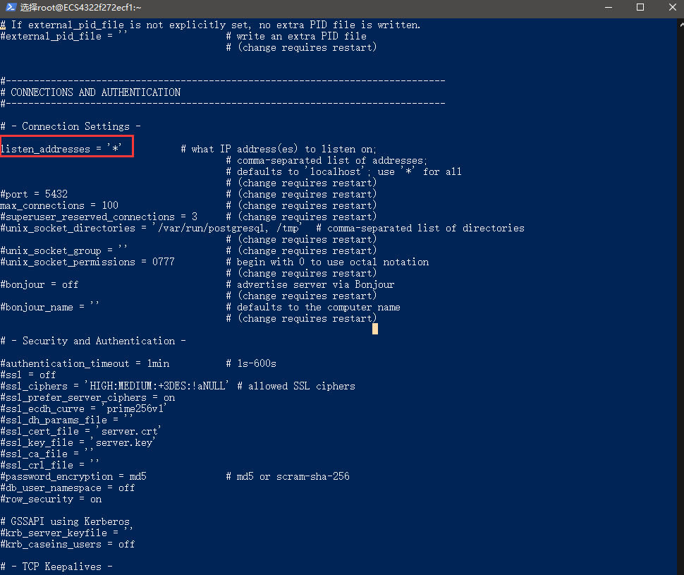
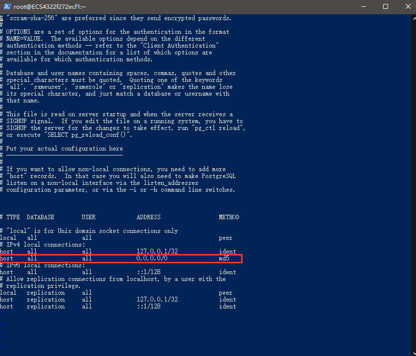

# PG主从数据库搭建

## 环境

+ 操作系统1：Windows Server 2012（X64）
+ 操作系统2：CentOS 7
+ 数据库：PostgreSQL 10.9

## CentOS 7 安装 Postgresql

### 安装数据库

1、安装`rpm`文件

```shell
yum install https://download.postgresql.org/pub/repos/yum/reporpms/EL-7-x86_64/pgdg-redhat-repo-latest.noarch.rpm
```

2、安装客户端

```shell
yum install postgresql10
```

3、安装服务端

```shell
yum install postgresql10-server
```

4、初始化pg

```shell
/usr/pgsql-10/bin/postgresql-10-setup initdb
```

5、设置自动启动并且启动postgresql服务

```shell
systemctl enable postgresql-10
systemctl start postgresql-10
```

### 创建数据库角色和数据库

1、使用postgres用户登录（PostgresSQL安装后会自动创建postgres用户，无密码）

```shell
su - postgres
```

2、登录postgresql数据库

```shell
psql
```

3、创建用户和数据库并授权

```shell
create user blog with password '123123';            // 创建用户
create database blog owner blog;                 // 创建数据库
grant all privileges on database blog to blog;   // 授权
```

4、退出psql（输入 q 再按回车键即可）

```shell
q
```

### 开启远程访问

1、修改/var/lib/pgsql/10/data/postgresql.conf文件，取消 listen_addresses 的注释，将参数值改为“*”



2、修改/var/lib/pgsql/10/data/pg_hba.conf文件，增加下图红框部分内容



3、切换到root用户，重启postgresql服务

```shell
systemctl restart postgresql-10.service
```

## 主从配置

### 主从环境说明

|主机名|IP|角色|
|-|-|-|
|master|192.168.0.100|master|
|slave|192.168.0.101|slave|

### 配置主库

1、创建数据库同步用户

2、修改pg_hba.conf

3、修改postgresql.conf

4、重启数据库

### 配置从库

1、拷贝数据

2、配置recovery.conf

3、配置postgresql.conf

4、配置完启动数据库

### 验证主从

1、方法一

2、方法二

