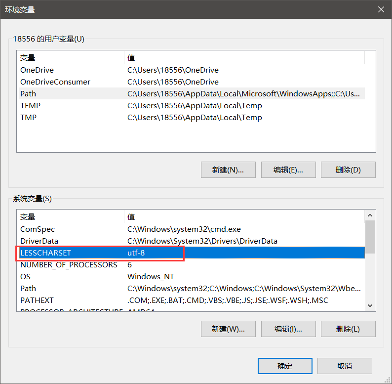

## 设置git编码

```shell
git config --global core.quotepath false 
git config --global gui.encoding utf-8
git config --global i18n.commit.encoding utf-8 
git config --global i18n.logoutputencoding utf-8 
```

## 设置编码

bash 环境下
```shell
export LESSCHARSET=utf-8
```

cmd环境下：
```shell
set LESSCHARSET=utf-8
```

## 设置Windows环境变量

LESSCHARSET utf-8



