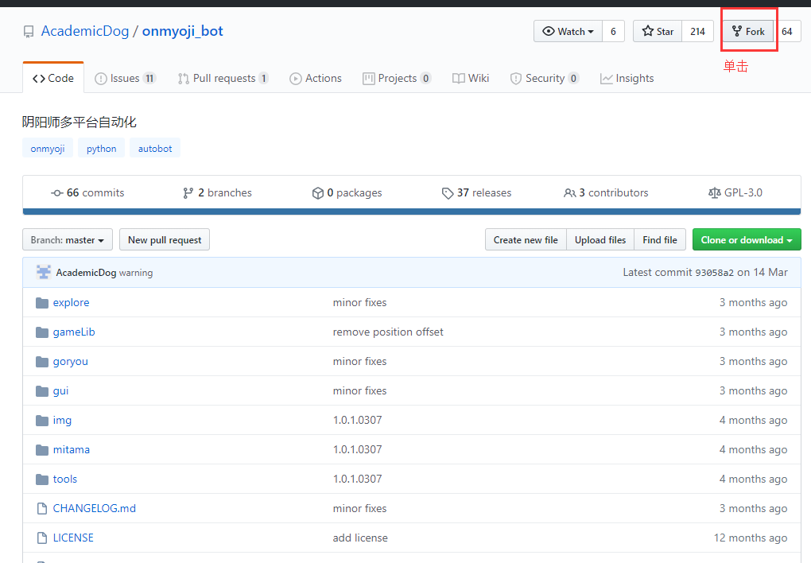
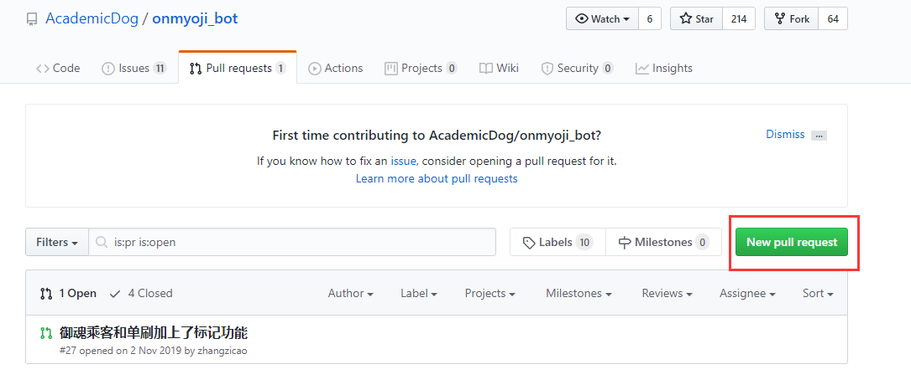

## fork project

单击fork，我们会发现个人仓库创建了一个克隆版。



## 添加远程库

```git
git remote add remote https://github.com/AcademicDog/onmyoji_bot.git
```

## 同步更新远程库

```git
git pull remote master:master
```

## 提交代码

```git
git commit -am 'edit readme'
```

## 创建pull request



然后选择对应分支，提交，便完成了一次`pull request`创建

