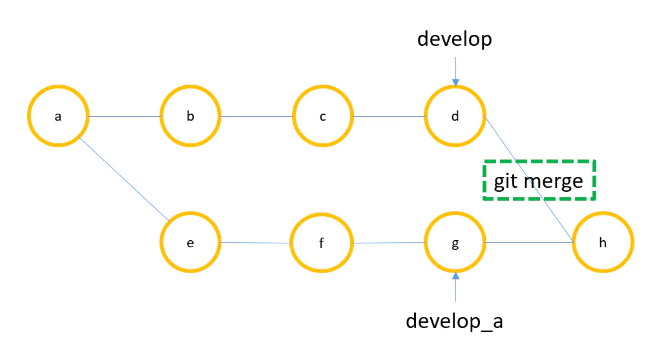
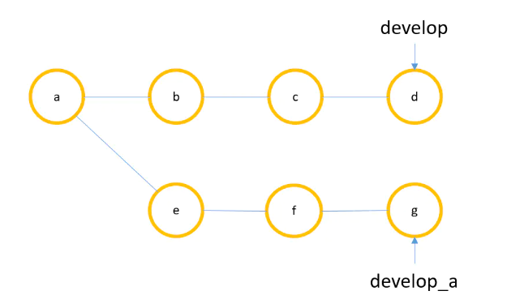
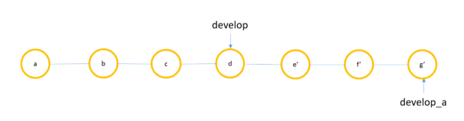
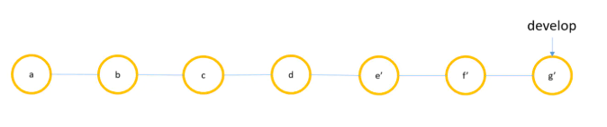
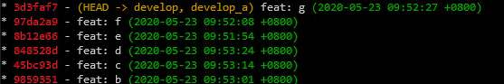
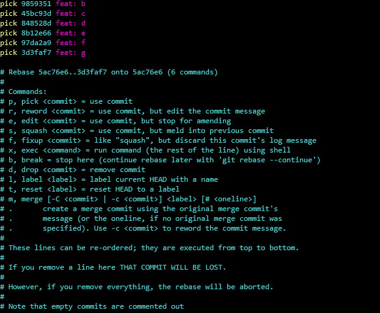
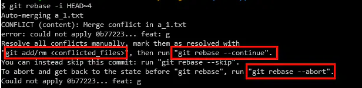

## 引言

工作一年多，使用过的`git`命令一只手都数的过来

`git add, git commit, git push, git stash, git pull, git merge, git log`

理论上来说，上面这些命令能应付绝大部分的使用场景，但是，我们看一下`git graph`，我的天！为什么这么乱啊？

大多数的软件公司，不太会在意`commit`信息是否混乱（命名不规范、分叉），当然，并不是所有公司都像`Google`一样，对于`commit`的命名都辣么严格。假如，你当前的公司对于`git`的提交非常严格，那么这篇博客会帮助你学会使用`git rebase`重构提交记录。

## Git Rebase 和 Git Merge

`rebase`的中文名叫“变基”，就是改变一次提交记录的`base`。我们不妨假设：`git rebase` ≈ `git merge`，并且使用两种命令实现同一工作流来对比它们的不同

我们假设两名开发人员合作开发，张三负责`dev_a`分支，李四负责`dev_b`分支，两人阶段性的合入`dev`分支，那么从张三的角度来想，可能的工作流程是这样的：

1. 个人在`dev_a`分支上开发自己的功能
2. 在这个期间其他人可能不断地向`dev`分支合并代码
3. 个人开发功能完成后通过`merge`的方式合入别人开发的功能



对应`git`命令如下：

```
git checkout dev_a
git pull origin dev = git fetch origin dev + git merge dev
```

同样走完这样一个工作流我们如果使用`git rebase`来实现，结果如下：



`rebase`之中



`rebase`之后



对应代码：

```
git checkout dev_a
// 本地功能开发...
git fetch origin dev
git rebase dev
git checkout dev
git merge dev_a
git br -d dev_a
```

由此可见：

1. 两者都可以用于本地代码合并
2. git merge保留真实的用户提交记录，且在merge的时候生成一个新的提交记录
3. git rebase会改写历史记录，这里的改写不仅限于树的历史结构，树上的节点`commit id`也会改写，收益是可以保证提交记录非常清爽

## 如何使用 git rebase -i 修改历史提交记录

`git rebase -i`，中文名叫交互式变基。意思就是在变基的过程中是可以掺入用户交互的，通过交互过程我们可以主动改写历史提交记录，包括修改、合并和删除等。我们以上面使用`rebase`后得到的提交记录为例，来进行历史提交记录的修改，在修改之前，提交记录是这个样子的



使用git rebase -i 修改历史提交的过程主要包含三步：

1. 列出一个提交记录的范围，并指出你在这个范围内需要怼那些记录进行什么样的修改
2. 执行上述修改，如果遇到冲突需要解决
3. 完成`rebase`操作

以上面截图中的提交记录为例，来对历史提交的`commit msg`进行修改，操作步骤如下：

```
// 查看最近6次提交记录，选择对哪一条记录进行修改
git rebase -i HEAD~6
```



执行完上述命令后，会以`vim`的方式打开一个文件(我设置成了`vs code`，习惯了图形化操作，不习惯`vim`编辑)

文件中显示了最近6次的提交信息，从上到下，由远到近。

从下面的注释可以看到，我们分别把每一行前面的`pick`修改成r, s, d的方式就可以实现对历史记录的修改，合并和删除。首先我们尝试修改提交信息，把第二行前面的`pick`改成r，保存退出（`vim`党自行研究吧）

除了修改提交的`commit msg`之外，我们也可以通过把`pick`改为`edit`，结合`git reset --soft HEAD^`的方式对档次提交的改动内容进行修改

合并与删除历史提交的操作步骤与编辑类似，只需要把`pick`分别改为`s`和`d`即可，各位看官可以自行尝试。如果在`rebase`的过程中遇到了冲突，需要手工解决，然后使用`git rebase --continue`完成`rebase`操作。`git rebase`的提示还是非常友好的，它会告诉你需要进行哪些操作解决当前的问题



## 使用 git rebase -i 必须遵守的规则是什么？

从修改历史提交记录这个功能来看，交互式变基是一个非常强大的功能。但是使用这个功能必须要遵循一个铁则：**不要对线上分支的提交记录进行变基！**

引用`git`官方指导文档的话来说大概是这样:

> 如果你遵循这条金科玉律，就不会出差错。 否则，人民群众会仇恨你，你的朋友和家人也会嘲笑你，唾弃你。

在说为什么不能对线上提交执行交互式变基之前，先说一下如果要对线上功能执行这个操作要怎么做

首先，你需要在自己本地变基成功，然后使用`git push -f`强行`push`并覆盖远程对应分支，之所以需要执行覆盖式`push`是因为如果你不覆盖，当前变基过后产生的新提交会与远程合并，导致你在本地的变基行为失去意义。因为我们上面提到过，从变基那个节点开始往后的所有节点的`commit id`都会发生变化。

同样的原因，即使你使用`git push -f`使远程分支发生了变基，如果你的同事的开发分支中还存在你执行变基操作（不论是修改、合并还是删除）时针对的那些分支，那么当你的同事`merge`你的提交之后，你所有想使用变基改变的东西都回来了！

## 如果打破了 git rebase -i 的使用规则应该怎么补救

此处我们尝试通过要点描述的方式，说明线上提交执行变基会导致什么结果以及如何避免这个结果：

1. 你在本地对部分线上提交进行了变基，这部分提交我们称之为`a`，`a`在变基之后`commit id`发生了变化
2. 你在本地改变的这些提交有可能存在于你的同事的开发分支中，我们称之为`b`，他们与`a`的内容相同，`commit id`不同
3. 如果你把变基结果强行`push`到远程仓库后，你的同事在本地执行`git pull`的时候会导致`a`和`b`发生融合，且都出现在了历史提交中，导致你的变基行为无效
4. 我们想要的是你的同事拉取线上代码时跳过对`a`和`b`的合并，只是把他本地分支上新增的修改合并进来

讲了这么多，最终的结论就是，使用变基解决变基带来的问题。即你的同事使用`git rebase`的方式把他本地的修改`rebase`到远程你执行过`rebase`的分支上

简言之，就是你的同事使用`git pull --rebase`而不是`git pull`来拉取远程分支。在这个操作的过程中，`git`会对我们上面提到几个要点的信息进行检查并把真正属于同事本地的修改合入远程分支的最后。

## 所以我们应该如何使用 Git Rebase

鉴于上面描述的`git rebase`可能带来的问题，最后要回答的一个问题是我们应该如何在日常工作中使用`git rebase`，同样借用`git`官方文档中的一句话：

> 总的原则是，只对尚未推送或分享给别人的本地修改执行变基操作清理历史，从不对已推送至别处的提交执行变基操作，这样，你才能享受到两种方式（`rebase`和`merge`）带来的便利。

