## 一、软件的本质特性

### 软件是什么

程序员要开发一个软件，那么他肯定要去制作一个程序，程序里的代码描述着行为逻辑与显示，根据需求，程序会产生数据保存数据。在多人合作开发中，开发人员肯定会产生文档：数据字典、接口文档等等。
那么，我们可以得出：软件 = 程序 + 数据 + 文档

程序：计算机可以接受的一系列指令，运行时可以提供所要求的功能和性能
数据：使得程序能够适当地操作信息的数据结构
文档：描述程序的研制过程、方法、和使用的图文资料

### 软件的本质特性

微软花了55年制作了Word 1.0，大约有25w行代码，晚交付了4年，不经思考软件的本质特性是什么？

软件具有：复杂性、一致性、可变性和不可见性等固有的内在特性，这是造成软件开发困难的根本原因。这比任何人类以往的创造都难得多。

#### 复杂性

Google搜索引擎建立了全球三十多个站点、百万台服务器，亚马逊拥有超过28个云计算中心，在全球的服务器总数量超过150万台。阿里云是国内最大的云计算平台，拥有百万台服务器。毫不夸张地说软件是人类开发的最复杂的物体，足以可见软件开发是非常困难的

#### 一致性

- 软件不能独立存在，需要依附一定的环境（硬件 、网络以及其他软件）
- 软件必须遵循认为的习惯，并适应已有的技术和系统
- 软件需要随接口不同而改变，随时间推移而变化，而这些变化是不同人设计的结果

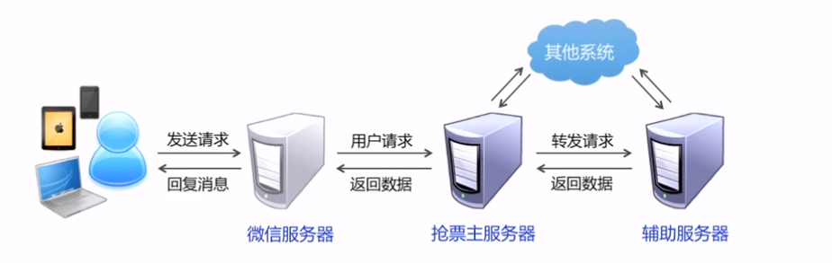

#### 可变性

这个世界在变，唯一不变的就是一直在变。

我们通过微信开发就可以了解软件的可变性

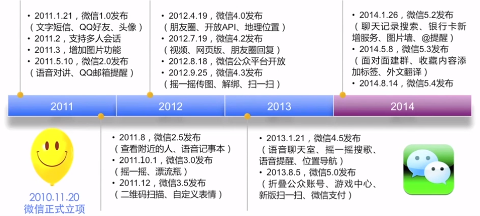

人们总是认为软件是容易修改的，但忽视修改了修改所带来的副作用
不断地修改最终导致软件的退化，从而结束其生命周期

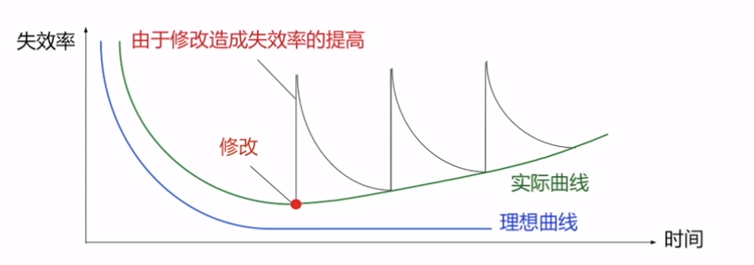

没有任何变化的软件一定是没用的，我们要以积极的态度和有效的方法控制变更，使软件在演化的过程中保证高质量

#### 不可见性

- 软件是一种 “看不见、摸不着” 的逻辑实体，不具有空间的形体特征
- 开发人员可以直接看到程序代码，但是源代码不是软件本身
- 软件是以机器代码的形式运行，但是开发人员无法看到源代码使如何执行的

这种不可见行不仅限制了软件的设计过程，同时严重的阻碍了相互之间的人与人的交流

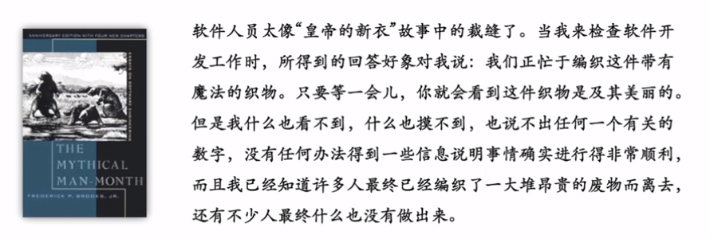

#### 小结

软件所具有的复杂性、一致性、可变性、不可见性等特性，使得软件开发过程变得难以控制，开发团队如同在焦油坑中挣扎的巨兽。我们需要寻找解决问题的有效方法，从而保证软件开发过程的高效、有序、可控。

## 二、软件工程的产生和发展

### 前言

软件具有复杂性、一致性、可变性和不可见行，这些特性使软件开发和管理变得很难控制，最终产品质量也难以保证

例1：

以上是美国Standish公司对软件研发的追踪调查

例2：

原因是：
程序试图将64位浮点数转换成16位整数时溢出

例3：

即使这样，Vista系统面世之后仍然暴露性能低、兼容性差、频繁死机的问题，可以说这是一款失败的软件产品

例4：

12306购票系统出现过很多严重漏洞

### 软件开发面临的挑战

### 探索软件之道

软件工程一直致力于探索软件开发问题的解决之道

1、1956-1967 史前阶段
软件开发没有方法可循
软件设计是在开发人员头脑中完成的隐藏过程
60世纪中期的软件危机

2、1968-1682 瀑布过程模型
1968年，北大西洋公约组织召开国际会议，提出“软件工程”概念和术语
结构化开发方法
瀑布式软件生命周期模型称为经典

3、1983-1995 质量标准体系
面向对象开发方法
软件过程改进运动
CMM/ISO9000/SPICE等质量标准体系

4、20世纪90年代至今
敏捷开发方法流行
更紧密的团队写作
有效应对需求变化
快速交付高质量软件
迭代和增量开发过程

## 三、软件工程的基本概念

### 工程

所谓工程就是应用有关的科学知识和技术手段通过有组织的群体协作活动建造具有预期使用价值的人造产品的过程。

高楼大厦、轮船、飞机建造，工程活动一般都具有以下特钟：

+ 大规模的设计和建造
+ 复杂问题与目标分解
+ 团队协作与过程控制

工程是将理论和知识应用于实践的科学，以便经济有效地解决问题

### 软件工程

#### 是什么

1. 将系统的、规范化的、可定量的方法应用于软件的开发、运行与维护，即工程化应用到软件上
2. 对以上所述的方法的研究

#### 目标

创造”足够好“的软件

足够好的软件是什么？

+ 较低的开发成本
+ 按时完成开发任务并及时交付
+ 实现客户要求的功能
+ 具有良好性能、可靠性、可扩展性、可移植性等
+ 软件维护费用低

### 软件工程过程

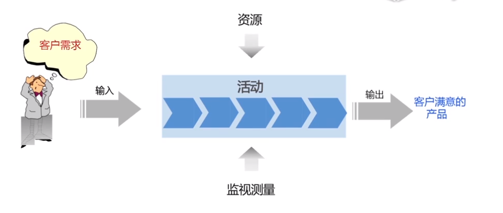

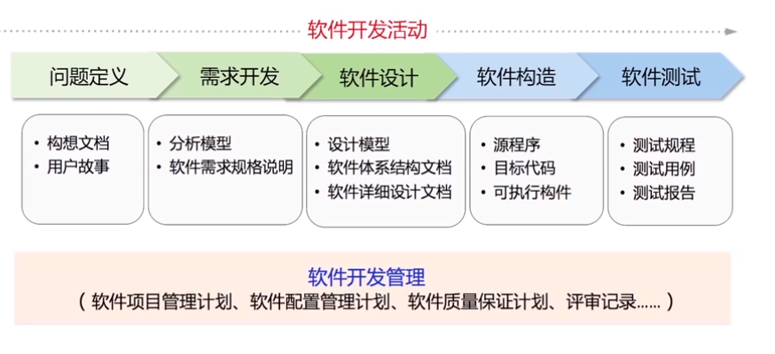

### 软件工程方法

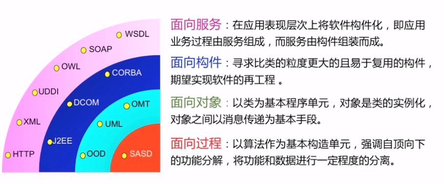

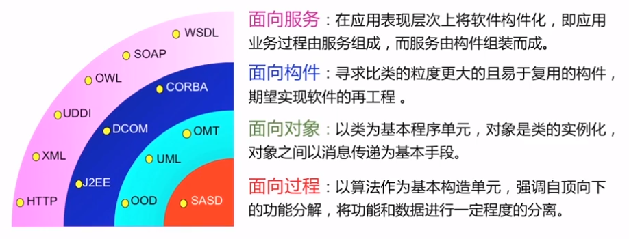

代码封装从函数到类再到构件，再到应用层级上的服务

### 软件工程工具

工欲善其事必先利其器，软件工程也不例外

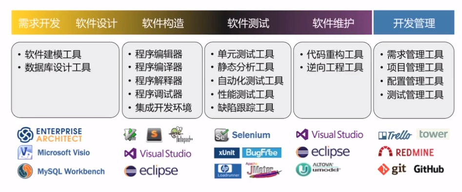

### 软件开发的基本策略

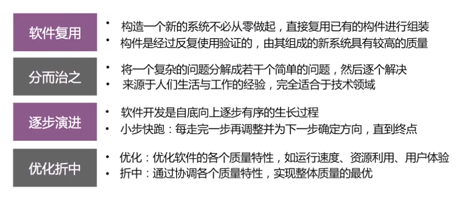

#### 软件复用

将已有的软件制品，直接组装或者合理修改形成新的软件系统，从而提升开发效率和产品质量，降低维护成本

软件复用不仅仅是代码复用

+ 库函数、类库
+ 模板（文档、网页等）
+ 设计模式
+ 组件
+ 框架

#### 分而治之

软件工程是一项解决问题的工程活动，通过对问题的研究分析，将一个复杂问题分解成可以理解并能够处理的若干小问题，然后逐个解决

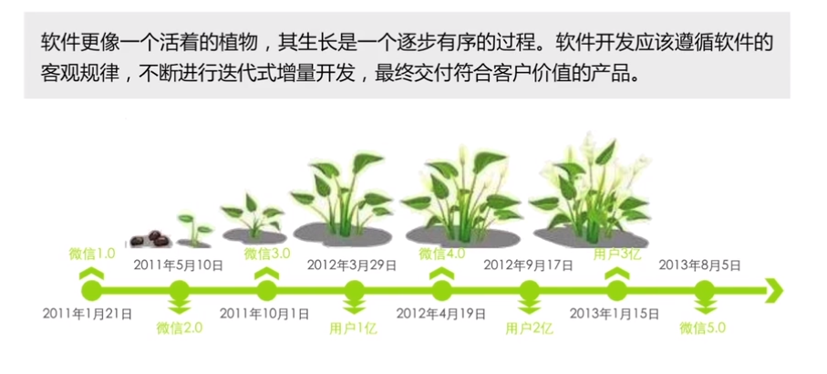

#### 逐步演进

软件工程师，应当把优化当成一种责任，不断改进和提升软件质量；但是优化是一个多目标的最有决策，在不可能使所有目标都得到优化时，需要进行折中实现整体最优

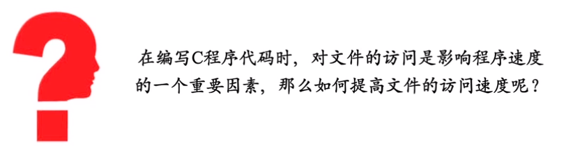

#### 优化折中

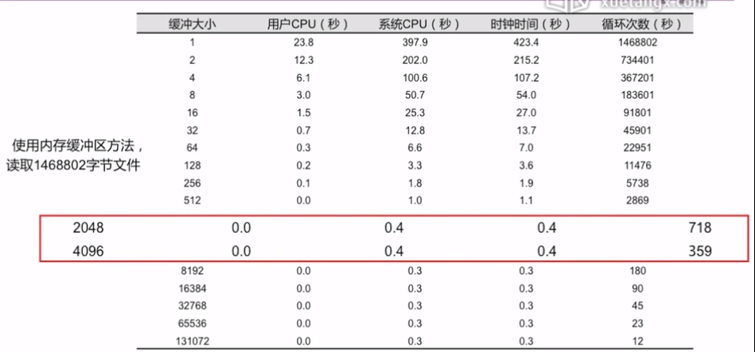

### 软件工程学科发展

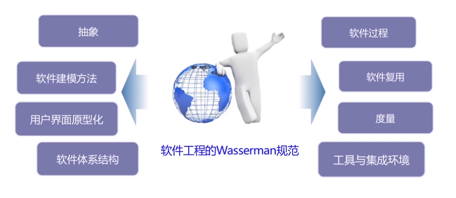

## 四、软件质量实现

### 前言

软件已经称为人们生活中很重要的一部分，也正式因为其重要性，人们对其质量要求越来越高，人们希望开发高质量软件，但是由于受到市场因素的研制，不可能达到完美这个标准。因此，软件工程的目标不是实现完美，而是达到足够好，那什么是足够好呢？

### 什么是好软件

不同角色有不同关注点，做好一个软件就是从用户、开发人员、投资者三个角度去做好以下几点

软件质量应该涵盖：软件过程、软件产品、产品使用

> 质量就是软件产品对于某个（或某些）人的价值   ——————杰拉尔德.温伯格

正确的软件：一个软件要满足用户的需求，为用户创造价值，这里的价值可以体现在两个方面，即为用户创造利润和减少成本
软件运行正确：软件没有或有很少的缺陷，具有很强的扩展性、良好的性能以及较高的易用性等

比如谷歌眼镜，自己都说不清楚自己的价值是什么，Windows Vista 产品质量太差，导致不得不两年后用 Windows 7 代替

高质量的软件产品：

+ 做了用户想要它做的事情
+ 正确有效的使用了计算机资源
+ 易于用户学习和使用
+ 设计良好、代码良好且易于维护和测试

那如何去做产品质量判断呢？

以下同样适量于软件产品

ISO9126 质量模型

功能性：

+ 适合性：当软件在指定条件下使用，其满足明确和隐含要求功能的能力
+ 准确性：软件提供给用户功能的精确度是否符合目标
+ 互操作性：软件和其他系统进行交互的能力
+ 安全性：软件保护信息和数据的安全能力

可靠性：

+ 成熟性：软件产品避免软件中错误发生而导致失效的能力
+ 容错性：软件防止外部接口错误扩散而导致系统失效的能力
+ 可恢复性：系统失效后，重新恢复原有功能和性能的能力

易用性：

+ 易理解性：软件显示的信息要清晰、准确且易懂，使用户能够快速理解软件
+ 易学习性：软件使用户能够学习其应用的能力
+ 易操作性：软件产品使用户能易于操作和控制它的能力
+ 吸引力：软件具有的某些独特的、能让用户眼前一亮的属性

效率：

+ 时间特性：在规定条件下，软件产品执行其功能时能够提供适当的响应时间和处理时间以及吞吐率的能力
+ 资源利用：软件系统在完成用户指定的业务请求所消耗的系统资源，诸如CPU占有率、内存消耗率、网络带宽占有率等

可维护性：

+ 易分析性：软件提供辅助手段帮助开发人员定位缺陷原因并判断出修改之处
+ 易改变行：软件产品使得指定的修改容易实现的能力
+ 稳定性：软件产品避免由于软件修改而造成意外结果的能力
+ 易测试性：软件提供辅助性手段帮助测试人员实现其测试意图

可移植性：

+ 适应性：软件产品无需做任何相应变动就能适应不同运行环境的能力
+ 易安装性：在平台变化后，成功安装软件的难易程度
+ 共存性：软件产品在公共环境于其共享资源的其他系统的共存能力
+ 替换性：软件系统的升级能力，包括在线升级、打补丁升级等

### 实现软件质量

+ 质量不是被测出来的，而是在开发过程中逐渐构建起来
+ 虽然质量不是测出来的，但是未经过测试也不可能开发出高质量的软件
+ 质量时开发过程的问题，测试是开发过程中不可缺少的重要环节

### 商业环境下的软件质量

软件质量的重要性毋庸置疑
那么是不是质量越高就越好
软件产品是否应该追求”零缺陷“

商业目标决定质量目标：

+ 商业目标决定质量目标，不应该把质量目标凌驾于商业目标之上
+ 质量是有成本的，不可能为了追求完美的质量而不惜一切代价
+ 理想的质量目标不是”零缺陷“，而是恰好让广大用户满意

***理想的软件质量不是零缺陷，而是恰好让用户满意***
