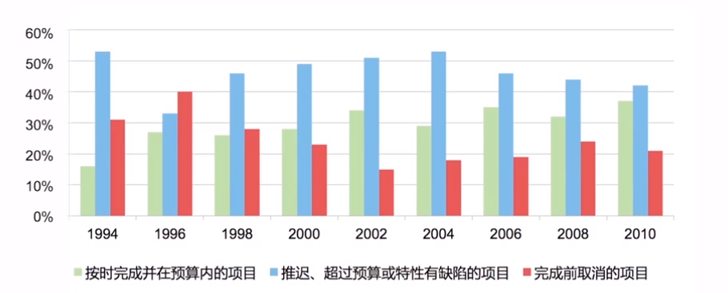
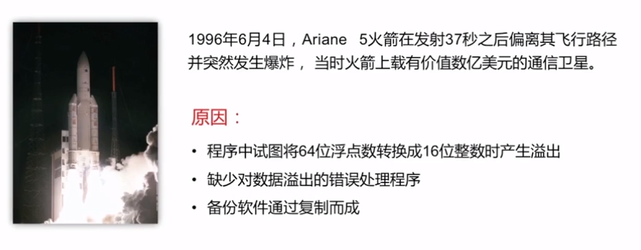
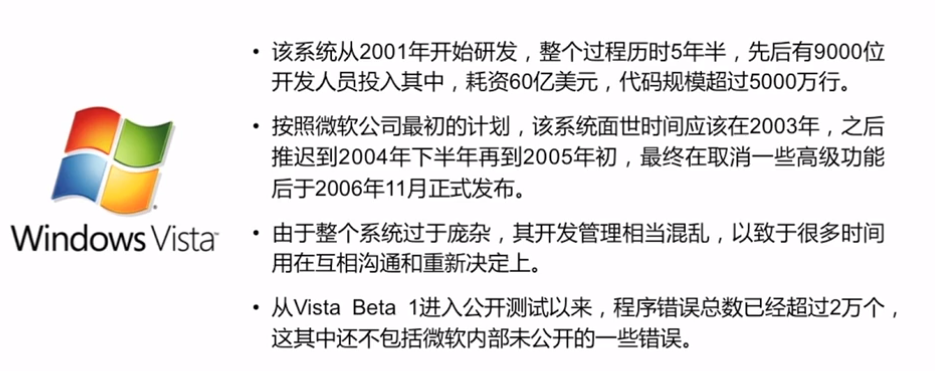
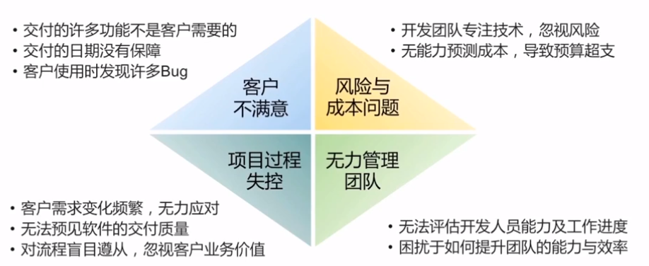
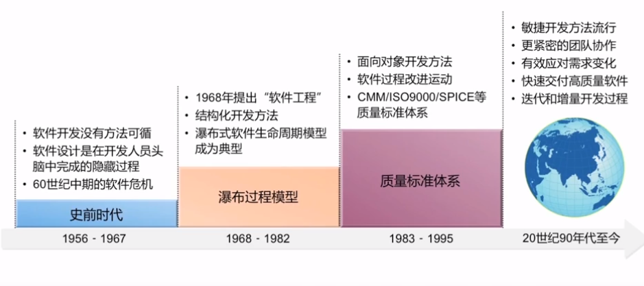

## 前言

软件具有复杂性、一致性、可变性和不可见行，这些特性使软件开发和管理变得很难控制，最终产品质量也难以保证

例1：

以上是美国Standish公司对软件研发的追踪调查

例2：

原因是：
程序试图将64位浮点数转换成16位整数时溢出

例3：

即使这样，Vista系统面世之后仍然暴露性能低、兼容性差、频繁死机的问题，可以说这是一款失败的软件产品

例4：

12306购票系统出现过很多严重漏洞

## 软件开发面临的挑战

## 探索软件之道

软件工程一直致力于探索软件开发问题的解决之道

1、1956-1967 史前阶段  
软件开发没有方法可循  
软件设计是在开发人员头脑中完成的隐藏过程  
60世纪中期的软件危机

2、1968-1682 瀑布过程模型  
1968年，北大西洋公约组织召开国际会议，提出“软件工程”概念和术语  
结构化开发方法  
瀑布式软件生命周期模型称为经典

3、1983-1995 质量标准体系  
面向对象开发方法  
软件过程改进运动  
CMM/ISO9000/SPICE等质量标准体系

4、20世纪90年代至今  
敏捷开发方法流行  
更紧密的团队写作  
有效应对需求变化  
快速交付高质量软件  
迭代和增量开发过程

