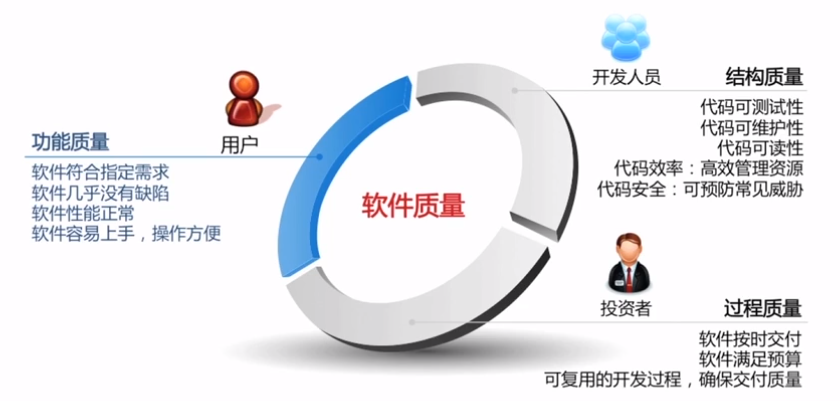
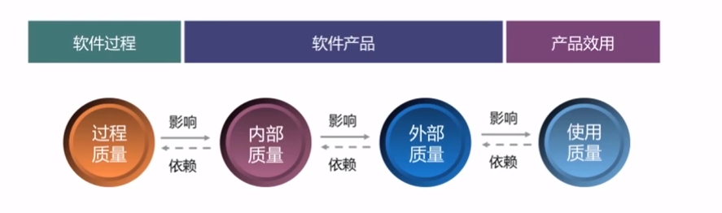
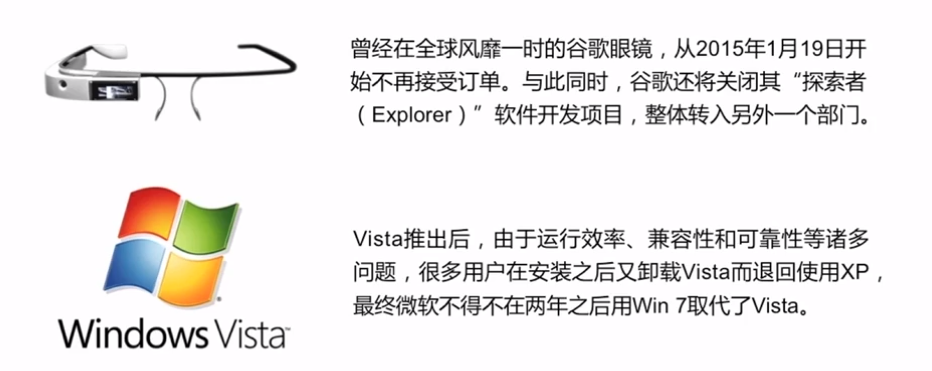
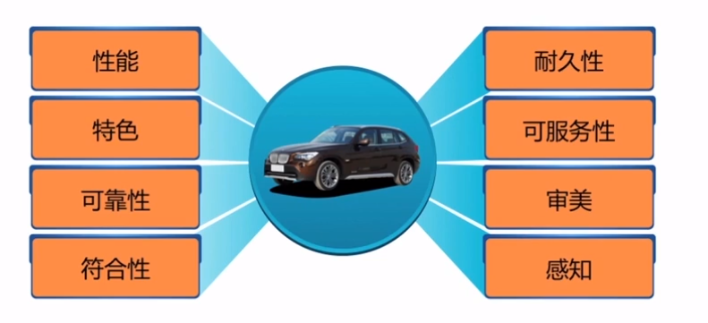
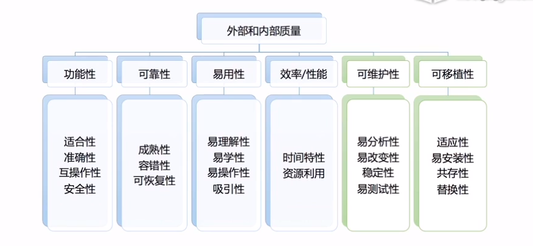
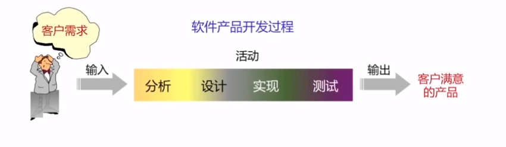
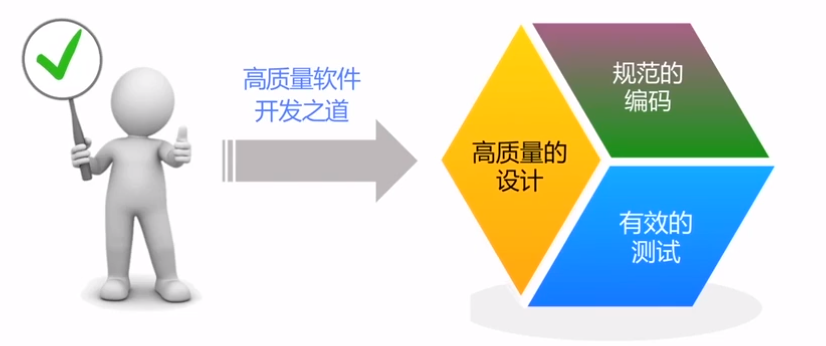
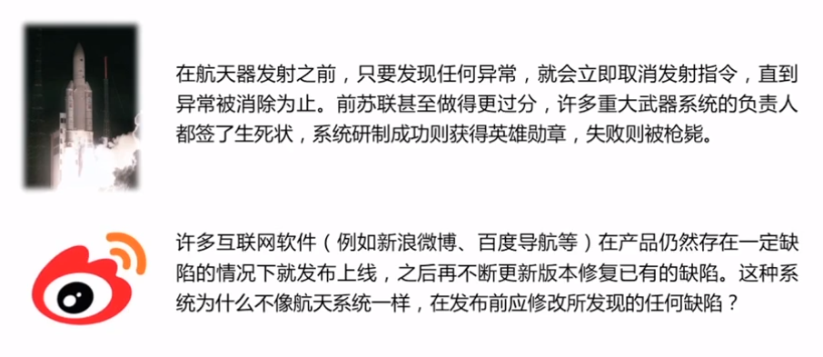

## 前言

软件已经称为人们生活中很重要的一部分，也正式因为其重要性，人们对其质量要求越来越高，人们希望开发高质量软件，但是由于受到市场因素的研制，不可能达到完美这个标准。因此，软件工程的目标不是实现完美，而是达到足够好，那什么是足够好呢？

## 什么是好软件

不同角色有不同关注点，做好一个软件就是从用户、开发人员、投资者三个角度去做好以下几点

软件质量应该涵盖：软件过程、软件产品、产品使用

> 质量就是软件产品对于某个（或某些）人的价值   ——————杰拉尔德.温伯格

正确的软件：一个软件要满足用户的需求，为用户创造价值，这里的价值可以体现在两个方面，即为用户创造利润和减少成本  
软件运行正确：软件没有或有很少的缺陷，具有很强的扩展性、良好的性能以及较高的易用性等

比如谷歌眼镜，自己都说不清楚自己的价值是什么，Windows Vista 产品质量太差，导致不得不两年后用 Windows 7 代替

高质量的软件产品：

+ 做了用户想要它做的事情
+ 正确有效的使用了计算机资源
+ 易于用户学习和使用
+ 设计良好、代码良好且易于维护和测试

那如何去做产品质量判断呢？

以下同样适量于软件产品

ISO9126 质量模型

功能性：

+ 适合性：当软件在指定条件下使用，其满足明确和隐含要求功能的能力
+ 准确性：软件提供给用户功能的精确度是否符合目标
+ 互操作性：软件和其他系统进行交互的能力
+ 安全性：软件保护信息和数据的安全能力

可靠性：

+ 成熟性：软件产品避免软件中错误发生而导致失效的能力
+ 容错性：软件防止外部接口错误扩散而导致系统失效的能力
+ 可恢复性：系统失效后，重新恢复原有功能和性能的能力

易用性：

+ 易理解性：软件显示的信息要清晰、准确且易懂，使用户能够快速理解软件
+ 易学习性：软件使用户能够学习其应用的能力
+ 易操作性：软件产品使用户能易于操作和控制它的能力
+ 吸引力：软件具有的某些独特的、能让用户眼前一亮的属性

效率：

+ 时间特性：在规定条件下，软件产品执行其功能时能够提供适当的响应时间和处理时间以及吞吐率的能力
+ 资源利用：软件系统在完成用户指定的业务请求所消耗的系统资源，诸如CPU占有率、内存消耗率、网络带宽占有率等

可维护性：

+ 易分析性：软件提供辅助手段帮助开发人员定位缺陷原因并判断出修改之处
+ 易改变行：软件产品使得指定的修改容易实现的能力
+ 稳定性：软件产品避免由于软件修改而造成意外结果的能力
+ 易测试性：软件提供辅助性手段帮助测试人员实现其测试意图

可移植性：

+ 适应性：软件产品无需做任何相应变动就能适应不同运行环境的能力
+ 易安装性：在平台变化后，成功安装软件的难易程度
+ 共存性：软件产品在公共环境于其共享资源的其他系统的共存能力
+ 替换性：软件系统的升级能力，包括在线升级、打补丁升级等

## 实现软件质量

+ 质量不是被测出来的，而是在开发过程中逐渐构建起来
+ 虽然质量不是测出来的，但是未经过测试也不可能开发出高质量的软件
+ 质量时开发过程的问题，测试是开发过程中不可缺少的重要环节

## 商业环境下的软件质量

软件质量的重要性毋庸置疑  
那么是不是质量越高就越好  
软件产品是否应该追求”零缺陷“

商业目标决定质量目标：

+ 商业目标决定质量目标，不应该把质量目标凌驾于商业目标之上
+ 质量是有成本的，不可能为了追求完美的质量而不惜一切代价
+ 理想的质量目标不是”零缺陷“，而是恰好让广大用户满意

***理想的软件质量不是零缺陷，而是恰好让用户满意***

腾讯云博客：
https://cloud.tencent.com/developer/support-plan?invite_code=1kgapvycx0xyo

