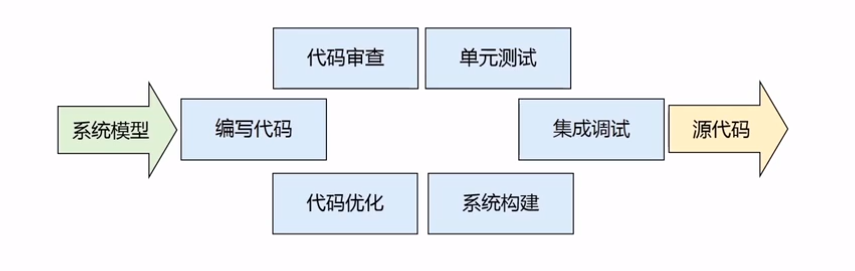
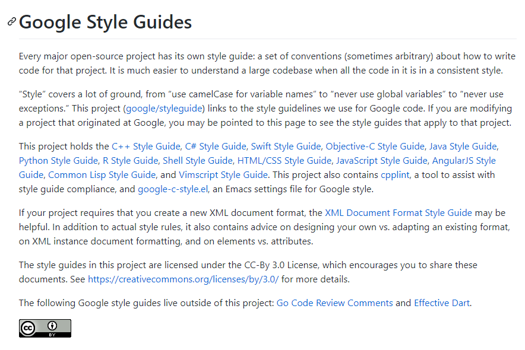

## 前言

- 编程是软件工程师的基本能力
- 编写优雅的代码是每一个程序员的不懈追求
- 编程是一门艺术，它能够展示结构之美、构造之美、表达之美

## 软件编程工作

软件编程是一个复杂而迭代的工程，它不仅仅是编写代码，还应该包括代码审查、单元测试、代码优化、继承调试等一系列工作

代码不仅仅是写给自己看的，更多情况我们处于一个团队中，代码他人也会查看维护，那么代码的可读性就十分重要了。所以 ，我们在软件编写初期要保证代码的整洁、清楚，给软件打下一个良好的基础

> 软件编码规范是与特定语言相关的描写如何编写代码的规则集合

目的  
- 提高编码质量，避免不必要的错误
- 增强代码的可读性、可重用性和可移植性

现实  
- 软件全生命周期的70%是成本维护
- 软件在其生命周期中很少由原编码人员进行维护

当然，软件编码规范在业界没有一个固定的标准，许多公司都有自己的规范，这里推荐`Google`公司的[编程规范](https://github.com/google/styleguide)

## 编程规范

我见过很多程序员对编程的规范很不重视，这就导致了在后续迭代开发中维护起来比较困难。举几个例子，程序员小陈对文件的命名风格不重视，是用中文拼音给定的文件名，我相信后期这个功能需要修改维护的时候找文件都找个半天

常见问题：

- 文件命名不规范、文件名含义不清
- 代码缺少注释、代码注释质量不高
- 源文件结构错误

我们的目标是：编写自文档化的代码

- 唯一能完整并正确地描述代码的文档是代码本身
- 编写可以阅读的代码，其本身简单易懂

