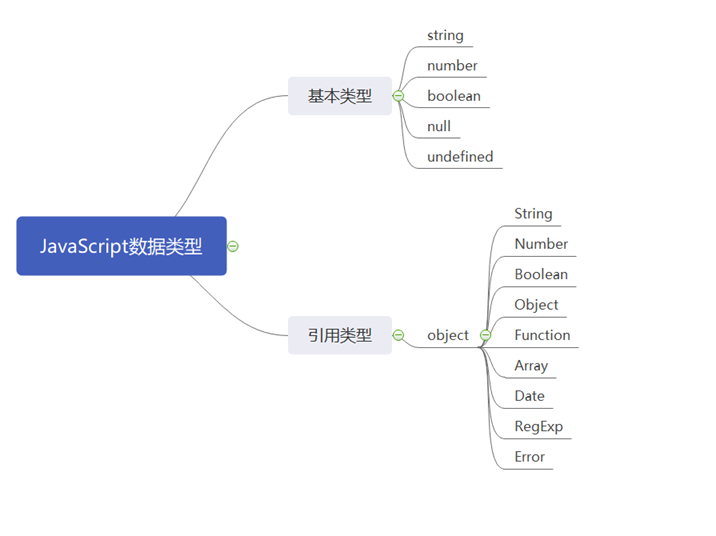

## 语法

我们熟知的对象创建方式：声明形式和构造形式

```javascript
var myObj = {
  key: value
}

var myObj = new Object();
myObj.key = value;
```

构造形式和文字形式生成的对象是一样的。唯一的区别是，在文字声明中你可以添加多个 键 / 值对，但是在构造形式中你必须逐个添加属性。

用上面的“构造形式”来创建对象是非常少见的，一般来说你会使用文字语法，绝大多数内置对象也是这样做的（稍后解释）。

## 类型



## 内置对象

有些内置对象的名字看起来和简单基础类型一样，不过实际上它们的关系更复杂。

```javascript
var foo = '123';
typeof foo; // string
var bar = new String('123');
typeof bar; // object
```

注： 这里的 foo 只是一个字面量，如果在这个字面量上要做一些操作，比如获取长度、访问某个字符，那需要转换成 String 对象，这个转换过程是自动完成的，不需要我们额外写代码。所以我们没必要显示的通过构造形式来创建 string

注意：null 和 undefined 没有对应的构造形式，只有文字形态，相反，Date 只有构造。对于 Object，Array，Function 和 RegExp 来说，它们无论是文字形式还是构造形式，都是对象。

内置对象从表现形式上来说很像其他语言中的类型或者类，比如 C# 中的 String 类。

但是在 JavaScript 中，它们实际上只是一些内置函数。这些内置函数可以当作构造函数来使用，从而构造一个对应子类型的新对象。

## 内容

对象的内容是由一些存储在特定命名位置的（任意类型的）值组成的， 我们称之为属性。

需要强调的一点是，当我们说“内容”时，似乎在暗示这些值实际上被存储在对象内部， 但是这只是它的表现形式。在引擎内部，这些值的存储方式是多种多样的，一般并不会存在对象容器内部。存储在对象容器内部的是这些属性的名称，它们就像指针（从技术角度来说就是引用）一样，指向这些值真正的存储位置

```javascript
var obj = {
  name: 'Karl',
  age: '23'
}
```

## 访问方式

+ 键访问
+ 属性访问

```javascript

var obj = {
  name: 'Karl'
}

console.log(obj.name); // Karl
console.log(obj['name']); // Karl
```

区别：
属性访问更加符合标识符的命名规范，而键访问可以接受任意 UTF-8/Unicode 字符串作为属性名。举例来说，如果引用名称为“Super-Fun!”的属性，那就必须使用键访问，因为它不是一个有效的标识符属性名

此外，在对象中，属性名永远是字符串

## 可计算属性名

如果我们需要通过表达式来计算属性名，那刚刚说到的 obj[..] 这种属性访问方法就可以排上用场

ES6 增加了可计算属性名，可以在文字形式中使用 [] 包裹一个表达式来当作属性名
可计算属性名最常用的场景可能是 ES6 的符号（Symbol）这里不去做详细介绍

```javascript
function setData(id, name, type) {
  this.data = {
    [type + 'id']: id,
    name: name
  }
}

setData('001', '张三', 'user_info');
setData('001', '菜单A', 'sys_menu');
```

## 属性和方法

如果访问的对象属性是一个函数，有些开发者喜欢使用不一样的叫法以作区分。由于函数 很容易被认为是属于某个对象，在其他语言中，属于对象（也被称为“类”）的函数通常被称为“方法”，因此把“属性访问”说成是“方法访问”也就不奇怪了。

有意思的是，JavaScript 的语法规范也做出了同样的区分。

从技术角度来说，函数永远不会“属于”一个对象，所以把对象内部引用的函数称为“方法”似乎有点不妥。

确实，有些函数具有 this 引用，有时候这些 this 确实会指向调用位置的对象引用。但是这种用法从本质上来说并没有把一个函数变成一个“方法”，因为 this 是在运行时根据调用位置动态绑定的，所以函数和对象的关系最多也只能说是间接关系。

```javascript
function foo() {
  console.log(123);
}

var obj = {
  foo
}
```

## 数组

数组也支持 [] 访问形式，不过就像我们之前提到过的，数组有一套更加结构化的值存储机制（不过仍然不限制值的类型）。数组期望的是数值下标，也就是说值存储的位置（通 常被称为索引）是整数，比如说 1、2、3

```javascript
var foo = ['Carl', 'Jessie', 'Will'];
foo.length; // 3
foo[0]; // Carl
```

数组也是对象，所以虽然每个下标都是整数，你仍然可以给数组添加属性

```javascript
var foo = ['Carl', 'Jessie', 'Will'];
foo.length; // 3
foo[0]; // Carl
foo.bar = 'Test';
console.log(foo.bar); // Test
```

你完全可以把数组当作一个普通的键 / 值对象来使用，并且不添加任何数值索引，但是这并不是一个好主意。数组和普通的对象都根据其对应的行为和用途进行了优化，所以最好只用对象来存储键 / 值对，只用数组来存储数值下标 / 值对。

## 复制对象

初学者最常见的一个问题，就是如何复制一个对象。看起来好像有一个内置的 copy() 方法，但是实际上事情比你想象得还要复杂，因为我们无法选择一个默认的复制算法。

```javascript
function foo() {
  console.log(123);
}

var arr = [];
var obj = {
  a: foo,
  b: arr
}

arr.push(foo, obj);
```

### 值类型复制

```javascript
var a = 1;
```

|name|val|
|-|-|
|a|1|

```javascript
var b = a;
```

|name|val|
|-|-|
|a|1|
|b|1|

### 引用类型复制

```javascript
var a = [0, 1, 2, 3, 4];
```

栈内存

|name|val|
|-|-|
|a|0X1234|

堆内存

|name|val|
|-|-|
|0X1234|[0, 1, 2, 3, 4]|

```javascript
var b = a;
```

栈内存

|name|val|
|-|-|
|a|0X1234|
|b|0X1234|

堆内存

|name|val|
|-|-|
|0X1234|[0, 1, 2, 3, 4]|

### 浅复制

浅复制很简单，如上例所示

相比深复制，浅复制非常易懂并且问题要少得多，所以 ES6 定义了 Object.assign(..) 方 法来实现浅复制。Object.assign(..) 方法的第一个参数是目标对象，之后还可以跟一个或多个源对象。它会遍历一个或多个源对象的所有可枚举（enumerable） 的自有键（owned key）并把它们复制（= 操作符赋值）到目标对象，最 后返回目标对象，就像这样：

### 深复制

假如，我们需要复制一个对象，并对这个拷贝对象的子元素修改，同时不会影响到被复制对象的子元素，浅复制是没办法实现的。我们理想就是`JavaScript`提供了一个内置函数名字叫`DeepClone`，实际上问题远远没有这么简单

### 无法精准表达深复制

我们先看这段代码

```javascript
function anOtherFunction() {}
var anotherObject = {
  c: true
}
var anotherArray = [];
var myObject = {
  a: 2,
  b: anotherObject,
  c: anotherArray,
  d: anotherFunction
}
anotherArray.push(anotherObject, myObject);
```

如何准确地表示 myObject 的复制呢？

首先，我们应该判断它是浅复制还是深复制。对于浅拷贝来说，复制出的新对象中 a 的值会 复制旧对象中 a 的值，也就是 2，但是新对象中 b、c、d 三个属性其实只是三个引用，它们 和旧对象中 b、c、d 引用的对象是一样的。对于深复制来说，除了复制 myObject 以外还会复 制 anotherObject 和 anotherArray。这时问题就来了，anotherArray 引用了 anotherObject 和 myObject，所以又需要复制 myObject，这样就会由于循环引用导致死循环。
 
我们是应该检测循环引用并终止循环（不复制深层元素）？还是应当直接报错或者是选择 其他方法？ 

除此之外，我们还不确定“复制”一个函数意味着什么。有些人会通过 toString() 来序列化一个函数的源代码（但是结果取决于 JavaScript 的具体实现，而且不同的引擎对于不同 类型的函数处理方式并不完全相同）

那么如何解决这些棘手问题呢？许多 JavaScript 框架都提出了自己的解决办法，但是 JavaScript 应当采用哪种方法作为标准呢？在很长一段时间里，这个问题都没有明确的答案。

### 解决办法

对于 JSON 安全（也就是说可以被序列化为一个 JSON 字符串并且可以根据这个字符串解析出一个结构和值完全一样的对象）的对象来说，有一种巧妙的复制方法

当然，这种方法需要保证对象是 JSON 安全的，所以只适用于部分情况。

```javascript
var obj = { a: 123 };
var anotherObj = JSON.parse(JSON.stringify(obj));
```

JSON.parse() 弊端的：具有局限性，只适用于一般数据的拷贝（对象、数组），更多详解请点[这里](https://segmentfault.com/a/1190000020297508)

## 属性描述符

ES5 之前，JavaScript 语言本身没有提供可以检测属性特性的方法，比如判断属性是否是只读，但是从es5开始，所有的属性都具备了属性描述符

```javascript
var obj = { a: 1 };
Object.getOwnPropertyDescriptor(obj, 'a');
```

只要属性是可配置的，就可以使用 definePropery(..) 方法来修改属性描述符

注意：下面这段代码在严格模式下会出错（TypeError），表示我们无法修改一个不可修改的属性。

```javascript
var obj = {};
Object.defineProperty(obj, 'a', {
  value: 2,
  writable: false,
  configurable: true,
  enumerable: true
});
obj.a = 3;
obj.a; // 2
```

## 不变性

希望属性或者是对象是不可改变的，有那些方法？

+ 对象常量
+ 禁止扩展 Object.preventExtensions(..)
+ 密封 Object.seal(..)
+ 冻结 Object.freeze(..)

## [[Get]]

属性访问在实现时有一个微妙却非常重要的细节，思考下面的代码：

```javascript
var myObj = {
  a: 2
}
myObj.a; // 2
```

在语言规范中，myObject.a 在 myObject 上实际上是实现了 [[Get]] 操作（有点像函数调用：[[Get]]()。
对象默认的内置 [[Get]] 操作首先在对象中查找是否有名称相同的属性，如果找到就会返回这个属性的值。
然而，如果没有找到名称相同的属性，按照 [[Get]] 算法的定义会执行另外一种非常重要的行为（原型链）。

如果无论如何都没有找到名称相同的属性，那 [[Get]] 操作会返回值 undefined。
注意，这种方法和访问变量时是不一样的。如果你引用了一个当前词法作用域中不存在的变量，并不会像对象属性一样返回 undefined，而是会抛出一个 ReferenceError 异常

## [[Put]]

我们可能认为给对象的属性赋值会触发 [[Put]] 来设置或者创建这个属性，但实际情况不是这样的。

[[Put]] 被触发时，实际的行为取决于很多元素，包括对象中是否存在这个属性（这是最重要的）

如果已经存在，那么 [[Put]] 的算法大致会检查下面这些内容：
+ 属性是否时访问描述符？如果时并且存在 setter 就调用 setter
+ 属性的数据描述符中 writable 是否是 false？如果是，在非严格模式下静默失败，在严格模式下抛出 TypeError 异常
+ 如果都不是，将该值设置为属性的值

如果对象中不存在这个属性，[[Put]] 的操作会更复杂，后面在 prototype 会去讲解

## Getter与Setter

对象默认的 [[Get]] 和 [[Put]] 操作分别可以控制属性值的设置和获取
在更高级的特性可以去更改对象的默认 [[Get]] 和 [[Put]] 操作，而不仅仅是某个属性
ES5 中使用 getter 和 setter 可以改写默认操作，但是只能作用在单个属性上，无法应用在整个对象上
getter 是一个隐藏函数，会在获取属性值时调用。setter 也是一个隐藏函数，会在设置属性值时调用

```javascript
var obj = {
  get a() {
    return this._a;
  },
  set a(val) {
    this._a = val;
  }
}
```

当我们给一个属性定义 getter、setter 或者两者都有时，整个属性会被定义成“属性描述符”。

## 存在性

我去访问一个对象中不存在的属性，会得到 undefined，但是这个值有可能是属性中存储的 undefined。

```javascript
var obj = {
  a: undefined
}

console.log(obj.a); // undefined
```

### 方法

In

```javascript
a in obj;
```

Object.prototype.hasOwnProperty(..)

```javascript
obj.hasOwnProperty('a');
```

