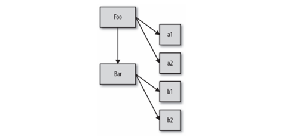
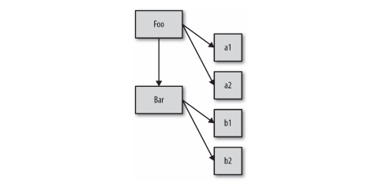

## 类理论

类 / 继承描述了一种代码的组织结构形式 ，一种在软件中对真实世界中问题领域的建模方法。

面向对象编程强调的是数据和操作数据的行为本质上是互相关联的（当然，不同的数据有不同的行为），因此好的设计就是把数据以及和它相关的行为打包（或者说封装）起来。这在正式的计算机科学中有时被称为数据结构。

举例来说，用来表示一个单词或者短语的一串字符通常被称为字符串。字符就是数据。但是你关心的往往不是数据是什么，而是可以对数据做什么，所以可以应用在这种数据上的行为（计算长度、添加数据、搜索，等等）都被设计成 String 类的方法。所有字符串都是 String 类的一个实例，也就是说它是一个包裹，包含字符数据和我们可以应用在数据上的函数。

```csharp
class String {
  string value;
  int GetLength() {
    return value.length;
  }
  void append(string value) {
    ...
  }
}
```

我们还可以使用类对数据结构进行分类，可以把任意数据结构看作范围更广的定义的一种 **特例**。 我们来看一个常见的例子，“汽车”可以被看作“交通工具”的一种特例，后者是更广泛的类。 我们可以在软件中定义一个`Vehicle`类和一个`Car`类来对这种关系进行建模。

`Vehicle`的定义可能包含推进器（比如引擎）、载人能力等等，这些都是`Vehicle`的行为。我们在`Vehicle`中定义的是（几乎）所有类型的交通工具（飞机、火车和汽车）都包含的东西。

在我们的软件中，对不同的交通工具重复定义“载人能力”是没有意义的。相反，我们只在`Vehicle`中定义一次，定义`Car`时，只要声明它继承（或者扩展）了`Vehicle`的这个基础定义就行。`Car`的定义就是对通用`Vehicle`定义的特殊化。

虽然`Vehicle`和`Car`会定义相同的方法，但是实例中的数据可能是不同的，比如每辆车独 一无二的`VIN`（Vehicle Identification Number，车辆识别号码），等等。 

这就是 **类**、**继承** 和 **实例化**。类的另一个核心概念是 **多态**，这个概念是说父类的通用行为可以被子类用更特殊的行为重写。

实际上，**相对多态性** 允许我们从重写行为中引用基础行为。类理论强烈建议父类和子类使用相同的方法名来表示特定的行为，从而让子类重写父类。我们之后会看到，在`JavaScript`代码中这样做会降低代码的可读性和健壮性。

### 类设计模式

“类”是设计模式？你可能从来没把类作为设计模式来看待，很多人对设计模式的印象恐怕是迭代器模式、观察者模式、工厂模式、单例模式等等。（毕竟现在主流语言是面向对象语言，所以很多初学者直接跳过了面向过程，所以，他们并不知道"类"是可选的。并不是所有语言都是有类这个概念的，比如`JavaScript`在`es6`之前就没有`class`）

我们熟知的优秀设计模式，看起来是在（低级） 面向对象类的基础上实现了所有（高级）设计模式，似乎面向对象是优秀代码的基础，虽然有些语言不支持类，但是这不妨碍程序员去模拟类行为

如果你之前接受过正规的编程教育的话，可能听说过过程化编程，这种代码只包含过程 （函数）调用，没有高层的抽象。或许老师还教过你最好使用类把过程化风格的“意大利面代码”转换成结构清晰、组织良好的代码。 

当然，如果你有函数式编程（比如`Monad`）的经验就会知道类也是非常常用的一种设计模式。但是对于其他人来说，这可能是第一次知道类并不是必须的编程基础，而是一种可选的代码抽象

有些语言（比如`Java`）并不会给你选择的机会，类并不是可选的——万物皆是类。其他语言（比如`C/C++`或者`PHP`）会提供过程化和面向类这两种语法，开发者可以选择其中一种风格或者混用两种风格

### JavaScript中的类

`JavaScript`属于哪一类呢？在相当长的一段时间里，`JavaScript`只有一些近似类的语法元素 （比如`new`和`instanceof`），不过在后来的`ES6`中新增了一些元素，比如`class`关键字。这是不是意味着`JavaScript`中实际上有类呢？简单来说：不是

由于类是一种设计模式，所以你可以用一些方法（本章之后会介绍）近似实现类的功能。为了满足对于类设计模式的最普遍需求，`JavaScript`提供了一些近似类的语法

虽然有近似类的语法，但是`JavaScript`的机制似乎一直在阻止你使用类设计模式。在近似类的表象之下，`JavaScript`的机制其实和类完全不同。语法糖和（广泛使用的）`JavaScript`“类”库试图掩盖这个现实，但是你迟早会面对它：其他语言中的类和`JavaScript`中的“类”并不一样

总结一下，在软件设计中类是一种可选的模式，你需要自己决定是否在`JavaScript`中使用它。由于许多开发者都非常喜欢面向类的软件设计，我们会在本章的剩余部分中介绍如何在`JavaScript`中实现类以及存在的一些问题。

## 类的机制

在许多面向类的语言中，“标准库”会提供`Stack`类，它是一种“栈”数据结构（支持压 入、弹出，等等）。`Stack`类内部会有一些变量来存储数据，同时会提供一些公有的可访问行为（“方法”），从而让你的代码可以和（隐藏的）数据进行交互（比如添加、删除数据）

但是在这些语言中，你实际上并不是直接操作`Stack`（除非创建一个静态类成员引用，这超出了我们的讨论范围）。`Stack`类仅仅是一个抽象的表示，它描述了所有“栈”需要做的事，但是它本身并不是一个“栈”。你必须先实例化`Stack`类然后才能对它进行操作。

```java
Stack stack = new Stack();
String s1 = "element 1";
String s2 = "element 2";
stack.push(s1);
stack.push(s2);
```

### 建造

“类”和“实例”的概念来源于房屋建造。

建筑师会规划出一个建筑的所有特性：多宽、多高、多少个窗户以及窗户的位置，甚至连 建造墙和房顶需要的材料都要计划好。在这个阶段他并不需要关心建筑会被建在哪，也不需要关心会建造多少个这样的建筑。

建筑师也不太关心建筑里的内容——家具、壁纸、吊扇等——他只关心需要用什么结构来容纳它们。

建筑蓝图只是建筑计划，它们并不是真正的建筑，我们还需要一个建筑工人来建造建筑。 建筑工人会按照蓝图建造建筑。实际上，他会把规划好的特性从蓝图中复制到现实世界的建筑中。

完成后，建筑就成为了蓝图的物理实例，本质上就是对蓝图的复制。之后建筑工人就可以到下一个地方，把所有工作都重复一遍，再创建一份副本。

建筑和蓝图之间的关系是间接的。你可以通过蓝图了解建筑的结构，只观察建筑本身是无法获得这些信息的。但是如果你想打开一扇门，那就必须接触真实的建筑才行——蓝图只能表示门应该在哪，但并不是真正的门。

一个类就是一张蓝图。为了获得真正可以交互的对象，我们必须按照类来建造（也可以说实例化）一个东西，这个东西通常被称为实例，有需要的话，我们可以直接在实例上调用方法并访问其所有公有数据属性。

这个对象就是类中描述的所有特性的一份副本

你走进一栋建筑时，它的蓝图不太可能挂在墙上（尽管这个蓝图可能会保存在公共档案馆中）。类似地，你通常也不会使用一个实例对象来直接访问并操作它的类，不过至少可以判断出这个实例对象来自哪个类。

把类和实例对象之间的关系看作是直接关系而不是间接关系通常更有助于理解。类通过复 制操作被实例化为对象形式：



### 构造函数

好了，回到之前的代码： 

```javascript
function Foo() {
  // ... 
}
var a = new Foo(); 
```

到底是什么让我们认为`Foo`是一个“类”呢？ 其中一个原因是我们看到了关键字`new`，在面向类的语言中构造类实例时也会用到它。另 一个原因是，看起来我们执行了类的构造函数方法，`Foo()`的调用方式很像初始化类时类构造函数的调用方式。

除了令人迷惑的“构造函数”语义外，`Foo.prototype`还有另一个绝招。思考下面的代码：

```javascript
function Foo() 
{
  // ...
}

Foo.prototype.constructor === Foo; // true
var a = new Foo();
a.constructor === Foo; // true
```

`Foo.prototype`默认（在代码中第一行声明时！）有一个公有并且不可枚举的属性`.constructor`，这个属性引用的是对象关联的函数（本例中是`Foo`）。此外，我们可以看到通过“构造函数”调用`new Foo()`创建的对象也有一个`.constructor`属性，指向 “创建这个对象的函数”。

实际上`a`本身并没有`.constructor`属性。而且，虽然`a.constructor`确实指向`Foo`函数，但是这个属性并不是表示`a`由`Foo`“构造”，稍后我们会解释。

哦耶，好吧……按照`JavaScript`世界的惯例，“类”名首字母要大写，所以名字写作`Foo`而非`foo`似乎也提示它是一个“类”。显而易见，是吧 ?

### “构造函数”还是“调用”

上一段代码很容易让人认为`Foo`是一个构造函数，因为我们使用`new`来调用它并且看到它 “构造”了一个对象。 实际上，`Foo`和你程序中的其他函数没有任何区别。函数本身并不是构造函数，然而，当你在普通的函数调用前面加上`new`关键字之后，就会把这个函数调用变成一个“构造函数 调用”。实际上，`new`会劫持所有普通函数并用构造对象的形式来调用它。举例来说：

```javascript
function NothingSpecial() {
  console.log( "Don't mind me!" );
}
var a = new NothingSpecial(); // "Don't mind me!“
a; // {}
```

`NothingSpecial`只是一个普通的函数，但是使用`new`调用时，它就会构造一个对象并赋值给`a`，这看起来像是`new`的一个副作用（无论如何都会构造一个对象）。这个调用是一个构 造函数调用，但是`NothingSpecial`本身并不是一个构造函数。

换句话说，在`JavaScript`中对于“构造函数”最准确的解释是，所有带`new`的函数调用。

函数不是构造函数，但是当且仅当使用`new`时，函数调用会变成“构造函数调用”。

## 类的继承

在面向类的语言中，你可以先定义一个类，然后定义一个继承前者的类。后者通常被称为“子类”，前者通常被称为“父类”。这些术语显然是类比父母和孩子，不过在意思上稍有扩展，你很快就会看到。

对于父母的亲生孩子来说，父母的基因特性会被复制给孩子。显然，在大多数生物的繁殖系统中，双亲都会贡献等量的基因给孩子。但是在编程语言中，我们假设只有一个父类。一旦孩子出生，他们就变成了单独的个体。虽然孩子会从父母继承许多特性，但是他是一个独一无二的存在。如果孩子的头发是红色，父母的头发未必是红的，也不会随之变红，二者之间没有直接的联系

同理，定义好一个子类之后，相对于父类来说它就是一个独立并且完全不同的类。子类会包含父类行为的原始副本，但是也可以重写所有继承的行为甚至定义新行为。非常重要的一点是，我们讨论的父类和子类并不是实例。父类和子类的比喻容易造成一些误解，实际上我们应当把父类和子类称为父类`DNA`和子类`DNA`。我们需要根据这些`DNA`来创建（或者说实例化）一个人，然后才能和他进行沟通。好了，我们先抛开现实中的父母和孩子，来看一个稍有不同的例子：不同类型的交通工具。这是一个非常典型（并且经常被抱怨）的讲解继承的例子

首先回顾一下本章前面部分提出的`Vehicle`和`Car`类。思考下面关于类继承的伪代码：

```csharp
class Vehicle
{
    public int Engines = 1;
    public void Ignition()
    {
        Console.WriteLine("Turning on my engine.");
    }
    public void Drive()
    {
        Console.WriteLine("Steering and moving forward!");
    }
}

class Car : Vehicle
{
    public int Wheels = 4;

    public new void Drive()
    {
	Base.Drive();
        Console.WriteLine("Rolling on all " + Wheels + " wheels!");
    }
}

class SpeedBoat : Vehicle
{
    public new int Engines = 2;

    public new void Ignition()
    {
        Console.WriteLine("Turning on my " + Engines + " engines.");
    }
    public void Pilot()
    {
	Base.Drive();
        Console.WriteLine("Speeding through the water with ease!");
    }
}
```

我们通过定义`Vehicle`类来假设一种发动机，一种点火方式，一种驾驶方法。但是你不可能制造一个通用的“交通工具”，因为这个类只是一个抽象的概念。

接下来我们定义了两类具体的交通工具：`Car`和`SpeedBoat`。它们都从`Vehicle`继承了通用的特性并根据自身类别修改了某些特性。汽车需要四个轮子，快艇需要两个发动机，因此它必须启动两个发动机的点火装置

### 多态

`Car`重写了继承自父类的`Drive()`方法，但是之后`Car`调用了`Base.Drive()`方法，这表明`Car`可以引用继承来的原始`Drive()`方法。快艇的`Pilot()`方法同样引用了原始`Drive()`方法。

这个技术被称为多态或者虚拟多态。在本例中，更恰当的说法是相对多态。

多态是一个非常广泛的话题，我们现在所说的“相对”只是多态的一个方面：任何方法都可以引用继承层次中高层的方法（无论高层的方法名和当前方法名是否相同）。之所以说“相对”是因为我们并不会定义想要访问的绝对继承层次（或者说类），而是使用相对引用“查找上一层”。

多态的另一个方面是，在继承链的不同层次中一个方法名可以被多次定义，当调用方法时会自动选择合适的定义。

在之前的代码中就有两个这样的例子：`Drive()`被定义在`Vehicle`和`Car`中，`Ignition()`被定义在`Vehicle`和`SpeedBoat`中。

我们可以在`Ignition()`中看到多态非常有趣的一点。在`Pilot()`中通过相对多态引用了（继承来的）`Vehicle`中的`Drive()`。但是那个 `Drive()`方法直接通过名字（而不是相对引用）引用了`Ignition()`方法。

那么语言引擎会使用哪个`Ignition()`呢，`Vehicle`的还是`SpeedBoat`的？实际上它会使用`SpeedBoat`的`Ignition()`。如果你直接实例化了`Vehicle`类然后调用它的`Drive()`，那语言引擎就会使用`Vehicle`中的`Ignition()`方法。

换言之，`Ignition()`方法定义的多态性取决于你是在哪个类的实例中引用它。

这似乎是一个过于深入的学术细节，但是只有理解了这个细节才能理解`JavaScript`中类似（但是并不相同）的`[[Prototype]]`机制。

在子类（而不是它们创建的实例对象！）中也可以相对引用它继承的父类，这种相对引用通常被称为`Base`。

还记得之前的那张图吗



注意这些实例（a1、a2、b1 和 b2）和继承（Bar），箭头表示复制操作。

从概念上来说，子类`Bar`应当可以通过相对多态引用（或者说`Base`）来访问父类`Foo`中的行为。需要注意，子类得到的仅仅是继承自父类行为的一份副本。子类对继承到的一个方法进行“重写”，不会影响父类中的方法，这两个方法互不影响，因此才能使用相对多态引用访问父类中的方法（如果重写会影响父类的方法，那重写之后父类中的原始方法就不存在了，自然也无法引用）。

多态并不表示子类和父类有关联，子类得到的只是父类的一份副本。类的继承其实就是复制。

### 多重继承

还记得我们之前关于父类、子类和 DNA 的讨论吗？当时我们说这个比喻不太恰当，因为在现实中绝大多数后代是由双亲产生的。如果类可以继承两个类，那看起来就更符合现实的比喻了。

有些面向类的语言允许你继承多个“父类”。多重继承意味着所有父类的定义都会被复制到子类中。

从表面上来，对于类来说这似乎是一个非常有用的功能，可以把许多功能组合在一起。然而，这个机制同时也会带来很多复杂的问题。如果两个父类中都定义了`Drive()`方法的话，子类引用的是哪个呢？难道每次都需要手动指定具体父类的`Drive()`方法吗？这样多态继承的很多优点就存在了。

除此之外，还有一种被称为钻石问题的变种。在钻石问题中，子类 D 继承自两个父类（B和 C），这两个父类都继承自 A。如果 A 中有 drive() 方法并且 B 和 C 都重写了这个方法（多态），那当 D 引用 drive() 时应当选择哪个版本呢（B:drive() 还是 C:drive()）？


这些问题远比看上去要复杂得多。之所以要介绍这些问题，主要是为了和 JavaScript 的机制进行对比。

相比之下，JavaScript 要简单得多：它本身并不提供“多重继承”功能。许多人认为这是件好事，因为使用多重继承的代价太高。然而这无法阻挡开发者们的热情，他们会尝试各种各样的办法来实现多重继承，我们马上就会看到。

## 混入

在继承或者实例化时，`JavaScript`的对象机制并不会自动执行复制行为。简单来说，`JavaScript`中只有对象，并不存在可以被实例化的“类”。一个对象并不会被复制到其他对象，它们会被关联起来。

由于在其他语言中类表现出来的都是复制行为，因此`JavaScript`开发者也想出了一个方法来模拟类的复制行为，这个方法就是混入。接下来我们会看到两种类型的混入：显式和隐式

### 显示混入

首先我们来回顾一下之前提到的`Vehicle`和`Car`。由于`JavaScript`不会自动实现`Vehicle`到`Car`的复制行为，所以我们需要手动实现复制功能。这个功能在许多库和框架中被称为`extend(..)`，但是为了方便理解我们称之为`mixin(..)`。

```javascript
// 非常简单的 mixin(..) 例子 :
function mixin(sourceObj, targetObj) {
  for (var key in sourceObj) {
    // 只会在不存在的情况下复制
    if (!(key in targetObj)) {
      targetObj[key] = sourceObj[key];
    }
  }
  return targetObj;
}
var Vehicle = {
  engines: 1,
  ignition: function() {
    console.log("Turning on my engine.");
  },
  drive: function() {
    this.ignition();
    console.log("Steering and moving forward!");
  }
};
var Car = mixin(Vehicle, {
  wheels: 4,
  drive: function() {
    Vehicle.drive.call(this);
    console.log(
      "Rolling on all " + this.wheels + " wheels!"
    );
  }
});
```

有一点需要注意，我们处理的已经不再是类了，因为在`JavaScript`中不存在类，`Vehicle`和`Car`都是对象，供我们分别进行复制和粘贴。

现在`Car`中就有了一份`Vehicle`属性和函数的副本了。从技术角度来说，函数实际上没有被复制，复制的是函数引用。所以，`Car`中的属性 `ignition()`只是从`Vehicle`中复制过来的对于`ignition()`函数的引用。相反，属性 engines 就是直接从`Vehicle`中复制了值 1。

`Car`已经有了`drive`属性（函数），所以这个属性引用并没有被`mixin`重写，从而保留了`Car`中定义的同名属性，实现了“子类”对“父类”属性的重写（参见 mixin(..) 例子中的 if 语句）。

1. 再说多态

我们来分析一下这条语句：Vehicle.drive.call( this )。这就是我所说的显式多态。还记得吗，在之前的伪代码中对应的语句是 inherited:drive()，我们称之为相对多态。

JavaScript（在 ES6 之前；参见附录 A）并没有相对多态的机制。所以，由于 Car 和Vehicle 中都有 drive() 函数，为了指明调用对象，我们必须使用绝对（而不是相对）引用。我们通过名称显式指定 Vehicle 对象并调用它的 drive() 函数。

但是如果直接执行 Vehicle.drive()，函数调用中的 this 会被绑定到 Vehicle 对象而不是Car 对象（参见第 2 章），这并不是我们想要的。因此，我们会使用 .call(this)（参见第 2章）来确保 drive() 在 Car 对象的上下文中执行。

如果函数 Car.drive() 的名称标识符并没有和 Vehicle.drive() 重叠（或者说“屏蔽”；参见第 5 章）的话，我们就不需要实现方法多态，因为调用mixin(..) 时会把函数 Vehicle.drive() 的引用复制到 Car 中，因此我们可以直接访问 this.drive()。正是由于存在标识符重叠，所以必须使用更加复杂的显式伪多态方法。

在支持相对多态的面向类的语言中，Car 和 Vehicle 之间的联系只在类定义的开头被创建，从而只需要在这一个地方维护两个类的联系。

但是在 JavaScript 中（由于屏蔽）使用显式伪多态会在所有需要使用（伪）多态引用的地方创建一个函数关联，这会极大地增加维护成本。此外，由于显式伪多态可以模拟多重继承，所以它会进一步增加代码的复杂度和维护难度。

使用伪多态通常会导致代码变得更加复杂、难以阅读并且难以维护，因此应当尽量避免使用显式伪多态，因为这样做往往得不偿失。

2. 混合复制

回顾一下之前提到的 mixin(..) 函数：

```javascript
// 非常简单的 mixin(..) 例子 :
function mixin(sourceObj, targetObj) {
  for (var key in sourceObj) {
    // 只会在不存在的情况下复制
    if (!(key in targetObj)) {
      targetObj[key] = sourceObj[key];
    }
  }
  return targetObj;
}
```

现在我们来分析一下 mixin(..) 的工作原理。它会遍历 sourceObj（本例中是 Vehicle）的属性，如果在 targetObj（本例中是 Car）没有这个属性就会进行复制。由于我们是在目标对象初始化之后才进行复制，因此一定要小心不要覆盖目标对象的原有属性。

如果我们是先进行复制然后对 Car 进行特殊化的话，就可以跳过存在性检查。不过这种方法并不好用并且效率更低，所以不如第一种方法常用：

```javascript
// 另一种混入函数，可能有重写风险
function mixin(sourceObj, targetObj) {
  for (var key in sourceObj) {
    targetObj[key] = sourceObj[key];
  }
  return targetObj;
}
var Vehicle = {
  // ...
};
// 首先创建一个空对象并把 Vehicle 的内容复制进去
var Car = mixin(Vehicle, {});
// 然后把新内容复制到 Car 中
mixin({
  wheels: 4,
  drive: function() {
    // ...
  }
}, Car);
```

这两种方法都可以把不重叠的内容从 Vehicle 中显性复制到 Car 中。“混入”这个名字来源于这个过程的另一种解释：Car 中混合了 Vehicle 的内容，就像你把巧克力片混合到你最喜欢的饼干面团中一样。

复制操作完成后，Car 就和 Vehicle 分离了，向 Car 中添加属性不会影响 Vehicle，反之亦然。

这里跳过了一些小细节，实际上，在复制完成之后两者之间仍然有一些巧妙的方法可以“影响”到对方，例如引用同一个对象（比如一个数组）。

由于两个对象引用的是同一个函数，因此这种复制（或者说混入）实际上并不能完全模拟面向类的语言中的复制。

JavaScript 中的函数无法（用标准、可靠的方法）真正地复制，所以你只能复制对共享函数对象的引用（函数就是对象；参见第 3 章）。如果你修改了共享的函数对象（比如ignition()），比如添加了一个属性，那 Vehicle 和 Car 都会受到影响。

显式混入是 JavaScript 中一个很棒的机制，不过它的功能也没有看起来那么强大。虽然它可以把一个对象的属性复制到另一个对象中，但是这其实并不能带来太多的好处，无非就是少几条定义语句，而且还会带来我们刚才提到的函数对象引用问题。

如果你向目标对象中显式混入超过一个对象，就可以部分模仿多重继承行为，但是仍没有直接的方式来处理函数和属性的同名问题。有些开发者 / 库提出了“晚绑定”技术和其他的一些解决方法，但是从根本上来说，使用这些“诡计”通常会（降低性能并且）得不偿失。

一定要注意，只在能够提高代码可读性的前提下使用显式混入，避免使用增加代码理解难度或者让对象关系更加复杂的模式。

如果使用混入时感觉越来越困难，那或许你应该停止使用它了。实际上，如果你必须使用一个复杂的库或者函数来实现这些细节，那就标志着你的方法是有问题的或者是不必要的。第 6 章会试着提出一种更简单的方法，它能满足这些需求并且可以避免所有的问题。

3. 再生继承

显式混入模式的一种变体被称为“寄生继承”，它既是显式的又是隐式的，主要推广者是Douglas Crockford。

下面是它的工作原理：

```javascript
//“传统的 JavaScript 类”Vehicle
function Vehicle() {
  this.engines = 1;
}
Vehicle.prototype.ignition = function() {
  console.log("Turning on my engine.");
};
Vehicle.prototype.drive = function() {
  this.ignition();
  console.log("Steering and moving forward!");
};
//“寄生类”Car
function Car() {
  // 首先，car 是一个 Vehicle
  var car = new Vehicle();
  // 接着我们对 car 进行定制
  car.wheels = 4;
  // 保存到 Vehicle::drive() 的特殊引用
  var vehDrive = car.drive;
  // 重写 Vehicle::drive()
  car.drive = function() {
    vehDrive.call(this);
    console.log(
      "Rolling on all " + this.wheels + " wheels!"
    );
    return car;
  }
  var myCar = new Car();
  myCar.drive();
  // 发动引擎。
  // 手握方向盘！
  // 全速前进！
```

如你所见，首先我们复制一份 Vehicle 父类（对象）的定义，然后混入子类（对象）的定义（如果需要的话保留到父类的特殊引用），然后用这个复合对象构建实例。

调用 new Car() 时会创建一个新对象并绑定到 Car 的 this 上（参见第 2章）。但是因为我们没有使用这个对象而是返回了我们自己的 car 对象，所以最初被创建的这个对象会被丢弃，因此可以不使用 new 关键字调用 Car()。这样做得到的结果是一样的，但是可以避免创建并丢弃多余的对象。

### 隐式混入

隐式混入和之前提到的显式伪多态很像，因此也具备同样的问题。

思考下面的代码：

```javascript
var Something = {
  cool: function() {
    this.greeting = "Hello World";
    this.count = this.count ? this.count + 1 : 1;
  }
};
Something.cool();
Something.greeting; // "Hello World"
Something.count; // 1
var Another = {
  cool: function() {
    // 隐式把 Something 混入 Another
    Something.cool.call(this);
  }
};
Another.cool();
Another.greeting; // "Hello World"
Another.count; // 1（count 不是共享状态）
```

通过在构造函数调用或者方法调用中使用 Something.cool.call( this )，我们实际上“借用”了函数 Something.cool() 并在 Another 的上下文中调用了它（通过 this 绑定；参加第 2 章）。最终的结果是 Something.cool() 中的赋值操作都会应用在 Another 对象上而不是Something 对象上。

因此，我们把 Something 的行为“混入”到了 Another 中。

虽然这类技术利用了 this 的重新绑定功能，但是 Something.cool.call( this ) 仍然无法变成相对（而且更灵活的）引用，所以使用时千万要小心。通常来说，尽量避免使用这样的结构，以保证代码的整洁和可维护性。

## 小结

类是一种设计模式。许多语言提供了对于面向类软件设计的原生语法。JavaScript 也有类似的语法，但是和其他语言中的类完全不同。

类意味着复制。

传统的类被实例化时，它的行为会被复制到实例中。类被继承时，行为也会被复制到子类中。

多态（在继承链的不同层次名称相同但是功能不同的函数）看起来似乎是从子类引用父类，但是本质上引用的其实是复制的结果。

JavaScript 并不会（像类那样）自动创建对象的副本。

混入模式（无论显式还是隐式）可以用来模拟类的复制行为，但是通常会产生丑陋并且脆弱的语法，比如显式伪多态（OtherObj.methodName.call(this, ...)），这会让代码更加难懂并且难以维护。

此外，显式混入实际上无法完全模拟类的复制行为，因为对象（和函数！别忘了函数也是对象）只能复制引用，无法复制被引用的对象或者函数本身。忽视这一点会导致许多问题。

总地来说，在 JavaScript 中模拟类是得不偿失的，虽然能解决当前的问题，但是可能会埋下更多的隐患。

