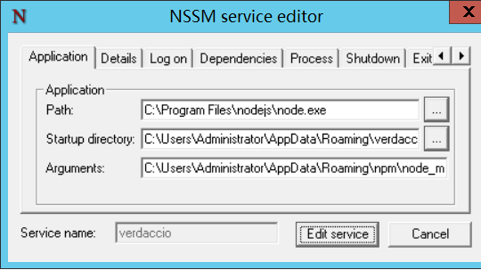

## 前言

Verdaccio 是一个简单的、零配置要求的本地私有 npm 注册表。无需整个数据库即可开始！Verdaccio 开箱即用，带有自己的小型数据库，并且能够代理其他注册表（例如 npmjs.org），并在此过程中缓存下载的模块。对于那些希望扩展其存储功能的人，Verdaccio 支持各种社区制作的插件，以连接到服务，例如 Amazon 的 s3、Google Cloud Storage或创建您自己的插件

> Verdaccio is a lightweight private npm proxy registry built in Node.js

verdaccio是基于node.js的，所以在我们的服务器上需要安装node

## Linux 部署

1、安装：

```shell
npm install -g verdaccio	# using npm
yarn global add verdaccio	# or using yarn
```

2、运行：

```shell
$> verdaccio
warn --- config file  - /home/.config/verdaccio/config.yaml
warn --- http address - http://localhost:4873/ - verdaccio/3.0.0
```

## Windows 部署

1、安装 nodejs

我们可以安装最新版本，==注意：Verdaccio 5 需要 Node.js v12==

[nodejs 下载地址](http://nodejs.cn/download/)

2、安装 verdaccio

```shell
mkdir c:verdaccio 		# 创建目录
cd c:verdaccio			# 进入目录
npm install verdaccio		# 安装 verdaccio
```

3、创建 config.yaml

在当前目录创建`config.yaml`文件

4、Windows 服务设置

自行选择使用`nssm`或者`winsw`，原理都一样。本文使用`nssm`：

+ 下载[nssm](https://www.nssm.cc/download/)
+ 添加包含`nssm.exe`的路径到`PATH`中
+ 打开管理命令
+ 运行`nssm install verdaccio`，至少必须填写应用程序`tab Path`，启动目录和参数字段。 假设在系统路径中以及`c:verdaccio`位置用`node`安装，以下的值将起作用：
	- Path: node
	- Startup directory: c:verdaccio
	- Arguments: c:verdaccionode_modulesverdacciobuildlibcli.js -c c:verdaccioconfig.yaml
+ 启动服务`sc`启动`verdaccio`



[查看nssm详细使用教程](https://gofinall.com/81.html)

## 配置

我们需要对 verdaccio 进行一些基本设置，打开配置文件：config.yaml

[查看verdaccio详细配置](https://verdaccio.org/docs/en/configuration)

### 设置网站名

```yaml
web:  
title: 'Sixpence NPM'
```

### 设置用户验证的文件

```yaml
auth:
  htpasswd:  
  file: ./htpasswd  
  max_users: 1000 #默认为1000，改为-1，禁止注册  
```

### 代理配置

在`uplinks`里设置源，然后在`packages`里设置`proxy`

```yaml
# a list of other known repositories we can talk to
uplinks:
  taobao:
    url: https://registry.npm.taobao.org/
  npmjs:
    url: https://registry.npmjs.org/

packages:
  '@*/*':
    # scoped packages
    access: $all
    publish: $authenticated
    unpublish: $authenticated
    proxy: taobao npmjs

  '**':
    # allow all users (including non-authenticated users) to read and
    # publish all packages
    #
    # you can specify usernames/groupnames (depending on your auth plugin)
    # and three keywords: "$all", "$anonymous", "$authenticated"
    access: $all

    # allow all known users to publish/publish packages
    # (anyone can register by default, remember?)
    publish: $authenticated
    unpublish: $authenticated

    # if package is not available locally, proxy requests to 'npmjs' registry
    proxy: taobao npmjs
```

### 配置权限管理 

```yaml
packages:  
   ‘@/’:  
  #表示哪一类用户可以对匹配的项目进行安装 【$all 表示所有人都可以执行对应的操作，$authenticated 表示只有通过验证的人可以执行对应操作，$anonymous 表示只有匿名者可以进行对应操作（通常无用）】  
  access: $all  
  #表示哪一类用户可以对匹配的项目进行发布  
  publish: $authenticated  
‘*’:  
  #表示哪一类用户可以对匹配的项目进行安装  
  access: $all  
  #表示哪一类用户可以对匹配的项目进行发布  
  publish: $authenticated  
  #如果一个npm包不存在，它会去询问设置的代理。  
  proxy: npmjs  
```

### 日志输出设置

```yaml
logs:  
   -{type: stdout, format: pretty, level: http}  
  #-{type: file, path: verdaccio.log, level: info}  
```

### 修改监听的端口

```yaml
listen: 0.0.0.0:4873  
```

### 示例

完整配置如下：

```yaml
#
# This is the default config file. It allows all users to do anything,
# so don't use it on production systems.
#
# Look here for more config file examples:
# https://github.com/verdaccio/verdaccio/tree/master/conf
#

# path to a directory with all packages
storage: ./storage
# path to a directory with plugins to include
plugins: ./plugins

web:
  title: Sixpence Verdaccio
  # comment out to disable gravatar support
  # gravatar: false
  # by default packages are ordercer ascendant (asc|desc)
  # sort_packages: asc
  # convert your UI to the dark side
  # darkMode: true

# translate your registry, api i18n not available yet
# i18n:
# list of the available translations https://github.com/verdaccio/ui/tree/master/i18n/translations
#   web: en-US

auth:
  htpasswd:
    file: ./htpasswd
    # Maximum amount of users allowed to register, defaults to "+inf".
    max_users: -1
    # You can set this to -1 to disable registration.
    # max_users: 1000

# a list of other known repositories we can talk to
uplinks:
  taobao:
    url: https://registry.npm.taobao.org/
  npmjs:
    url: https://registry.npmjs.org/

packages:
  '@*/*':
    # scoped packages
    access: $all
    publish: $authenticated
    unpublish: $authenticated
    proxy: taobao npmjs

  '**':
    # allow all users (including non-authenticated users) to read and
    # publish all packages
    #
    # you can specify usernames/groupnames (depending on your auth plugin)
    # and three keywords: "$all", "$anonymous", "$authenticated"
    access: $all

    # allow all known users to publish/publish packages
    # (anyone can register by default, remember?)
    publish: $authenticated
    unpublish: $authenticated

    # if package is not available locally, proxy requests to 'npmjs' registry
    proxy: taobao npmjs

# You can specify HTTP/1.1 server keep alive timeout in seconds for incoming connections.
# A value of 0 makes the http server behave similarly to Node.js versions prior to 8.0.0, which did not have a keep-alive timeout.
# WORKAROUND: Through given configuration you can workaround following issue https://github.com/verdaccio/verdaccio/issues/301. Set to 0 in case 60 is not enough.
server:
  keepAliveTimeout: 60

middlewares:
  audit:
    enabled: true

# log settings
logs:
  - { type: stdout, format: pretty, level: http }
  #- {type: file, path: verdaccio.log, level: info}
#experiments:
#  # support for npm token command
#  token: false
#  # support for the new v1 search endpoint, functional by incomplete read more on ticket 1732
#  search: false

# This affect the web and api (not developed yet)
#i18n:
#web: en-US

listen: 0.0.0.0
```

## 遇到的问题

### 问题 1

运行`npm install`出现 thon Python is not set from command line or npm configuration 解决方案

### 解决方案

```shell
npm install -g -p windows-build-tools
```

