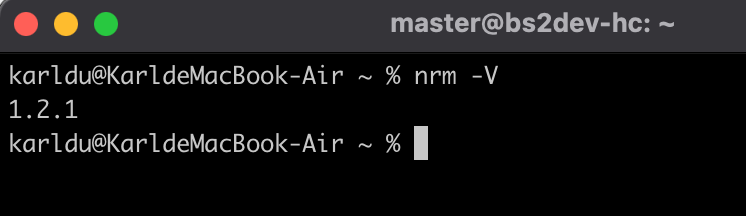
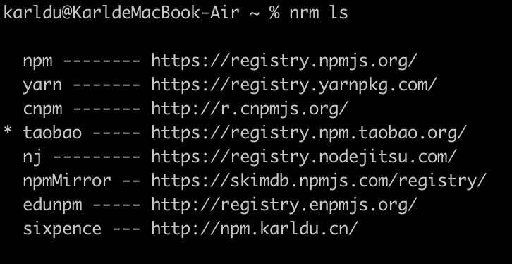
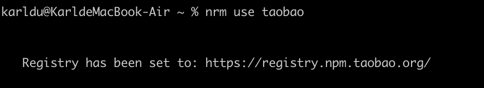
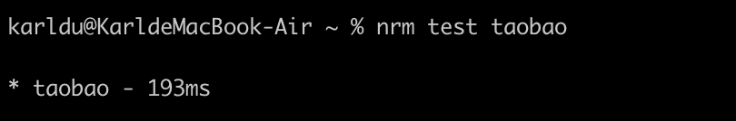
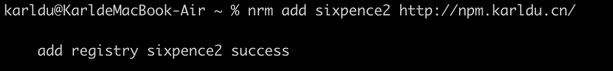
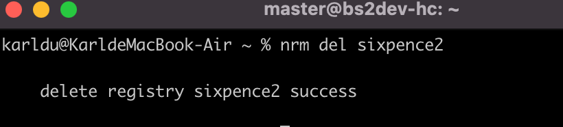

## nrm

`nrm`是一个`npm`镜像源管理命令行工具，通过它可以通过简单的命令迅速切换源。假如你访问`npmjs`官方源特别慢，或者你经常需要切换私有源那么强烈推荐你使用`nrm`

## 安装

假如你电脑已经安装好`nodejs`，那么通过内置包管理工具`npm`可以直接全局安装`nrm`

```shell
npm install -g nrm
```

安装完成后我们可以通过`nrm -V`查看版本



## 常用命令

1、查看源

命令：`nrm ls`



2、切换源

命令：`nrm use taobao`



这样我们就切换到了国内的淘宝源

3、测试源网络情况

命令：`nrm test taobao`



4、添加源

命令：`nrm add [name] [url]`



5、删除源

命令：`nrm del [name]`



## 更多命令

下面列出所有命令的中文示意：

+ nrm -V ：查看当前nvm版本。
+ nrm -h ：显示所有命令。
+ nrm current ：显示当前源名称。
+ nrm use <registry> ：切换源。
+ nrm add <registry> <url> [home] ：添加一个源。比如公司自己的私有源等。
+ nrm set-auth <registry> <value> [always] ：设置自定义源的授权信息。
+ nrm set-email <registry> <value> ：给自定义源设置路径。
+ nrm set-hosted-repo <registry> <value> ：设置发布到自定义源的npm托管仓储。
+ nrm del <registry> ：删除自定义源。
+ nrm home <registry> [browser] ：浏览器中打开源首页。
+ nrm publish [options] [<tarball>|<folder>] ：发布包到自定义源，如果没有使用自定义源，则直接发布到npm。
+ nrm test [registry] ：测试源的访问速度。不加registry时，测试所有的。

