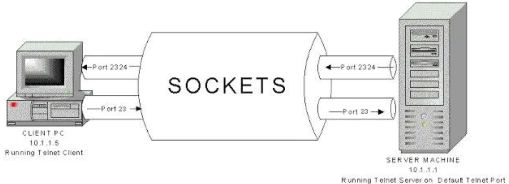

## 翻译的锅

第一次接触"套接字"这个词是在大学里《计算机网络技术》这门课程，英文是"Socket"，中译就是：插座、插孔。我很难将Sokect和套接字联系到一起，我也不知道是谁翻译出来的，导致我当时一度难以理解什么是套接字。都怪我国最早那批计算机程序员都是电气工程师，套接是一个工程用词，一般来描述套结式管道。这里正好符合套接字其基层特性（包含端口信息的一个套接口，接受指定信息）

直到看到这个图，才发觉Sokcet（插座）这个单词使用之妙

服务器就像一个大插座，客户端就像一个插头，每个插头都有很多电线，电线可以想象成线程，客户端将含有电线的插头插入服务器的插座上，就可以开始通信了

## 官方话

> 所谓套接字(Socket)，就是对网络中不同主机上的应用进程之间进行双向通信的端点的抽象。一个套接字就是网络上进程通信的一端，提供了应用层进程利用网络协议交换数据的机制。从所处的地位来讲，套接字上联应用进程，下联网络协议栈，是应用程序通过网络协议进行通信的接口，是应用程序与网络协议根进行交互的接口。

以上用大白话来讲就是，Socket就是服务器上的端口，端口就是用来通信的，所以我要告诉服务器的进程有人通过网络协议向我发送了信息

## 表示方法

套接字（Socket）= IP地址 + 端口号

例如：192.168.1.1: 80

## 工作流程

如果我们想通过互联网进行通信，那么由上可知，我们至少需要一对套接字，其中一个运行客户端（Client Socket），另一个运行于服务器端（Server Socket）

根据连接启动的方式以及本地套接字要连接的目标，套接字之间的连接过程可以分为三个步骤：

1. 服务器监听
2. 客户端请求
3. 连接确认

举个例子，我现在有一个聊天程序，小明向小丽发送了一条消息，此时，由客户端Socket向服务器Socket发起一个请求。而服务器上的聊天服务端程序一直在监听9999端口，这时候接收到小明发送过来的请求，服务端会建立一个线程和客户端进行通信

