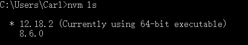
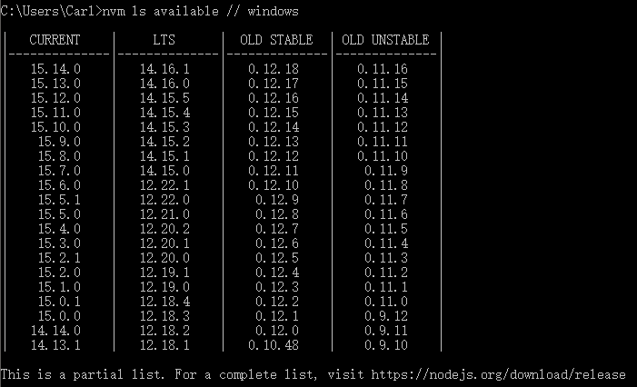
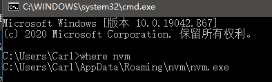
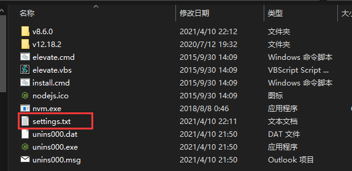

## 诞生背景

在我们的日常开发中经常会遇到这种情况：手上有好几个项目，每个项目的需求不同，进而不同项目必须依赖不同版的`NodeJS`运行环境。如果没有一个合适的工具，这个问题将非常棘手

`nvm`应运而生，`nvm`是`Mac`下的`node`管理工具，有点类似管理`Ruby`的`rvm`，如果需要管理`Windows`下的`node`，官方推荐使用`nvmw`或`nvm-windows`。不过，`nvm-windows`并不是`nvm`的简单移植，他们也没有任何关系。但下面介绍的所有命令，都可以在`nvm-windows`中运行。

`nvm`的安装和使用方式非常简单，你只需要花费几分钟的时间便可轻易上手。

## 安装方式

### Windows 安装

下载 [nvm-windows](https://github.com/coreybutler/nvm-windows/releases) 最新安装包，直接安装即可。

### OS X/Linux 安装

与`Windows`不同，我们并不一定要先卸载原有的`NodeJS`。当然我们推荐还是先卸载掉比较好。安装命令：

```bash
curl -o- https://raw.githubusercontent.com/nvm-sh/nvm/v0.38.0/install.sh | bash
```

## 安装多版本 node/npm

例如，我们要安装8.6.0版本，可以用如下命令：

```bash
nvm install 8.6.0
```

如果我们想查看所有本地安装的`node`版本，我们可以用如下命令：

```bash
nvm ls
```



如果我们想查看远程所有的`node`版本，我们可以用如下命令：

```bash
nvm ls--remote
nvm ls available // windows
```



## 切换版本

每当我们安装了一个新版本`Node`后，全局环境会自动把这个新版本设置为默认。

`nvm`提供了`nvm use`命令。这个命令的使用方法和`install`命令类似。

例如，切换到 8.6.0：

```bash
nvm use 8.6.0
```

## 在项目中使用不同版本的 Node

我们可以通过创建项目目录中的`.nvmrc`文件来指定要使用的`Node`版本。之后在项目目录中执行`nvm use`即可。`.nvmrc`文件内容只需要遵守上文提到的语义化版本规则即可。另外还有个工具叫做`avn`，可以自动化这个过程。

## 解决nvm下载速度慢问题

由于`nvm`默认的下载地址`http://nodejs.org/dist/`是外国外服务器，国内很慢可以使用淘宝的镜像。

1、通过如下命令可以找到nvm安装目录

```bash
where nvm
```



2、找到`settings.txt`文件



3、将下面这两句话复制到`settings.txt`,并保存

```bash
node_mirror: https://npm.taobao.org/mirrors/node/
npm_mirror: https://npm.taobao.org/mirrors/npm/
```

