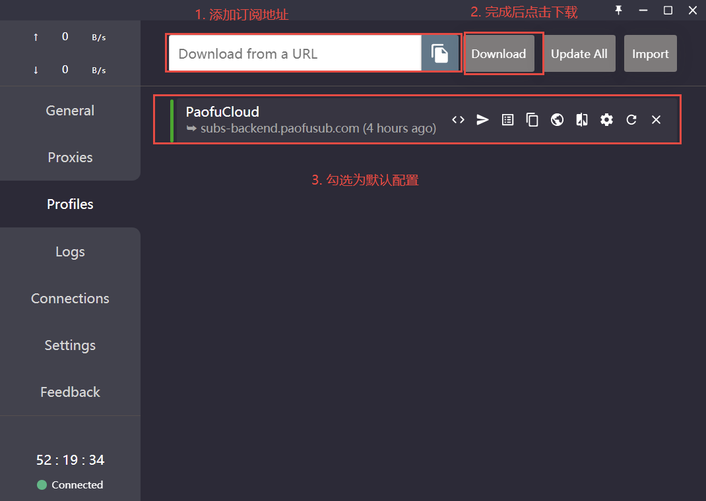
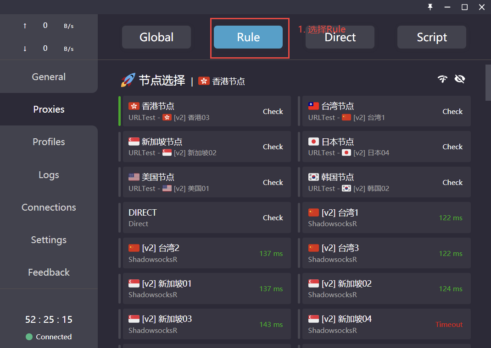
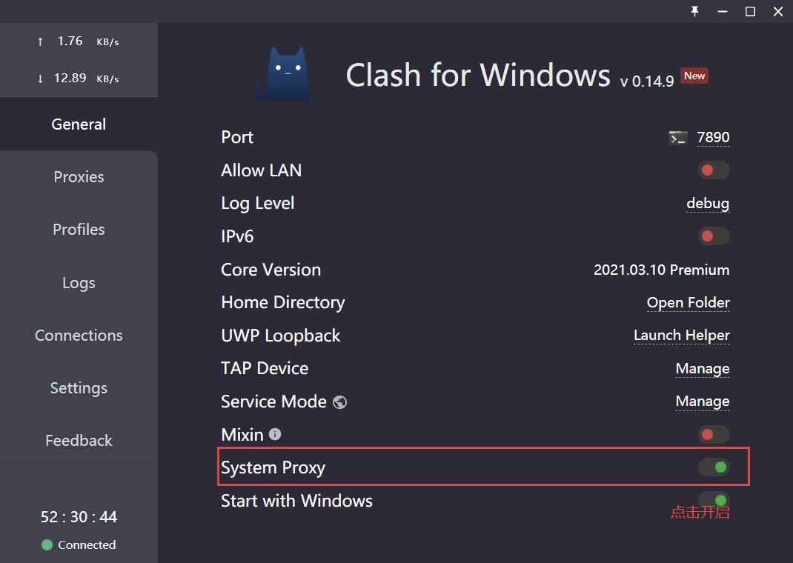

众所周知，国内访问`github`网速非常令人抓狂。你如果是一个`github`重度使用者，那么你必须要有一个代理工具

## 代理工具

这里推荐两款代理工具，均是免费使用

- ShadowsocksR
- Clash（更推荐）

这里不细讲下载方式，大家可以在`github`上搜索到对应仓库下载到 Release 版本

## Clash 配置

1、添加订阅地址配置



2、设置代理规则



3、开启系统代理



## git 代理

Clash 开启系统代理后我们可以显著的发现网页访问国外网址速度边得非常快，但是如果我们通过`git`去做`push`或者`pull`依旧非常慢，我们要手动配置`git`代理

### 设置全局代理

这里`7890`是`Clash`默认的代理端口号

```bash
git config --global http.proxy socks5://127.0.0.1:7890
git config --global https.proxy socks5://127.0.0.1:7890
```

如果你是小飞机，则把端口号改为默认的`1080`

完成后再尝试`git clone`会发现速度提升很明显

> 注意： 经过这种操作后每次执行 git 操作都要确保已经开启了代理工具，否则可能会报无法连接的错误

## 取消代理

国内大部分企业都会搭建`gitlab`私有仓库，所以，当我推送到公司仓库的适合我希望取消代理

```bash
git config --global --unset http.proxy
git config --global --unset https.proxy
```

## 设置 GitHub 代理

如果每次访问`github`都要设置代理，访问私有仓库要取消代理，那么会非常麻烦，这里推荐给`github`单独设置代理

```bash
git config --global http.https://github.com.proxy socks5://127.0.0.1:7890
git config --global https.https://github.com.proxy socks5://127.0.0.1:7890
```

## 有些问题

可能有些同学配置代理后克隆库的出现了以下错误

```bash
PS D:开发学习> git clone https://github.com/lodash/lodash.git
Cloning into 'lodash'...
fatal: unable to access 'https://github.com/lodash/lodash.git/': OpenSSL SSL_connect: SSL_ERROR_SYSCALL in connection to github.com:443
```

通过以下配置即可

```bash
git config --global http.sslBackend "openssl"
git config --global http.sslCAInfo "C:Program FilesGitmingw64sslcert.pem"
```

