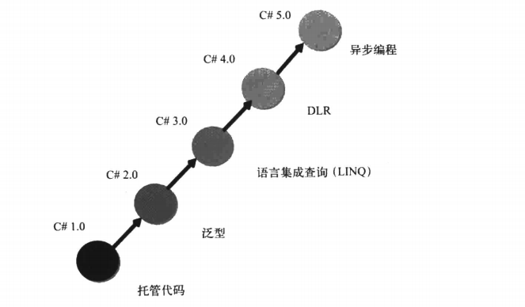
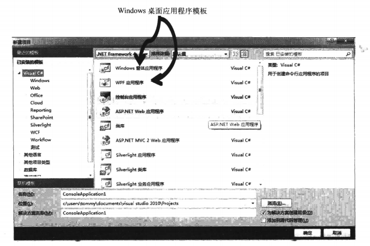
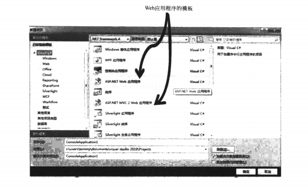
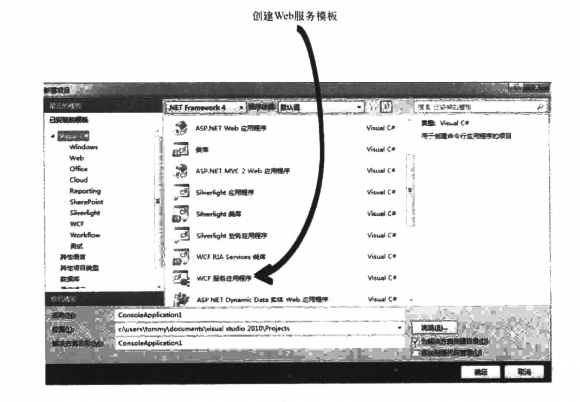

## 什么是 C#

`C#`是微软公司开发的一种面向对象语言且运行于`.Net Framework`之上的高级程序设计语言。因为基于`.Net Framework`，使得`C#`拥有丰富的类库和图形控件。当我们开发应用程序可以利用这些现有的控件快速开发。

## C# 语言发展历程

无论学习什么语言，都必要要了解它的发展历程，只有你知道了`C#`语言所具有的特性，才能更好的去掌握和学习。`C#`是微软公司 2000 年 6 月发布的全新编程语言。在其诞生后的 14 年里，微软不断地去迭代更新`C#`语言的版本。我们可以通过下表去了解对应版本更新的特性和对应`.Net Framework`版本。

|C# 版本|.Net Framework 版本|Visual Studio 版本|发布日期|特性|
|-|-|-|-|-|
|C# 1.0|.Net Framework 1.0|Visual Studio .Net 2002|2002.1|委托事件|
|C# 1.1|.Net Framework 1.1|Visual Studio .Net 2003|2003.4|APM|
|C# 2.0|.Net Framework 2.0|Visual Studio 2005|2005.11|泛型 匿名方法 迭代器可空类型|
|C# 3.0|.Net Framework 3.0 .Net Framework 3.5|Visual Studio 2008|2007.11|隐式类型 对象集合初始化 自动实现属性 匿名类型 扩展方法 查询表达式 Lambda表达式 表达式树 分部类和分部方法 Linq|
|C# 4.0|.Net Framework 4.0|Visual Studio 2010|2010.4|动态绑定 命名和可选参数 泛型的协变和逆变 互操作性|
|C# 5.0|.Net Framework 4.5|Visual Studio 2012|2012.8|一部和等待调用方法信息|

从表中可以看出，对于`C#`的每一个版本，微软都是围绕某个主题进行更新的，下图更形象地总结了每个`C#`版本地主题

## C# 可以做什么

这里只说最常用的三种，其他不做介绍

### Windows 桌面应用程序

在 C# 1 和 2 时代我们可以创建`Winform`项目开发桌面应用程序，在`C# 3.0`之后我们还可以通过`WPF`来实现。`WPF`提供了更大的灵活性和更漂亮的外观

### Web 应用程序

`.Net Framework`提供了`ASP.Net`技术来帮助我们实现`Web`应用程序。我们通过 `Visual Studio`里集成好的模板可以快速创建应用程序

### Web 服务

`Web`服务是实现分布式应用程序的一种方式。在`.Net Framework 3.0`之后，微软提供了`WCF`技术来实现`Web`服务，同样`Visual Studio`也集成了该应用程序的模板

## 什么是 .Net Framework

初学者最容易搞不清楚`C#`和`.Net Framework`的关系，其实很简单，`C#`只是一门编程语言，而`.Net Framework`就是程序运行时执行环境，为应用程序提供了以下几种服务。`.Net Framework`上不仅可以跑`C#`编写的程序，还可以跑`VB`、`F#`编写的程序

+ 全面的类库
+ 内存管理
+ 通用类型系统
+ 开发结构和技术
+ 语言互操作性

### .Net Framework 的组成

上面说的是`.Net Framework`提供的服务，而这些服务是`.Net Framework`各个组件分工完成的

#### 公共语言运行时（CLR）

**公共语言运行时**是`.Net Framework`的核心基础。我们可以将`CLR`堪称一个在执行时管理代码的代理，提供了内存管理、线程管理和异常处理等服务，而且还负责对代码实施严格的类型安全检查，保证了代码的正确性。我们将受`CLR`管理的代码称之为**托管代码**，将不受`CLR`管理的代码称之为**非托管代码**

`CLR`包含两个组成部分

+ 通用类型系统（CTS）
+ 公共语言规范（CLS）

`CLS`解决不同语言之间数据类型不同的问题，`CLS`解决语言规范的差异

#### .Net Framework 基础类库（BCL）

`.Net Framework`类库就是一组`DLL`程序集的集合，包含了大量定义好的类型，这些类型都公开了一些功能。我们可以使用这些公开的功能开发出多种应用程序，例如`Windows Form`和`Asp.Net`应用程序。

由于`FCL`包含了数量极多的类型，因此有必要将相关的一组类型放到一个单独的命名空间中加以区分，例如`System.IO`命名空间中就包含了执行`I/O`操作的类型。因此，在使用`FCL`中某个类时，还必须要知道该类所在的命名空间

### C# 代码执行过程

执行步骤如下：

1、`C#`代码编译为中间语言代码
2、中间语言代码编译为本机代码

第一个步骤是由对应语言的编译器去做编译工作，第二个步骤是交给`CLR`的`JIT`编译器来编译为本机代码

## 总结

这里简单介绍了`C#`语言的特点和发展历程，阐释了`.Net Framework`与`C#`之间的关系，并了解了`C#`代码执行过程。如此，你已经对`C#`有了一个全面的认知了，接下来就可以去正式学习`C#`语言了！

