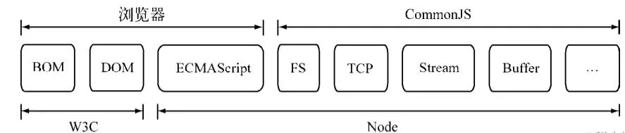
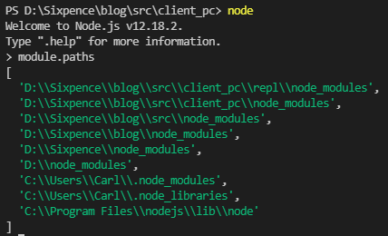

## 模块化

在`js`发展前期，它主要是在浏览器环境发光发热，由于`ES`规范规范化的时间比较早，所以涵盖的范畴比较小，但是在实际应用中，`js`的表现取决于宿主环境对ES规范的支持程度，随着`web2.0`的推进，`HTML5`崭露头角，它将`web`从网页时代带进了应用时代，并且在`ES`标准中出现了更多、更强大的`api`，在浏览器中也出现了更多、更强大的`api`供`js`调用，这需要感谢各大浏览器厂商对规范的大力支持，然而，浏览器的更新迭代和`api`的升级只出现在前端，后端的`js`规范却远远落后，对于`js`自身而言，它的规范依然是十分薄弱的，还存在一些严重的缺陷，比如：没有模块标准。

`CommonJS`规范的提出，主要是为了弥补当初`js`没有模块标准的缺点，以达到像其它语言（例如Java、Python）那样具备开发大型应用的基础能力，而不是停留在脚本程序的阶段。他们期望用`CommonJS`规范写出的应用具备跨宿主环境（浏览器环境）执行的能力，这样不仅可以利用`js`编写`web`程序，而且也可以编写服务器、命令行工具、甚至桌面应用程序。

理论和实践总是相互影响和促进的，`NodeJS`能以一种比较成熟的姿态出现，离不开`CommonJS`规范的影响，同样，在服务端，`CommonJS`能以一种寻常的姿态写进各个公司的项目中，也离不开`NodeJS`优异的表现，下图是`NodeJS`与`W3C`、还有浏览器，`CommonJS`组件、`ES`规范之间的关系：



`NodeJS`借鉴了`CommonJS`的模块化规范实现了一套非常易用的模块。

## CommonJS规范

`CommonJS`对模块的定义十分简单，主要分为`模块引用`、`模块定义`、`模块标识`三个部分。

### 模块引用

模块引用的示例代码：

```javascript
const fs = require('fs');
```

在规范中，存在`require()`方法，这个方法接收**模块标识**，以此入一个模块的API到当前上下文中。

### 模块定义

出了引入的功能之外，上下文还提供了`exports`对象，用于导出当前模块的方法或者变量，并且它是唯一导出的出口，在模块中，还存在一个`module`对象，代表模块自身，而`exports`是`module`的属性，在`NodeJS`中，一个文件就是一个模块，将方法挂载在`exports`对象上作为属性即可定义导出的方式：

```javascript
exports.add = function () {
    // ……
};
```

在另一个文件中，我们通过`require()`方法引入模块后，就能调用方法或者属性了：

```javascript
const math = require('math');
const result = math.add(10, 20);
```

### 模块标识

模块标识其实就是传递给`require()`函数的参数，它必须是符合`小驼峰命名的字符串`，或者是 以 `.` 和 `..` 开头的相对路径或者绝对路径，它可以没有文件名后缀`.js`

模块的定义十分简单，接口也十分简洁，它的意义在于将累聚的方法或者变量限定在私有的作用域用，同时支持引入和导出功能以顺畅的衔接不同的模块（文件），每个模块具有独立的空间，它们互不干扰，在引用的时候也显得干净利落。

## NodeJS的模块实现

尽管规范中`exports`、`require`和`module`听起来十分简单，但是`NodeJS`在实现它的过程中究竟经历了什么，这个过程需要知晓：

在`NodeJS`中引入模块，需要经历如下三个步骤：`路径分析`、`文件定位`、`编译执行`

需要注意的是，在`NodeJS`中，模块分为两类，一类是`NodeJS`内置的模块，称为`核心模块`；另一类是用户编写的模块，称为`文件模块`。

+ 核心模块在`NodeJS`源码的编译过程中，编译进了二进制文件，在进程启动时，部分核心模块就直接被加载进内存，这部分核心模块引入时，文件定位和编译执行这两个步骤可以省略掉，并且在路径分析的过程中优先判断，所以这部分的加载速度是最快的。
+ 文件模块是在运行时动态加载，需要完整的路径分析、文件定位、编译执行过程，速度比核心模块慢。

接下来，我们详细分析一下模块加载的过程：

### 优先从缓存加载

在此之前，我们需要知晓的一点是，与浏览器会缓存静态文件从而提高性能一样，`NodeJS`也会对引入过的模块进行缓存，以减少二次引入时的开销。不同的地方在于，浏览器只缓存文件，而`NodeJS`缓存的是编译的对象。

不论是核心模块还是文件模块, `require()`方法对相同模块的二次加载都一律采用缓存优先的方式，这是第一优先级的。并且核心模块的缓存检查优先于文件模块的缓存检查。

### 路径分析和文件定位

因为模块标识有几种形式，对于不同的标识符，模块查找和定位都有不同程度的差异。

#### 模块标识符分析

前面提到过，`require()`方法接收一个标识符作为参数，标识符在`NodeJS`中主要分为以下几类：

- 核心模块（内置模块），比如http、fs、path等
- 以 / 开头的绝对路径或者相对路径的文件模块
- 非路径形式的文件模块，如自定义的模块

#### 核心模块

核心模块的优先级仅次于缓存加载，它在`NodeJS`的源代码编译过程中编译为二进制代码，加载过程最快。

如果试图加载一个与核心模块标识符相同的自定义模块，那是不会成功的。如果自己编写了一个http用户模块，想要加载成功，必须选择一个不同的标识符或者换用路径的方式。

#### 文件模块

以`.`和`/`开头的标识符，都被当做文件模块来处理。在分析文件模块时，`require()`方法会将路径转为真实路径，并以真实路径作为索引，将编译执行后的结果存放到缓存中，以使二次加载时更快。

由于文件模块给`NodeJS`指明了确切的文件位置,所以在查找过程中可以节约大量时间，其加载速度慢于核心模块。

#### 自定义模块

自定义模块指的是非核心模块，也不是路径形式的标识符。它是一种特殊的文件模块，可能是一个文件或者包的形式。这类模块的查找是最费时的，也是所有方式中最慢的一种。

在介绍自定义模块的查找方式之前，需要先介绍一下模块路径这个概念，关于这个路径的生成规则，我们可以手动尝试一番：在任意一个目录下创建一个js文件，然后打印出`module.paths`：

```javascript
console.log(module.paths);
```

然后执行代码，可以得到如下结果：



可以看到，模块路径的内容具体表现为一个路径组成的数组，数组的生成规则如下：

+ 当前文件目录下的`node_modules`目录

+ 父目录下的`node_modules`目录

+ 父目录的父目录下的`node_modules`目录

+ 父目录的父目录的父目录下的`node_modules`目录

+ 沿路径向上逐级递归，直到根目录下的`node_modules`目录

它的生成方式与`js`的原型链或作用域链的查找方式十分类似。在加载的过程中，`NodeJS`会逐个尝试模块路径中的路径，直到找到目标文件为止。可以看出，当前文件的路径越深，模块查找耗时会越多，这也是自定义模块的加载速度是最慢的原因。

#### 文件定位

从缓存加载的优化策略使得二次引人时不需要路径分析、文件定位和编译执行的过程，大大提高了再次加载模块时的效率。但在文件的定位过程中，还有一些细节需要注意，这主要包括文件扩展名的分析、目录的处理：

#### 后缀分析

- `require()`在分析标识符的过程中，会出现标识符中不包含文件扩展名的情况。`CommonJS`模块规范也允许在标识符中不包含文件扩展名，这种情况下，`Node`会按`.js`、`.json`、`.node`的次序补足扩展名，依次尝试。
- 在尝试的过程中，需要调用`fs`模块同步阻塞式地判断文件是否存在。因为`NodeJS`是单线程的，所以这里是一个会引起性能问题的地方。小诀窍是：如果是`.node`和`.json`文件，在传递给`require()`的标识符中带上文件后缀，会加快一点速度。另一个诀窍是：同步配合缓存，可以大幅度缓解`NodeJS`单线程中阻塞式调用的缺陷。

#### 目录分析

- 在分析标识符的过程中，`require()`通过分析文件扩展名之后，可能没有查找到对应文件，但却得到一个目录，这在引入自定义模块和逐个模块路径进行查找时经常会出现，此时`NodeJS`会将目录当做一个包来处理。
- 在这个过程中，`NodeJS`对`CommonJS`包规范进行了一定程度的支持。首先，`NodeJS`在当前目录下查找`package.json`，通过`JSON.parse()`解析出包描述对象，从中取出`main`属性指定的文件名进行定位。如果文件名缺少扩展名，将会进行后缀分析的步骤。
- 如果`main`属性指定的文件名错误，或者压根没有`package.json`文件，`NodeJS`会将`index`当做默认文件名，然后依次查找`index.js`、`index.json`、`index.node`。
- 如果在目录分析的过程中没有定位成功任何文件，则自定义模块进入下一个模块路径进行查找。如果模块路径数组都被遍历完毕，依然没有查找到目标文件，则会抛出查找失败的异常。

## 模块编译

在`NodeJS`中，每个文件模块都是一个对象，它的定义如下:

```javascript
function Module(id, parent) {
    this.id = id;
    this.exports = {};
    this.parent = parent;
    if (parent && parent.children) {
        parent.children.push(this);
    }
    this.filename = null;
    this.loaded = false;
    this.children = [];
}
```

编译和执行是引入文件模块的最后一个阶段。定位到具体的文件后，`NodeJS`会新建一个对象，然后根据路径载入并编译。对于不同的文件扩展名,其载入方法也有所不同，具体如下所示。

- .js文件。通过`fs`模块同步读取文件后编译执行。

+ .node文件。这是用`C/C++`编写的扩展文件，通过`dlopen()`方法加载，最后编译生成的文件。
+ .json文件。通过`fs`模块同步读取文件后，用`JSON.parse()`解析返回结果。
+ 其余扩展名文件。它们都被当做.js文件载入。

每一个编译成功的模块都会将其文件路径作为索引缓存在`Nodule.cache`对象上，以提高二次引入的性能。根据不同的文件扩展名，`NodeJS`会调用不同的读取方式。通过在代码中访问`require.extensions`可以知道系统中已有的扩展加载方式。编写如下代码测试一下：

```javascript
console.log(require.extensions);
```

得到的执行结果如下：


可以看到，有三个处理函数，我们可以把它转成字符串然后打印出来：

```javascript
console.log(Object.values(require.extensions).toString());
```

得到的执行结果如下：

```javascript
// 对.js文件的处理
function (module, filename) {
    if (filename.endsWith('.js')) {
        const pkg = readPackageScope(filename);
        if (pkg && pkg.data && pkg.data.type === 'module') {
            const parentPath = module.parent && module.parent.filename;
            const packageJsonPath = path.resolve(pkg.path, 'package.json');
            throw new ERR_REQUIRE_ESM(filename, parentPath, packageJsonPath);
        }
    }
    const content = fs.readFileSync(filename, 'utf8');
    module._compile(content, filename);
},
// 对.json文件的处理
function (module, filename) {
    const content = fs.readFileSync(filename, 'utf8');
    if (manifest) {
        const moduleURL = pathToFileURL(filename);
        manifest.assertIntegrity(moduleURL, content);
    }
    try {
        module.exports = JSONParse(stripBOM(content));
    } catch (err) {
        err.message = filename + ':' + err.message;
        throw err;
    }
},
// 对.node文件的处理
function (module, filename) {
    if (manifest) {
        const content = fs.readFileSync(filename);
        const moduleURL = pathToFileURL(filename);
        manifest.assertIntegrity(moduleURL, content);
    }
    return process.dlopen(module, path.toNamespacedPath(filename));
}
```

上面三个函数，就是`NodeJS`在模块编译时分别对.js文件、.json文件、.node文件的编译方式。

