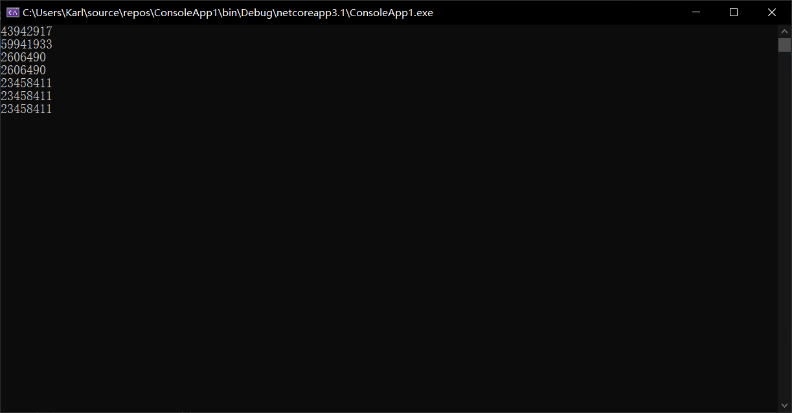

## 概念

### 什么是IoC

Ioc—Inversion of Control，即`控制反转`，其是一种`设计思想`，而不是一种技术。再没有使用`IoC`之前，我们一般是通过`new`来实例化，从而创建一个对象。但是我们使用`IoC`之后，创建这个对象的控制权将由内部转换到外部，那么这个过程便可以理解为控制反转。也即 *把对象转换成抽象对象的依赖*。

同时控制反转也是一个目标，控制反转的优点有如下两点：

+ 可以很好的做到解耦
+ 屏蔽对象的实现细节，只关心动作不关心动作中的细节

### 什么是DI（依赖注入）

全称为`Dependency Injection`，意思自身对象中的内置对象是通过注入的方式进行创建。形象的说，即由容器动态的将某个依赖关系注入到组件之中。

### IOC和DI的联系

`IoC`是一种设计思想，而DI是这种设计思想的一个实现。理解`IoC`和`DI`的关键是：“谁依赖谁，为什么需要依赖，谁注入谁，注入了什么”。 

+ 谁依赖于谁：当然是应用程序依赖于`IoC`容器； 

+ 为什么需要依赖：应用程序需要IoC容器来提供对象需要的外部资源；
+ 谁注入谁：很明显是IoC容器注入应用程序某个对象，应用程序依赖的对象； 
+ 注入了什么：就是注入某个对象所需要的外部资源（包括对象、资源、常量数据）

### 常见的IoC框架

微软`.net core`内置的`DI`、`Autofac`、`Unity`

## 内置IoC

### 内置的IoC声明周期

- `Transient`：瞬时生命周期, `Transient`服务在每次被请求时都会被创建一个新的对象。这种生命周期比较适用于轻量级的无状态服务。
- `Scoped`： `Scoped`生命周期的服务是每次web请求被创建,局部单例对象, 在某个局部内是同一个对象(作用域单例,本质是容器单例);一次请求内是一个单例对象，多次请求则多个不同的单例对象.
- `Singleton`： `Singleton`生命能够周期服务在第一被请求时创建，在后续的每个请求都会使用同一个实例。如果你的应用需要单例服务，推荐的做法是交给服务容器来负责单例的创建和生命周期管理，而不是自己来走这些事情。

`ASP.NET Core`本身已经集成了一个轻量级的`IOC容器`，开发者只需要定义好接口后（抽象），并且对抽象的接口进行实现，再`Startup.cs`的`ConfigureServices`方法里使用对应生命周期的注入，再调用的地方进行使用，比如构造函数注入等等。

在`startup`类中`ConfigureServices`方法对实例进行注册如下代码：

```csharp
// This method gets called by the runtime. Use this method to add services to the container.
public void ConfigureServices(IServiceCollection services)
{
    Console.WriteLine("ConfigureServices");
    services.AddControllersWithViews();

    //注入生命周期为单例的服务
    services.AddSingleton<ISingletonService, SingletonService>();
    //注入生命周期为Scoped 的服务
    services.AddScoped<IScopedService, ScopedService>();
    //注入生命周期为瞬时的服务
    services.AddTransient<ITransientService, TransientService>();
}
```

上面代码我分别注册了**单例**、**瞬时**、**作用域**的生命周期的服务。

下面简单写了一个例子让大家看看这三个生命周期的实例的代码

三个生命周期的抽象服务实现代码如下：

```csharp
public class ScopedService : IScopedService
{
    public string GetInfo()
    {
        return $"this is scoped service ";
    }
}

public class SingletonService : ISingletonService
{
    public string GetInfo()
    {
        return $"this is singleton service";
    }
}

public class TransientService : ITransientService
{
    public string GetInfo()
    {
        return $"this is transient service";
    }
}
```

运行示例代码如下：

```csharp
var serviceProvider = new ServiceCollection()
    .AddTransient<ITransientService, TransientService>()
    .AddScoped<IScopedService, ScopedService>()
    .AddSingleton<ISingletonService, SingletonService>()
    .BuildServiceProvider();
using (var scope = serviceProvider.CreateScope())
{
    var transientService1 = serviceProvider.GetService<ITransientService>();
    var transientService2 = serviceProvider.GetService<ITransientService>();
    Console.WriteLine(transientService1.GetHashCode());
    Console.WriteLine(transientService2.GetHashCode());

    var scopedService1 = serviceProvider.GetService<IScopedService>();
    var scopedService2 = serviceProvider.GetService<IScopedService>();
    Console.WriteLine(scopedService1.GetHashCode());
    Console.WriteLine(scopedService2.GetHashCode());

    var singletonService1 = serviceProvider.GetService<ISingletonService>();
    var singletonService2 = serviceProvider.GetService<ISingletonService>();
    Console.WriteLine(singletonService1.GetHashCode());
    Console.WriteLine(singletonService2.GetHashCode());
}
var singletonService3 = serviceProvider.GetService<ISingletonService>();
Console.WriteLine(singletonService3.GetHashCode());
Console.ReadKey();
```

运行结果如下：



从上图的运行的每个对象的`hashCode`的结果看出`Transient`生命周期是每次获得对象都是一次新的对象；`Scoped`生命周期是在作用域是同一个对象，非作用域内则是新的对象；`Singletion`生命周期是最好理解的，是这个服务启动后都是一个对象，也即是`全局单例对象`。

## 注入方式

### 直接注入

通过`ServiceProvider`直接注入具体实现

```csharp
var serviceProvider = new ServiceCollection()
    .AddTransient<ITransientService, TransientService>()
    .AddScoped<IScopedService, ScopedService>()
    .AddSingleton<ISingletonService, SingletonService>()
    .BuildServiceProvider();
```

### 集合注入

这种方式其实就是省去了注入`IServiceProvider`的过程，直接将`GetServices`获取的结果进行注入。首先注入`interface`及具体实现

```csharp
services.AddSingleton<ISingletonService, SingletonService1>();
services.AddSingleton<ISingletonService, SingletonService2>();
```

获取的方式如下

```csharp
public HomeController(IEnumerable<ISingletonService> services)
{
    var singletoService1 = services.First();
    var singletoService2 = services.Skip(1).First();
}
```

### 工厂方式注入

然后我们继续注入`Func`这个工厂，这里我们按`int`来返回不同的实现，当然你也可以采用其他方式比如`string`

```csharp
services.AddSingleton(provider =>
{
    Func<int, ISingletonService> func = n =>
    {
        switch (n)
        {
            case 1:
                return provider.GetService<SingletonService1>();
            case 2:
                return provider.GetService<SingletonService2>();
            default:
                throw new NotSupportedException();
        }
    };
    return func;
});
```

然后在构造函数中通过如下方式获取具体实现

```csharp
public HomeController(Func<int, ISingletonService> funcFactory)
{
    var singletonService1 = funcFactory(1);
    var singletonService2 = funcFactory(2);
}
```

除了以上的几个注入方式外，还可以通过反射的方式批量注入程序集的方式，这里就不一一写出具体的例子，自己去尝试。

## 获取注入

### 直接获取

通过`ServiceProvider`可以直接获取

```csharp
var transientService1 = serviceProvider.GetService<ITransientService>();
var transientService2 = serviceProvider.GetService<ITransientService>();
```

你可以把生成的`provider`赋值给静态类的静态变量，这样可以在任意地方去获取实现了

### 构造函数

在构造函数中添加`IServiceProvider`，通过如下方式获取具体实现

```csharp
public HomeController(IServiceProvider serviceProvider)
{
    var singletonService = serviceProvider.GetService<SingletonService>();
}
```

或者直接在构造函数里添加注入接口，如下所示

```csharp
public HomeController(ISingletonService singletonService)
{
    var _singletonService = singletonService;
}
```

