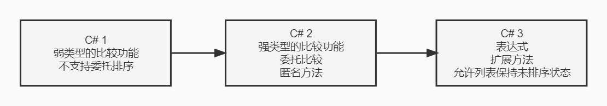

# 排序

排序是开发中非常常见的场景，我们在不同的`C#`版本该如何实现排序呢？本文通过讲解`C# 1`到`C# 3`不同的实现方案来帮助大家清晰的了解 C# 进化的过程。

## 准备

我们先实现一个`Product`实体类，在类里我定义了名称和价格，并定义了一个静态类获取预先定义好的数据

```csharp
public class Product
{
    readonly string name;
    public string Name { get { return name; } }

    readonly decimal price;
    public decimal Price { get { return price; } }

    public Product(string name, decimal price)
    {
        this.name = name;
        this.price = price;
    }

    public static ArrayList GetProducts()
    {
        return new ArrayList()
        {
            new Product("West Side Story", 9.99m),
            new Product("Assassins", 14.99m),
            new Product("Forgs", 13.99m),
            new Product("Sweeney Todd", 10.99m),
        };
    }
}
```

## C# 1

在`C# 1`中如果我们想实现排序，你需要们实现`IComparer`接口。`Compare`方法返回结果是`int`类型，小于 0 则 x 小于 y，大于 0 则 x 大于 y

```csharp
using System;
using System.Collections;

namespace Demo
{
    class Program
    {
        static void Main(string[] args)
        {
            ArrayList products = Product.GetProducts();
            products.Sort(new ProductPriceComparer());
            foreach (Product item in products)
            {
                Console.WriteLine("Name：" + item.Name + " Price：" + item.Price);
            }
            Console.ReadKey();
        }
    }
    
    public class ProductPriceComparer : IComparer
    {
        public int Compare(object x, object y)
        {
            Product first = (Product)x;
            Product second = (Product)y;
            return first.Price.CompareTo(second.Price);
        }
    }
}
```

以上是`C# 1`的实现方案，但是我们能看到很多缺点

1、`ArrayList`是一个弱类型集合类型

2、`Compare`函数入参需要强制转换，存在类型转换异常风险

这些类型问题`C# 2`的泛型帮我们完美解决，我们快来看看泛型的强大吧！

## C# 2

`IComparer`和`List<>`均支持传入类型，代码更为精简了，类型也得到了约束，再也不需要手动类型转换了

```csharp
using System;
using System.Collections;
using System.Collections.Generic;

namespace Demo
{
    class Program
    {
        static void Main(string[] args)
        {
            List<Product> products = Product.GetProducts();
            products.Sort(new ProductPriceComparer());
            foreach (Product item in products)
            {
                Console.WriteLine("Name：" + item.Name + " Price：" + item.Price);
            }
            Console.ReadKey();
        }
    }

    public class Product
    {
	    // ...
            
        public static List<Product> GetProducts()
        {
            // 强类型
            return new List<Product>()
            {
                new Product("West Side Story", 9.99m),
                new Product("Assassins", 14.99m),
                new Product("Forgs", 13.99m),
                new Product("Sweeney Todd", 10.99m),
            };
        }
    }
    
    public class ProductPriceComparer : IComparer<Product>
    {
        public int Compare(Product x, Product y)
        {
            return x.Price.CompareTo(y.Price);
        }
    }
}
```

对产品价格排序进比较的代码变得更为简单，不再需要做强制类型转换。类似`foreach`循环中隐式的类型转换也被取消了。编译器仍然会考虑将序列中的源类型转换为变量的目标类型，但它知道这时两种类型均为`Product`，因此没必要产生任何用于转换的代码。

确实有了一定的改进。但是，我们希望能直接指定要进行的比较，就能开始对产品进行排序，而不需要实现一个接口来做这件事情

```csharp
List<Product> products = Product.GetProducts();
products.Sort(delegate(Product x, Product y) { return x.Price.CompareTo(y.Price); });
```

注意，我们现在已经不需要`ProductPriceComparer`类型了，我们可以创建一个委托势力提供给`Sort`方法执行比较

到此为止，我们已经修正了`C# 1`版本中不喜欢的所有的东西，但是这并不意味着不能做得更好

## C# 3

```csharp
List<Product> products = Product.GetProducts();
products.Sort((x, y) => x.Price.CompareTo(y.Price));
```

你又看到了一个新语法（Lambda 表达式），它仍然会创建一个`Comparsion<Product>`的委托，只是代码量减少了。这里不必使用`delegate`关键字来引入委托，甚至不需要指定参数类型

## 总结

通过三个版本的代码对比，我们发现 C# 正向着更清晰、更简单的代码迈进。在开发过程中，我们更倾向于使用简单易懂的实现方式去书写代码，代码的自述性尤其重要。



