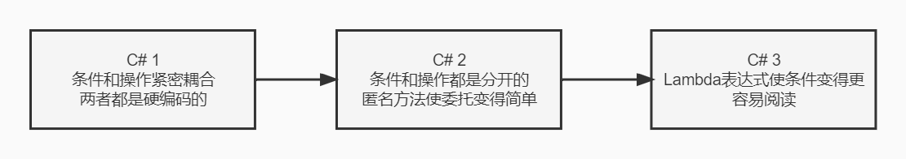

本文将介绍`C#`一种非常重要的数据处理方式——查询。例如我想筛选产品中大于10美元的产品，那么`C#`不同版本都是如何完成查询的呢？

## C# 1

`C# 1`没有什么技巧，我们需要在循环里判断价格，实现方式非常通俗易懂，但是代码又长又不够美观

```csharp
using System;

namespace Demo
{
	static void Main(string[] args)
    {
        ArrayList products = Product.GetProducts();
        foreach(Product item in products)
        {
            if (item.Price > 10)
            {
        		Console.WriteLine(item.Name);
            }
        }
    }
}
```

## C# 2

`C# 2`稍微进行了一点改进，变量`test`的初始化使用了匿名方法，而`print`变量的初始化使用了`C# 2`的另一个特性——方法组转换，它简化了从现有方法创建委托的过程。

```csharp
using System;
using System.Collections.Generic;

namespace Demo
{
    class Program
    {
        static void Main(string[] args)
        {
            List<Product> products = Product.GetProducts();

            Predicate<Product> test = delegate (Product p) { return p.Price > 10m; };
            List<Product> matches = products.FindAll(test);

            Action<Product> print = Console.WriteLine;
            matches.ForEach(print);

            Console.ReadKey();
        }
    }
}
```

上述代码并没有比`C# 1`简单，但是它强大了很多

具体地说，它使我们可以非常轻松地更改测试条件并对每个匹配项采取单独地操作。涉及的委托变量（`test`和`print`)可以传递给一个方法——相同的方法可以用于测试完全不同的条件以及执行完全不同的操作。当然，可以将所有测试和打印都放到一条语句中

```csharp
List<Product> products = Product.GetProducts();
products.FindAll(delegate (Product p) { return p.Price > 10m; })
    	.ForEach(Console.WriteLine);
```

这样更好一些，但是`delegate(Product p)`还是很爱是，大括号也是。它们是代码中不和谐音符，有损可读性。如果一直进行相同的测试和执行相同的操作，我还是喜欢`C# 1`的版本。

## C# 3

`C# 3`拿掉了以前将实际的委托逻辑包裹起来的许多无意义的东西， 从而有了极大的改进

```csharp
List<Product> products = Product.GetProducts();
foreach(Product product in products.Where(p => p.Price > 10m))
{
    Console.WriteLine(product);
}
```

`Lambda`表达式将测试放在了一个非常恰当的位置。再加上一个有意义的方法名，你甚至可以大声读出代码，几乎不用怎么思考就能明白代码的含义。`C# 2`的灵活性也得到了保留——传递给`Where`的参数值可以来源于一个变量。此外，如果愿意，完全可以使用`Action<Product>`，而不是硬编码的`Console.WriteLine`调用

## 总结

`C# 2`中的匿名方法有助于问题的可分离性；`C#`中，`Lambda`表达式则增加了可读性



